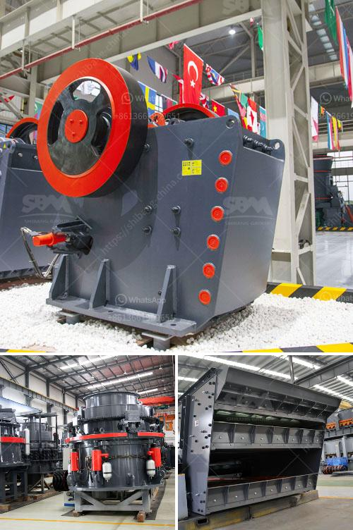

<h3>impact crusher in egypt</h3>
The construction industry in Egypt has been witnessing unprecedented growth in the past few years. This growth is mainly driven by the government's massive infrastructure development plans, including the construction of new cities, roads, and buildings. As a result, the demand for construction materials such as aggregates, sand, and gravel has increased significantly.

To meet this growing demand, contractors and construction companies are now turning to innovative technologies and machinery to speed up the construction process and improve the quality of the final product. One such technology that has revolutionized the construction industry in Egypt is the impact crusher.

An impact crusher is a machine that uses striking as opposed to pressure to reduce the size of a material. Impact crushers are often used in construction and mining industries to reduce the size of materials such as rubble, concrete, and asphalt aggregates. These machines are designed to crush large rocks or ores into smaller pieces, making them suitable for recycling or further processing.

The impact crusher consists of a rotor, which revolves at high speeds. In the rotor, there are hammers attached. When the feed enters the crushing chamber, it is struck by the rotating hammers, causing the materials to break down into smaller pieces. The crushed materials then exit the crushing chamber through a discharge opening.

One of the key advantages of an impact crusher is its ability to produce a consistent and uniform product size. This is achieved through the combination of high impact forces and the controlled discharge opening. As a result, contractors can achieve the desired size and shape of aggregates for their construction projects.

Furthermore, impact crushers are versatile machines that can handle a wide range of materials. Whether it is soft limestone or hard granite, an impact crusher can effectively crush it with minimal wear and tear. This versatility makes them suitable for various applications, including road construction, building construction, and mining operations.

In addition to their versatility and consistent product size, impact crushers also offer energy efficiency and low maintenance requirements. Due to their robust construction and high-performance capabilities, these machines have a long service life and require minimal downtime for maintenance or repairs. This is particularly beneficial for construction companies in Egypt, as it allows them to optimize their operations and reduce operational costs.

The adoption of impact crushers in Egypt has been instrumental in speeding up the construction process and improving the quality of construction materials. Contractors can now produce high-quality aggregates on-site, eliminating the need for transporting materials from distant quarries. This not only reduces transportation costs but also minimizes the environmental impact associated with long-haul transportation.

Overall, the impact crusher has played a significant role in revolutionizing the construction industry in Egypt. Its ability to produce consistent and uniform product size, handle a wide range of materials, and offer energy efficiency and low maintenance requirements make it a valuable asset for contractors and construction companies. As the construction industry continues to grow in Egypt, the impact crusher will likely remain a vital tool for meeting the increasing demand for construction materials.
<h3>Contact us</h3><ul><li><strong>Whatsapp:&nbsp;<a href="https://wa.me/8613661969651">+8613661969651</a></strong></li><li><a href="https://swt.shibang-china.com/?git&amp;zhl&amp;impact crusher in egypt"><strong>Online Service(chat now)</strong></a></li></ul><h3>Related</h3><ul><li><a href='small scale industrial pulveriser.md'>small scale industrial pulveriser</a></li><li><a href='nigeria c125 jaw crusher.md'>nigeria c125 jaw crusher</a></li><li><a href='crushing stone machines for sale in usa.md'>crushing stone machines for sale in usa</a></li><li><a href='mini stone crushers for small scale mining.md'>mini stone crushers for small scale mining</a></li><li><a href='dolomite production line.md'>dolomite production line</a></li></ul>