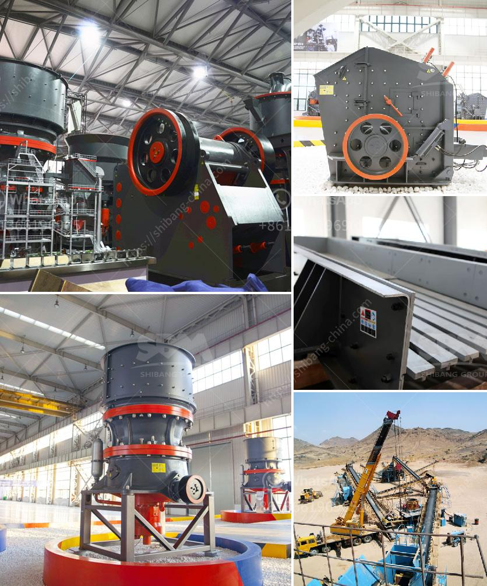

<h3>impact crusher philippines</h3>
The impact crusher is a versatile and efficient machine that can handle hard and brittle materials such as rocks and ores. It is commonly used in mining and construction industries for crushing materials into smaller pieces. With its high crushing ratio and reliable performance, the impact crusher has been widely used in the Philippines.

One of the main benefits of the impact crusher is its low operating cost. This machine uses energy-efficient motors and durable wear-resistant materials, reducing maintenance costs and increasing overall productivity. In addition, its simple structure and easy-to-use design make it user-friendly, allowing operators to quickly adjust settings and control the output size of the crushed materials.

The impact crusher also offers a high degree of versatility. It can be used to crush a variety of materials, including limestone, granite, concrete, and asphalt, making it ideal for both mining and construction applications. Moreover, it can produce uniformly-shaped stones, which are highly sought after in the construction industry.

In the Philippines, where infrastructure development is a top priority, the impact crusher has become a crucial equipment in road construction projects. The machine is used to crush large rocks into smaller particles that can be used as base materials for new roads or as aggregates for concrete mixtures. With its ability to produce consistently-sized materials, the impact crusher contributes to the smooth and efficient construction of roads in the country.

Furthermore, the impact crusher plays a significant role in the mining industry in the Philippines. Whether it is used for hard rock mining or open-pit mining, this machine can process large quantities of ore to produce high-quality metals and minerals. The impact crusher can effectively reduce the size of mined materials, resulting in a higher yield and lower production costs. Additionally, it can help extract valuable minerals from ores, improving the profitability of mining operations.

Moreover, the impact crusher is also environmentally friendly. It produces less dust and noise compared to other crushing machines, which is crucial in densely populated areas. Additionally, its efficient energy consumption reduces greenhouse gas emissions, contributing to a cleaner and more sustainable environment.

To cater to the increasing demand for impact crushers in the Philippines, manufacturers have introduced various models and designs with advanced features. Many models are now equipped with automated systems, such as hydraulic settings and remote control operation, enhancing safety and convenience for operators.

In conclusion, the impact crusher has significantly impacted the mining and construction industries in the Philippines. Its low operating cost, high versatility, and environmental friendliness have made it a popular choice among operators. With its ability to crush hard and brittle materials, produce uniformly-sized particles, and reduce production costs, the impact crusher has revolutionized mining and construction operations, contributing to the rapid development of the Philippines' infrastructure.
<h3>Contact us</h3><ul><li><strong>Whatsapp:&nbsp;<a href="https://wa.me/8613661969651">+8613661969651</a></strong></li><li><a href="https://swt.shibang-china.com/?git&amp;zhl&amp;impact crusher philippines"><strong>Online Service(chat now)</strong></a></li></ul><h3>Related</h3><ul><li><a href='coal pulverizer manufacturers in south africa.md'>coal pulverizer manufacturers in south africa</a></li><li><a href='pakistan directory of cement plants list pdf.md'>pakistan directory of cement plants list pdf</a></li><li><a href='used rotary kiln equipment for sale.md'>used rotary kiln equipment for sale</a></li><li><a href='quarrying crusher machine.md'>quarrying crusher machine</a></li><li><a href='aggregate crusher machine suppliers.md'>aggregate crusher machine suppliers</a></li></ul>