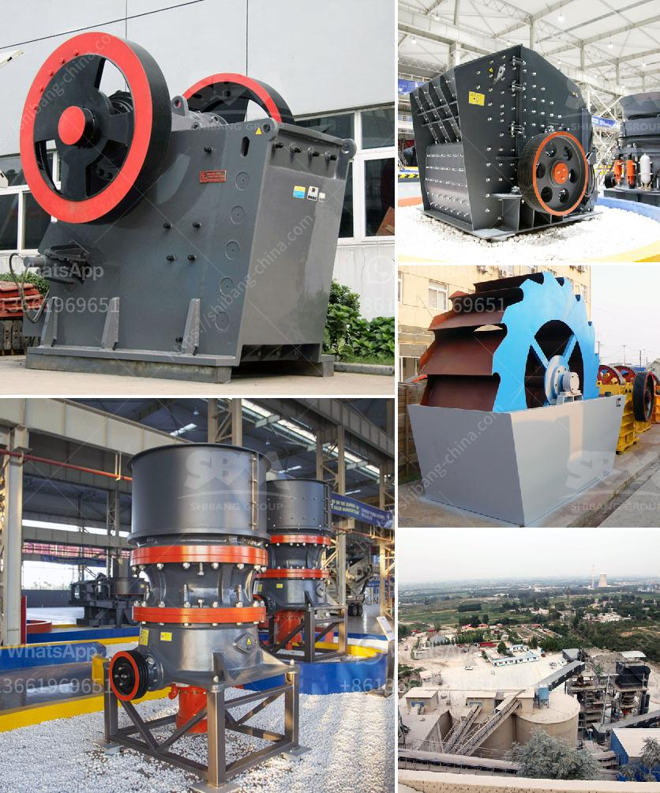

<h3>impact crushers for sale</h3>
Impact crushers are powerful machines that are used to crush a variety of materials. These machines can be found in sectors such as mining, water conservation, and recycling. They work by reducing the size of the material to smaller particles, and as such, are an essential tool in the mining and construction industries.

One of the key advantages of an impact crusher is its ability to produce a uniform particle shape. This is achieved by using a series of anvils, hammers, or blow bars, which are fixed to the rotor. As the rotor spins at high speeds, the material is hit with enough force to break it down into smaller pieces. This process ensures that the final product has consistent dimensions and is suitable for various applications.

Impact crushers are also known for their high production capacity. These machines can handle a wide range of materials, from soft to medium-hard rocks. The size and shape of the inlet opening can be adjusted to accommodate different types of material, making them versatile tools on the construction site. This versatility allows contractors to use one machine for a variety of crushing tasks, saving time and money.

Furthermore, impact crushers are valued for their efficiency. Due to their design and operational features, these machines have a lower energy consumption compared to other types of crushers. They also generate less noise and produce fewer fines during the crushing process, which is beneficial for environmental protection.

When looking for impact crushers for sale, there are several factors to consider. It is important to choose a machine that is suitable for the specific application. The capacity and output size requirements should be carefully evaluated to ensure that the crusher meets the needs of the project.

Additionally, it is crucial to assess the quality of the crusher. Researching the reputation of the manufacturer and reading customer reviews can provide valuable insight into the performance and durability of the machine. Some key features to look for include a robust frame, high-quality components, and easy maintenance.

Regarding price, it is advisable to compare different models and brands to find the best value for money. However, it is essential to prioritize quality and performance over price, as a low-quality crusher may end up costing more in the long run due to frequent breakdowns and maintenance costs.

In conclusion, impact crushers are essential equipment in the mining and construction industries. Their ability to produce uniform particle sizes, high production capacity, and efficiency make them valuable additions to any project. When searching for impact crushers for sale, it is vital to research various models and manufacturers to ensure that the chosen machine meets the specific requirements and offers high-quality performance. By investing in a reliable impact crusher, companies can improve productivity, reduce costs, and achieve efficient material processing.
<h3>Contact us</h3><ul><li><strong>Whatsapp:&nbsp;<a href="https://wa.me/8613661969651">+8613661969651</a></strong></li><li><a href="https://swt.shibang-china.com/?git&amp;zhl&amp;impact crushers for sale"><strong>Online Service(chat now)</strong></a></li></ul><h3>Related</h3><ul><li><a href='quartz powder special production line for mining.md'>quartz powder special production line for mining</a></li><li><a href='hydrated lime powder making machine from germany.md'>hydrated lime powder making machine from germany</a></li><li><a href='want to buy stone crusher in canada.md'>want to buy stone crusher in canada</a></li><li><a href='list of quarrying companies in the philippines.md'>list of quarrying companies in the philippines</a></li><li><a href='limestone manufacturing process.md'>limestone manufacturing process</a></li></ul>