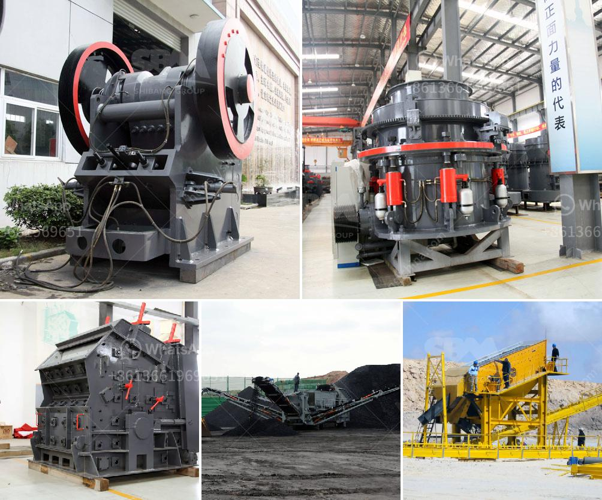

<h3>india gypsum powder equipment</h3>
India is witnessing rapid growth in its construction industry, with new infrastructure projects and residential buildings springing up across the country. To support this booming sector, the demand for high-quality construction materials is also on the rise. Gypsum powder, a versatile material widely used in construction, plays a crucial role in strengthening the Indian construction industry. In this article, we will explore the significance of gypsum powder equipment in India.

Gypsum powder, obtained by heating gypsum stone, is commonly used as a construction material due to its various advantages. It possesses excellent fire-resistant properties and is highly durable, making it a preferred choice for building interiors. Gypsum powder is extensively used for plastering walls, creating decorative elements, and even producing lightweight building materials like gypsum boards and blocks.

To meet the growing demand for gypsum powder, specialized equipment is required for processing and manufacturing. India has witnessed a steady increase in the number of manufacturing units focusing on gypsum powder production in recent years. These units rely on advanced gypsum powder equipment to extract and produce high-quality gypsum powder.

The gypsum powder equipment comprises several essential components that work together to transform raw gypsum into a fine powder suitable for construction applications. One of the key components is the crusher, which efficiently breaks down large-size gypsum stones into smaller particles. This process ensures a consistent and uniform size distribution of gypsum powder.

Once the gypsum stones are crushed, they are transported to the grinding mill for further processing. The grinding mill plays a crucial role in reducing the particle size of gypsum, enhancing its chemical reactivity and workability. Advanced grinding mills equipped with powerful motors and precision grinding tools ensure the desired fineness of gypsum powder is achieved.

After grinding, the gypsum powder is conveyed to a calciner where it undergoes controlled heating to remove excess moisture and convert it into a hemihydrate form. The hemihydrate gypsum powder obtained from the calcination process possesses enhanced setting properties, making it suitable for various construction applications.

To ensure optimum quality, the gypsum powder equipment incorporates advanced quality control systems. These systems monitor and regulate the production process, ensuring compliance with industry standards and specifications. Quality control measures help achieve consistent and reliable properties of the gypsum powder, making it a trusted material for construction projects.

Moreover, the gypsum powder equipment used in India has undergone significant technological advancements in recent years. These advancements have enhanced the efficiency, reliability, and sustainability of the manufacturing process. Modern equipment is designed to minimize energy consumption, reduce emissions, and optimize resource utilization, thereby promoting environmental sustainability.

In conclusion, the India gypsum powder equipment industry plays a vital role in supporting the growth of the construction sector. With its exceptional fire-resistant properties, high durability, and versatility, gypsum powder is becoming increasingly popular in the Indian construction industry. The advanced gypsum powder equipment used in India ensures the production of high-quality gypsum powder, meeting the diverse needs of construction projects across the country. As the construction industry continues to flourish, the demand for gypsum powder equipment is expected to rise, contributing further to India's development.
<h3>Contact us</h3><ul><li><strong>Whatsapp:&nbsp;<a href="https://wa.me/8613661969651">+8613661969651</a></strong></li><li><a href="https://swt.shibang-china.com/?git&amp;zhl&amp;india gypsum powder equipment"><strong>Online Service(chat now)</strong></a></li></ul><h3>Related</h3><ul><li><a href='gold refining equipment machine plant.md'>gold refining equipment machine plant</a></li><li><a href='stone crushing plant use jaw crusher price list.md'>stone crushing plant use jaw crusher price list</a></li><li><a href='looking for washing plant for gold germany.md'>looking for washing plant for gold germany</a></li><li><a href='biering roller mill.md'>biering roller mill</a></li><li><a href='buy stone crusher india.md'>buy stone crusher india</a></li></ul>