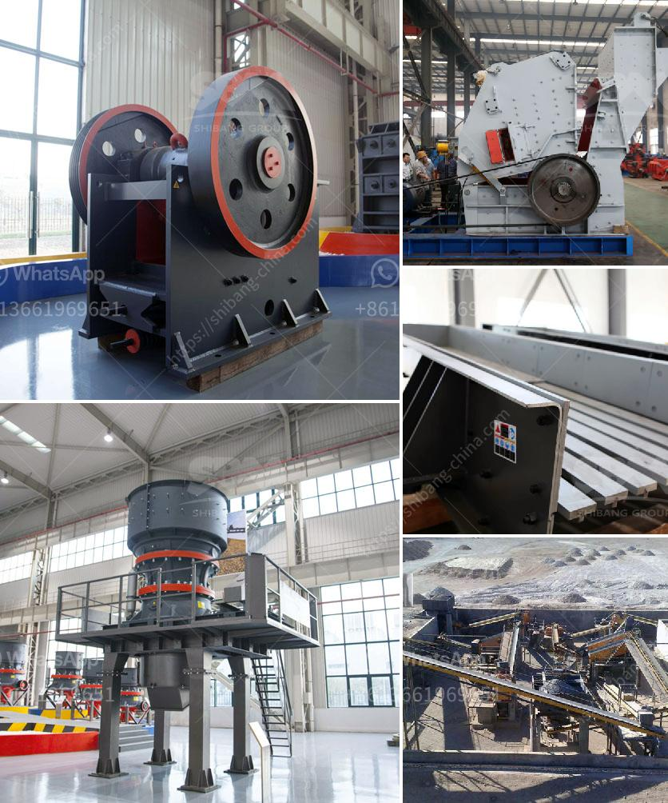

<h3>india stone crusher machine price in china</h3>
India is one of the most populated countries in the world. It is home to over 1.3 billion people, making it a hub for various industries. One such industry is the stone crushing market, which is thriving in India. With the increasing demand for affordable housing and infrastructure projects, the demand for stone crushers is constantly on the rise.

China, on the other hand, is one of the largest stone crusher markets in the world. It has been witnessed that China is the fastest-growing market for stone crushers in the past few years. With the construction industry booming, there is a huge demand for stone crushers in this region. China's rapid industrialization and urbanization have fueled the need for more stones and rocks, which in turn has led to the increase in stone crushing activities.

The stone crusher machines produced by China have been widely used in many construction projects in India. The crushing machines have also been exported to other countries and widely used in various industries. China Stone Crusher Machine Price in India market is every year growing.

China's rapid economic development, infrastructure construction, and urbanization are driving the growth of the stone crusher machine market in India. China has also made considerable efforts to promote the use of advanced technologies in stone crushing machines. These efforts have resulted in the improvement of crushing efficiency and overall productivity. As a result, China's stone crusher machines are more reliable, energy-efficient, and environmentally friendly compared to those of other countries.

With the continuous advancements in technology and automation, China has pioneered the development of advanced and efficient stone crushers. These crushers are equipped with features like intelligent control systems, high-performance motors, and durable wear parts, which ensure efficient and trouble-free operation. Moreover, Chinese stone crusher machines are known for their high crushing capacity, adjustable output size, and low operating cost.

China's stone crusher machines offer multiple benefits to the Indian construction industry. Besides saving time and effort on crushing stones manually, these machines can significantly increase the overall productivity and output of construction projects. Moreover, with the increased availability of crushed stones, it becomes easier and more affordable to build roads, bridges, and buildings.

Another notable advantage of Chinese stone crusher machines is their competitive pricing. The cost of a stone crusher machine in China is usually much lower compared to that of India. This ensures that the Indian construction companies get the best value for their money when investing in stone crushing machines from China.

Overall, the stone crusher machine market in India is experiencing steady growth fueled by the increasing demand for stone crushers. This has further prompted leading manufacturers in the Chinese stone crusher market to expand their presence in the Indian market. With reliable and efficient products at competitive prices, Chinese stone crusher machines have become a preferred choice for Indian construction companies. As a result, the future of stone crusher machines in India looks promising, with China playing a crucial role in this growth story.
<h3>Contact us</h3><ul><li><strong>Whatsapp:&nbsp;<a href="https://wa.me/8613661969651">+8613661969651</a></strong></li><li><a href="https://swt.shibang-china.com/?git&amp;zhl&amp;india stone crusher machine price in china"><strong>Online Service(chat now)</strong></a></li></ul><h3>Related</h3><ul><li><a href='stone crusher equipment quarry.md'>stone crusher equipment quarry</a></li><li><a href='granite quarry machines.md'>granite quarry machines</a></li><li><a href='list of quarrying companies in the philippines.md'>list of quarrying companies in the philippines</a></li><li><a href='calcium carbonate manufacturing machinery.md'>calcium carbonate manufacturing machinery</a></li><li><a href='primary crusher price in bolivia.md'>primary crusher price in bolivia</a></li></ul>