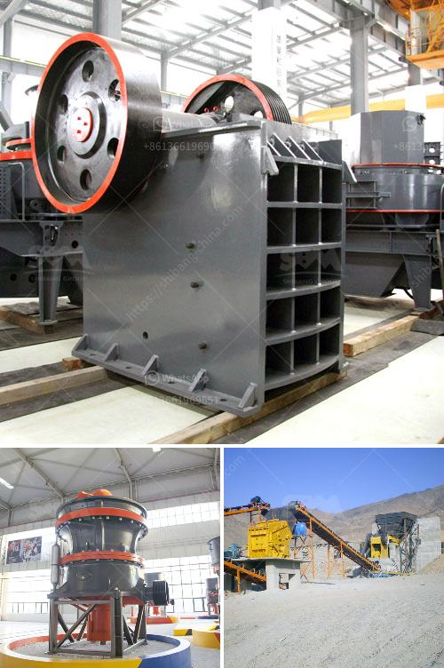

<h3>india stone crusher plant production line</h3>
India is a country with a vast amount of natural resources, including stone resources. In recent years, India has witnessed rapid economic growth, and as a result, it has witnessed an increase in the construction industry. As a crucial component of the construction industry, the stone crushing market in India has grown in recent years. With the increasing demand for stone materials in construction projects, the need for efficient and reliable stone crusher plants is on the rise.

A stone crusher plant is a machine designed to reduce the large stone, granites, marble, lime rocks into the smaller size and output gravel, dust, different size of the material. Stone crushers plants can accomplish stones into different sizes such as 0-5mm, 5-10mm, 10-20mm, 20-30mm, 30-40mm, 40-50mm, etc. Users can get detailed information about these different sizes of the stone from Indian stone crusher plant production line.

Stone crusher plants' production line effectively saves raw material transportation cost. The stone crusher plant will be able to produce crushed stones of various sizes that can be used in various construction projects. There is a wide range of projects that can be undertaken using the crushed stone produced by stone crusher plants. Some of the common projects include:

1. Road construction: Crushed stone is widely used in road construction as a base material for foundational layers. The stone crusher plant production line produces crushed stone that is used as a stabilizing base material for roads and highways.

2. Building construction: Crushed stone is used as a key material in the construction of buildings. The stone crusher plant production line provides aggregates for concrete production, which can be used in the construction of buildings, bridges, dams, and other structures.

3. Railway construction: Stone crusher plants play a crucial role in the construction of railway tracks, as crushed stones are used as a ballast to provide stability and support to the railway tracks. The stone crusher plant production line provides the necessary materials for railway construction projects.

4. Landscaping and decoration: Crushed stones produced by stone crusher plants can be used in landscaping and decoration projects. They can be used to create pathways, garden beds, and decorative features in gardens, parks, and public spaces.

To meet the increasing demand for stone materials, many stone crusher plant production lines have been set up in India. These production lines consist of jaw crushers, impact crushers, cone crushers, vibrating screens, belt conveyors, and other auxiliary equipment. The stone crusher plant production lines in India are highly automated and can be operated with minimal manpower. They are capable of producing high-quality crushed stones that meet the specifications required for various construction projects.

In conclusion, the stone crusher plant production line plays a vital role in India's construction industry. It not only facilitates the construction of various infrastructure projects but also provides employment opportunities for thousands of people. The stone crusher plant production line is an efficient and reliable investment for any construction company or individual looking to kickstart their construction projects. With India's continuous economic growth, the stone crusher plant production line is expected to witness further expansion and development in the coming years.
<h3>Contact us</h3><ul><li><strong>Whatsapp:&nbsp;<a href="https://wa.me/8613661969651">+8613661969651</a></strong></li><li><a href="https://swt.shibang-china.com/?git&amp;zhl&amp;india stone crusher plant production line"><strong>Online Service(chat now)</strong></a></li></ul><h3>Related</h3><ul><li><a href='list of mineral processing plants in oman.md'>list of mineral processing plants in oman</a></li><li><a href='ultra fine dry grinding mill.md'>ultra fine dry grinding mill</a></li><li><a href='stone hammer mill.md'>stone hammer mill</a></li><li><a href='stone crusher design.md'>stone crusher design</a></li><li><a href='grinding machine kuwait for sale.md'>grinding machine kuwait for sale</a></li></ul>