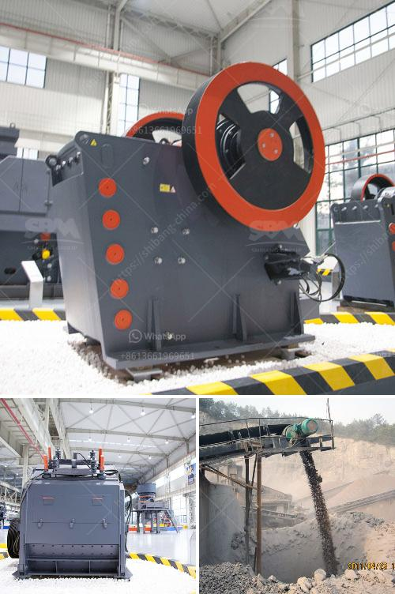

<h3>indian river sand grinding machine price</h3>
The Indian River sand grinding machine is used to grind various types of materials, including river sand, quartz sand, stone, sand, cement clinker, iron ore, copper ore, construction waste, and so on. It is a crucial equipment for grinding after materials are crushed. The grinder machine is widely used in cement, silicate products, new building materials, refractory materials, fertilizer, black and non-ferrous metals, and glass ceramics production industries.

The price of the Indian River sand grinding machine varies according to different models, parameters, and brands. Generally, the larger the size of the grinding machine, the higher its price. The sand grinding machine with a larger capacity and higher efficiency is more expensive. Additionally, the brand also affects the price. Well-known brands often have higher prices due to their reputation, quality assurance, and after-sales service.

To find the best price for an Indian River sand grinding machine, it is recommended to compare prices from different manufacturers and suppliers. Online platforms and industry exhibitions are great places to explore various options and find competitive prices. However, buyers should not only consider the price but also the quality and performance of the machine. A cheaper but lower-quality grinding machine may lead to frequent breakdowns and higher maintenance costs in the long run.

Regular maintenance and timely replacement of worn parts are essential to prolong the service life of the grinding machine. Many manufacturers provide after-sales services, including spare parts supply and technical support, which ensure the smooth operation of the machine. These services, although they might come with an additional cost, are crucial investments that save money and time in the future.

In conclusion, the price of the Indian River sand grinding machine depends on factors such as size, capacity, brand, and after-sales service. Buyers should thoroughly research and compare different options to find the best price with good quality and reliable after-sales support. Regular maintenance and care will also help to maximize the machine's lifespan and efficiency, providing a cost-effective solution for grinding various materials.
<h3>Contact us</h3><ul><li><strong>Whatsapp:&nbsp;<a href="https://wa.me/8613661969651">+8613661969651</a></strong></li><li><a href="https://swt.shibang-china.com/?git&amp;zhl&amp;indian river sand grinding machine price"><strong>Online Service(chat now)</strong></a></li></ul><h3>Related</h3><ul><li><a href='coal processing machine.md'>coal processing machine</a></li><li><a href='cone crusher for sale philippines.md'>cone crusher for sale philippines</a></li><li><a href='copper crusher for sale in malaysia.md'>copper crusher for sale in malaysia</a></li><li><a href='small cement grinding plant.md'>small cement grinding plant</a></li><li><a href='rubber latex processing ppt.md'>rubber latex processing ppt</a></li></ul>