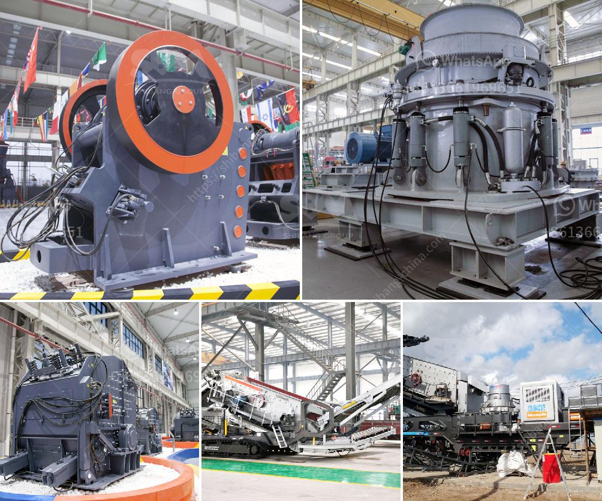

<h3>indonesia coal crusher stamler agent</h3>
Indonesia is one of the largest coal producers in the world. In this article, we will discuss the coal crushing process and the potential benefits of using a coal crusher in Indonesia.

Indonesia's coal mines contain abundant coal resources that require intensive crushing and screening. Coal is mainly produced by open-pit mining, which is commonly used in Indonesia. In the coal mining process, coal crusher is used as the primary crushing equipment. Stamler agent in Indonesia plays an important role in the coal mining process.

Stamler coal crusher stamler coal crusher brand stamler crushercoal crusher stamler agenIndonesia Stone Crusher Machine,Stone Crusher,Stone Crushers,Stone Breaker, Crushers, Coal Grinding Mill/Coal Ball Mill/Grinding Mill For Coal Mining/Coal Grinding Mill For Sale;

Stamler coal crusher is a type of equipment used to crush coal into small pieces for use in the coal mining process. It is also often used to break over-sized boulders on a continuous feed from a hopper to a crusher. This machine is ideal for use in a wide range of mining operations, including coal mining.

There are several benefits to using a coal crusher. First and foremost, a coal crusher can process all types of coal ores. It can crush both underground and surface coal deposits, making it ideal for use in various mining operations.

Secondly, using a crusher can improve productivity. By breaking down large chunks of coal into small, manageable pieces, a coal crusher increases the efficiency of the entire coal mining process. This results in higher coal production rates, reduced downtime, and improved overall profitability.

Furthermore, a coal crusher can enhance safety in the workplace. Large chunks of coal can pose a safety risk to miners. By using a crusher, these large chunks can be broken down into smaller, more manageable pieces, reducing the risk of accidents and injuries.

Lastly, a coal crusher can reduce environmental impact. By breaking down coal into smaller pieces, crushers enable easier storage, transportation, and combustion of coal. This leads to reduced emissions and a cleaner environment.

Stamler is a well-known coal crusher manufacturer in the world. With more than 80 years of experience in the coal mining industry, Stamler has become a global leader in the design, manufacture, and support of equipment for the coal mining industry.

Stamler's main products include feeder breakers, reclaim feeders, crushers, and sizers. The company also manufactures and sells various spare parts for these machines. Stamler products are known for their reliability, durability, and efficiency in processing coal.

In conclusion, the use of a coal crusher in Indonesia is beneficial in many ways. It improves productivity, enhances safety, and reduces environmental impact. Stamler, as a well-established coal crusher manufacturer, provides a range of machines that offer these benefits. By using a Stamler crusher, Indonesian coal miners can enhance their mining operations and contribute to a more sustainable future for the coal mining industry.
<h3>Contact us</h3><ul><li><strong>Whatsapp:&nbsp;<a href="https://wa.me/8613661969651">+8613661969651</a></strong></li><li><a href="https://swt.shibang-china.com/?git&amp;zhl&amp;indonesia coal crusher stamler agent"><strong>Online Service(chat now)</strong></a></li></ul><h3>Related</h3><ul><li><a href='artificial stone production line.md'>artificial stone production line</a></li><li><a href='sample of granite quarry proposal.md'>sample of granite quarry proposal</a></li><li><a href='cost of gypsum mining equipment.md'>cost of gypsum mining equipment</a></li><li><a href='hydraulic system loesche mill.md'>hydraulic system loesche mill</a></li><li><a href='granite mining business plan.md'>granite mining business plan</a></li></ul>