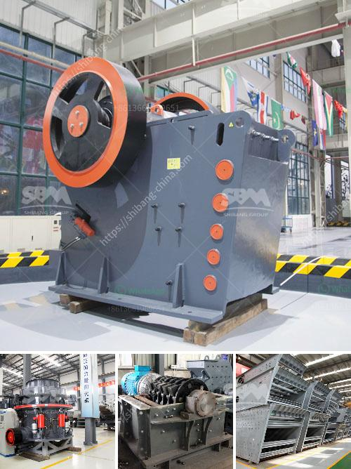

<h3>indonesia quality crusher conveyor belts</h3>
Indonesia is a huge archipelago of diverse islands, rich with natural resources. The country has a long history of mining and is known as the world's top exporter of thermal coal. However, the mining industry has also been hit by various challenges, including the fluctuating prices of minerals in the global market, as well as stricter environmental regulations.

In this context, ensuring efficiency and productivity in the mining sector has become crucial. One important aspect of achieving this is the use of high-quality crusher conveyor belts. These belts are essential for conveying bulk materials such as coal, ore, and limestone in the mining sector. They play a critical role in enhancing overall mining operations by reducing the manual handling of materials and increasing efficiency.

With the growing demand for minerals in both domestic and international markets, the need for robust and reliable conveyor belts in Indonesia has increased significantly. To meet this demand, various local and international manufacturers have stepped forward to produce quality crusher conveyor belts.

Indonesia Quality Crusher Conveyor Belts are made with adherence to international standards. These conveyor belts have excellent tensile strength and wear resistance, ensuring durability and longevity. They are also flexible and can easily adapt to different environments, making them excellent candidates for various mining applications.

The conveyor belts are designed specifically for the mining sector and can withstand the harsh conditions commonly associated with mining operations. The belts are designed to resist abrasion and carry heavy loads, making them suitable for transporting minerals and other raw materials.

Moreover, these conveyor belts have been developed with advanced technology, enabling them to offer enhanced features. Some crusher conveyor belts come with a self-aligning idler system that ensures smooth operation and minimal downtime, even in the toughest conditions. These features contribute to improved productivity and reduced maintenance costs.

Another advantage of using Indonesia Quality Crusher Conveyor Belts is their cost-effectiveness. These belts are competitively priced, making them an affordable option for mining companies, especially those operating on tight budgets. By investing in quality conveyor belts, mining companies can maximize their return on investment by reducing downtime and increasing overall operational efficiency.

Indonesia Quality Crusher Conveyor Belts are not limited to the mining sector – they also cater to various other industries, such as cement, fertilizer, and construction. The textile reinforcement ensures flexibility and high tensile strength, while the rubber compound provides excellent resistance to wear, tear, and impact.

In conclusion, Indonesia Quality Crusher Conveyor Belts offer a wide range of benefits for the mining industry. These belts are made from high-quality materials, built to withstand harsh conditions, and are competitively priced. Investing in Indonesia Quality Crusher Conveyor Belts will provide long-term benefits for mining companies and ensure a higher level of productivity and efficiency in their operations.
<h3>Contact us</h3><ul><li><strong>Whatsapp:&nbsp;<a href="https://wa.me/8613661969651">+8613661969651</a></strong></li><li><a href="https://swt.shibang-china.com/?git&amp;zhl&amp;indonesia quality crusher conveyor belts"><strong>Online Service(chat now)</strong></a></li></ul><h3>Related</h3><ul><li><a href='grinding machine kuwait for sale.md'>grinding machine kuwait for sale</a></li><li><a href='ball mill size.md'>ball mill size</a></li><li><a href='indonesia coal crusher stamler agent.md'>indonesia coal crusher stamler agent</a></li><li><a href='crusher manufacturers in europe.md'>crusher manufacturers in europe</a></li><li><a href='calcium carbonate ball milling.md'>calcium carbonate ball milling</a></li></ul>