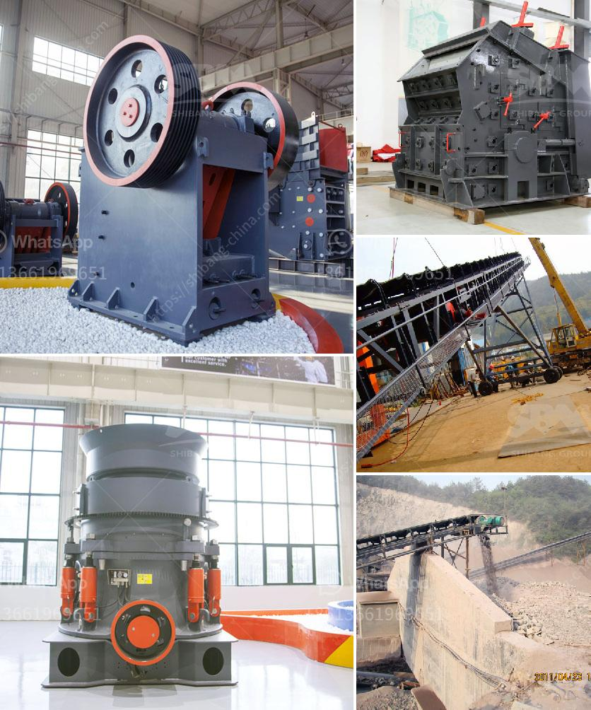

<h3>industerial ball mill for sale</h3>
Industrial ball mills are used in manufacturing processes for grinding and mixing materials such as minerals, chemicals, ceramics, and paints. With the increasing demand for high-quality materials, the need for industrial ball mills is also on the rise. If you are in the market for an industrial ball mill, there are a few things to consider before making your purchase.

One important factor to consider when purchasing an industrial ball mill is its capacity. The capacity of a ball mill is determined by its size and the amount of material it can process at a given time. Smaller ball mills are suitable for grinding and milling small batches of materials, while larger mills are capable of handling larger capacities.

Another crucial factor to consider is the material used to manufacture the ball mill. High-quality industrial ball mills are typically made of durable materials such as stainless steel or alloy steel, which can withstand the wear and tear of constant grinding and milling. These materials ensure that the ball mill can operate efficiently for a long time without needing frequent maintenance or replacement.

The design and features of the ball mill are also important considerations. Some industrial ball mills come with additional features, such as digital displays, timers, and variable speed settings, which can enhance the user experience and efficiency of the milling process. It is essential to assess the specific requirements of your manufacturing process to determine which features are necessary for your operations.

When purchasing an industrial ball mill, it is crucial to buy from a reputable and reliable supplier. A reputable supplier will ensure that the ball mill is of high quality and meets your requirements. They will also provide excellent customer service and support, including assistance with installation and troubleshooting.

The price of an industrial ball mill can vary depending on its capacity, material, design, and additional features. It is advisable to research and compare prices from different suppliers to ensure you get the best value for your money. However, it is essential to note that the cheapest option may not always be the best, as the quality and durability of the ball mill can affect its long-term performance.

In conclusion, an industrial ball mill is an essential piece of equipment in manufacturing processes. Whether you are involved in the production of minerals, chemicals, ceramics, or paints, a high-quality ball mill can enhance your operations and ensure consistent particle size reduction and mixing. By considering factors such as capacity, material, design, and supplier reputation, you can make an informed decision when purchasing an industrial ball mill.
<h3>Contact us</h3><ul><li><strong>Whatsapp:&nbsp;<a href="https://wa.me/8613661969651">+8613661969651</a></strong></li><li><a href="https://swt.shibang-china.com/?git&amp;zhl&amp;industerial ball mill for sale"><strong>Online Service(chat now)</strong></a></li></ul><h3>Related</h3><ul><li><a href='mobile stone crusher for sale in south africa.md'>mobile stone crusher for sale in south africa</a></li><li><a href='sample quarry business plan.md'>sample quarry business plan</a></li><li><a href='dust cover for screening and crushing plant.md'>dust cover for screening and crushing plant</a></li><li><a href='how to make a iron ore crusher machine.md'>how to make a iron ore crusher machine</a></li><li><a href='65 tph cone crusher complete plant.md'>65 tph cone crusher complete plant</a></li></ul>