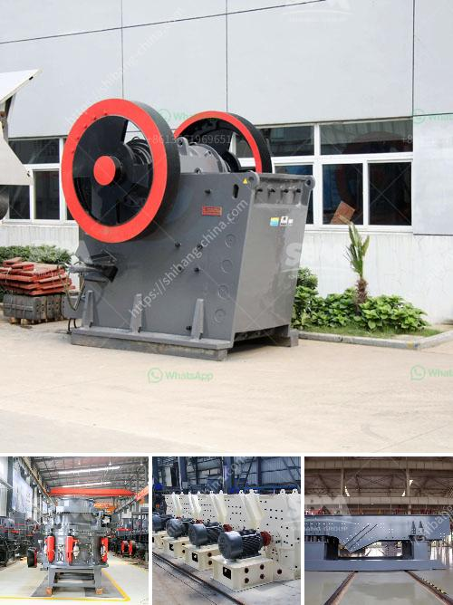

<h3>industrial vibrating screen price</h3>
When it comes to purchasing industrial equipment, price is always a significant consideration. The same applies to industrial vibrating screens, which are essential in various industries such as mining, construction, and pharmaceuticals. These screens are used to separate and sort different materials based on their size or density. However, determining the price of an industrial vibrating screen can be challenging, as it depends on several factors. In this article, we will delve into the key determinants of the price range of these screens.

The size and capacity of the vibrating screen are crucial factors influencing its price. Larger screens typically cost more due to the increased materials and labor required for their construction. Moreover, screens with higher capacity, measured in tons per hour, are generally more expensive. This is because higher capacity screens require more robust construction and stronger motors to handle the increased workload.

The materials used in the construction of an industrial vibrating screen can significantly affect its price. Screens made from high-quality stainless steel are more expensive than those made from regular steel. Stainless steel screens are preferred in industries where hygiene is paramount, such as the food processing and pharmaceutical industries. Additionally, screens made from special alloys or reinforced composite materials can be even more costly but offer increased durability and resistance to corrosion.

The motor is a vital component of the vibrating screen as it provides the necessary vibrations for efficient material separation. Motors with higher horsepower and efficiency tend to be more expensive. Powerful motors are required for screens handling heavy-duty applications or large quantities of materials. Similarly, more efficient motors consume less energy, resulting in lower operational costs in the long run. Therefore, considering the motor power and efficiency is crucial when analyzing the price of an industrial vibrating screen.

Various additional features and customization options can be implemented in industrial vibrating screens to meet specific requirements. These include adjustable screen inclination, multiple deck options, and different mesh types for enhanced particle separation. Such added features increase the versatility and effectiveness of the screen, resulting in a higher price. However, it is essential to assess the value and usefulness of these features to ensure that they are worth the additional cost.

The reputation and credentials of the manufacturer also play a significant role in determining the price of an industrial vibrating screen. Well-established manufacturers with a history of delivering high-quality products often command a premium price. This is due to the trust and assurance associated with their brand. However, it is essential to conduct thorough research and read customer reviews to ensure that the manufacturer's reputation aligns with your expectations.

In conclusion, several factors influence the price range of industrial vibrating screens. Size and capacity, construction materials, motor power and efficiency, additional features, and manufacturer reputation all contribute to the final cost. Before making a purchasing decision, it is crucial to consider the specific requirements of your industry and find the right balance between price and functionality. Compare multiple options and consult industry experts to ensure that the chosen vibrating screen offers the best value for your investment.
<h3>Contact us</h3><ul><li><strong>Whatsapp:&nbsp;<a href="https://wa.me/8613661969651">+8613661969651</a></strong></li><li><a href="https://swt.shibang-china.com/?git&amp;zhl&amp;industrial vibrating screen price"><strong>Online Service(chat now)</strong></a></li></ul><h3>Related</h3><ul><li><a href='basalt crushing production line.md'>basalt crushing production line</a></li><li><a href='barite beneficiation plant.md'>barite beneficiation plant</a></li><li><a href='barite mill saltillo.md'>barite mill saltillo</a></li><li><a href='marble processing plant in uae.md'>marble processing plant in uae</a></li><li><a href='ball mill design calculation.md'>ball mill design calculation</a></li></ul>