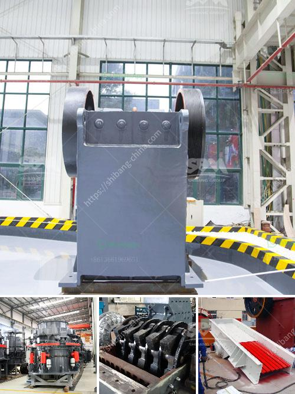

<h3>iron crushing machine</h3>
Iron, a vital element in almost every industry, has been central to mankind's progress for centuries. With its extensive use in construction, manufacturing, and transportation sectors, iron plays a crucial role in shaping our modern world. Consequently, the recycling of iron has become paramount in reducing environmental impact and conserving resources. Among the many impressive advancements in recycling technology, iron crushing machines stand out as key players. This article aims to delve into the workings, benefits, and significance of these remarkable inventions.

Iron crushing machines, also known as iron crushers or iron pulverizers, are robust mechanical devices that reduce the size and shape of iron waste materials. Equipped with powerful hydraulic jaws or hammers, these machines exert tremendous force to break down bulky iron debris into smaller, more manageable pieces with ease.

Iron crushing machines operate with exceptional efficiency, efficiently handling tons of iron waste daily. With precise control and immense crushing power, they can swiftly reduce iron scraps, damaged components, or discarded machinery into smaller fragments, ready for further recycling processes.

By pulverizing large iron waste into smaller, more homogeneous pieces, iron crushing machines contribute to optimizing the recycling process. Smaller chunks increase efficiency in further refining and melting, ensuring better resource utilization without compromising quality.

Integrating iron crushing machines in recycling facilities has led to a significant decrease in environmental pollution. By crushing iron waste, these machines confidently convert scrap into reusable materials, reducing the need for mining fresh iron ore and lowering CO2 emissions associated with the manufacturing process.

Iron crushing machines play an integral role in the steel industry. By producing smaller, uniform iron scraps, they facilitate smelting, making it easier for steel manufacturers to incorporate recycled iron into their production process. This reduces the reliance on extracting virgin iron ore, conserving resources and lowering both costs and emissions.

With the construction industry's growing focus on sustainability, iron crushing machines have become indispensable. These machines enable construction firms to recycle iron waste from demolished structures, such as reinforcement bars and beams. This recycled iron can then be utilized in new construction projects, reducing the demand for new materials and minimizing construction waste.

Iron crushing machines have revolutionized the recycling industry, presenting a compelling solution to the challenges of iron waste management. Their efficiency, resource optimization, and reduced environmental impact make them an invaluable asset across multiple sectors. With the continued development of these machines, we can expect the recycling of iron waste to become more streamlined, sustainable, and cost-effective. As we move towards a more environmentally conscious future, iron crushing machines prove their worth by transforming industrial waste into valuable resources.
<h3>Contact us</h3><ul><li><strong>Whatsapp:&nbsp;<a href="https://wa.me/8613661969651">+8613661969651</a></strong></li><li><a href="https://swt.shibang-china.com/?git&amp;zhl&amp;iron crushing machine"><strong>Online Service(chat now)</strong></a></li></ul><h3>Related</h3><ul><li><a href='steed conveyor belting.md'>steed conveyor belting</a></li><li><a href='sand washing plant for sale in uae.md'>sand washing plant for sale in uae</a></li><li><a href='coal mining equipment in spain.md'>coal mining equipment in spain</a></li><li><a href='cost of mobile stone crusher.md'>cost of mobile stone crusher</a></li><li><a href='roller mill for mantles.md'>roller mill for mantles</a></li></ul>