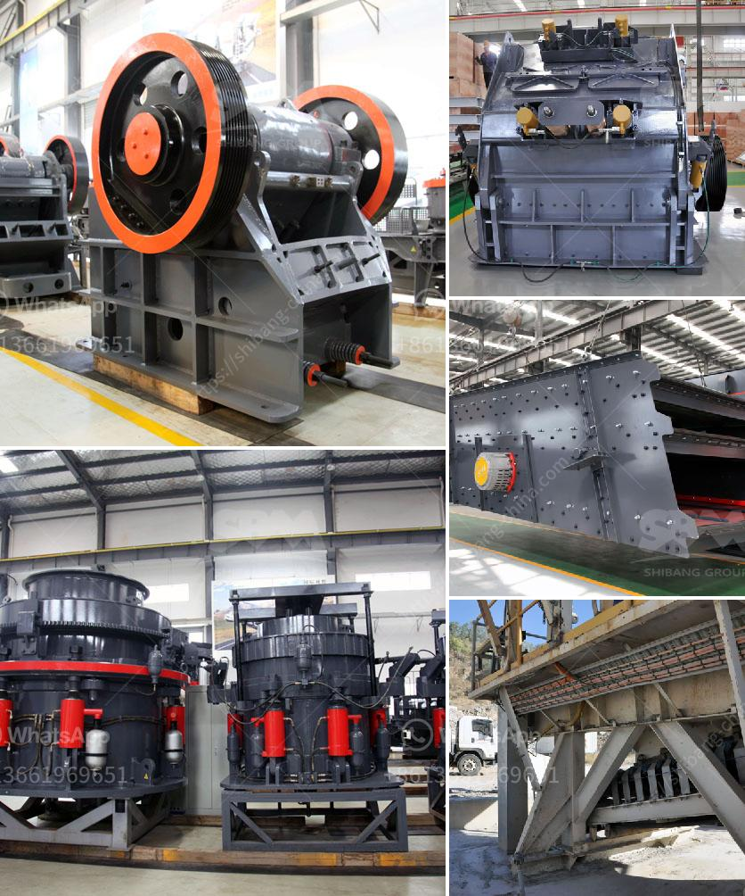

<h3>iron crushing plant</h3>
Iron is one of the most abundant metals found on Earth, making it a crucial component in various industries. As a primary raw material, iron is used in the production of steel, which is further utilized in construction, automotive manufacturing, and many other sectors. To efficiently extract and process iron ore, crushing plants play a vital role in the production chain.

A typical iron crushing plant consists of various machinery units, including a primary crusher, a secondary crusher, and a screen. Different sizes of iron ore pieces are fed into the jaw crushers for size reduction. Depending on the desired output size, the crushed material may be further crushed in the secondary or tertiary crushers. Additionally, the screening process ensures the proper separation of different sizes of iron ore particles.

The primary crusher in an iron crushing plant usually operates at a controlled feed rate to ensure a consistent and uniform supply of material to subsequent machinery. It efficiently breaks down large chunks of iron ore into smaller pieces suitable for further processing. The secondary crusher, on the other hand, takes the crushed material from the primary crusher and further reduces its size. This step is crucial for obtaining the desired size distribution required for downstream processes.

During the crushing process, iron ore is often subjected to various forces, such as compression, impact, and attrition, to break it down into smaller particles. The choice of crushers is essential to achieve the desired results. Cone crushers and impact crushers are commonly used as secondary crushers in iron crushing plants due to their ability to handle large feed sizes and produce a well-graded product.

In addition to crushers, screens are an integral part of an iron crushing plant. They separate the crushed material into different sizes, ensuring that the iron ore particles meet the specifications required for the production process. Vibrating screens are commonly employed in iron crushing plants due to their high efficiency and ability to handle large volumes of material.

To operate efficiently and maintain a consistent output, iron crushing plants require regular maintenance and inspection. This includes checking the wear and tear of the crushing equipment, lubrication, and cleaning of the machinery, as well as ensuring the screens are in good condition and free from any blockages.

In conclusion, iron crushing plants are essential in the iron and steel industry for the extraction and processing of iron ore. These plants incorporate various machinery units, including primary crushers, secondary crushers, and screens, to efficiently crush and separate iron ore particles. Their role in the production chain ensures a reliable supply of iron for numerous industries. Regular maintenance and inspection are vital to ensure the smooth operation of these plants and maximize their productivity.
<h3>Contact us</h3><ul><li><strong>Whatsapp:&nbsp;<a href="https://wa.me/8613661969651">+8613661969651</a></strong></li><li><a href="https://swt.shibang-china.com/?git&amp;zhl&amp;iron crushing plant"><strong>Online Service(chat now)</strong></a></li></ul><h3>Related</h3><ul><li><a href='hammer mill dimension for 15tph.md'>hammer mill dimension for 15tph</a></li><li><a href='cone crusher for sale.md'>cone crusher for sale</a></li><li><a href='stone crushet 10 tons.md'>stone crushet 10 tons</a></li><li><a href='crasher sand machine south africa.md'>crasher sand machine south africa</a></li><li><a href='granite crusher manufacturer.md'>granite crusher manufacturer</a></li></ul>