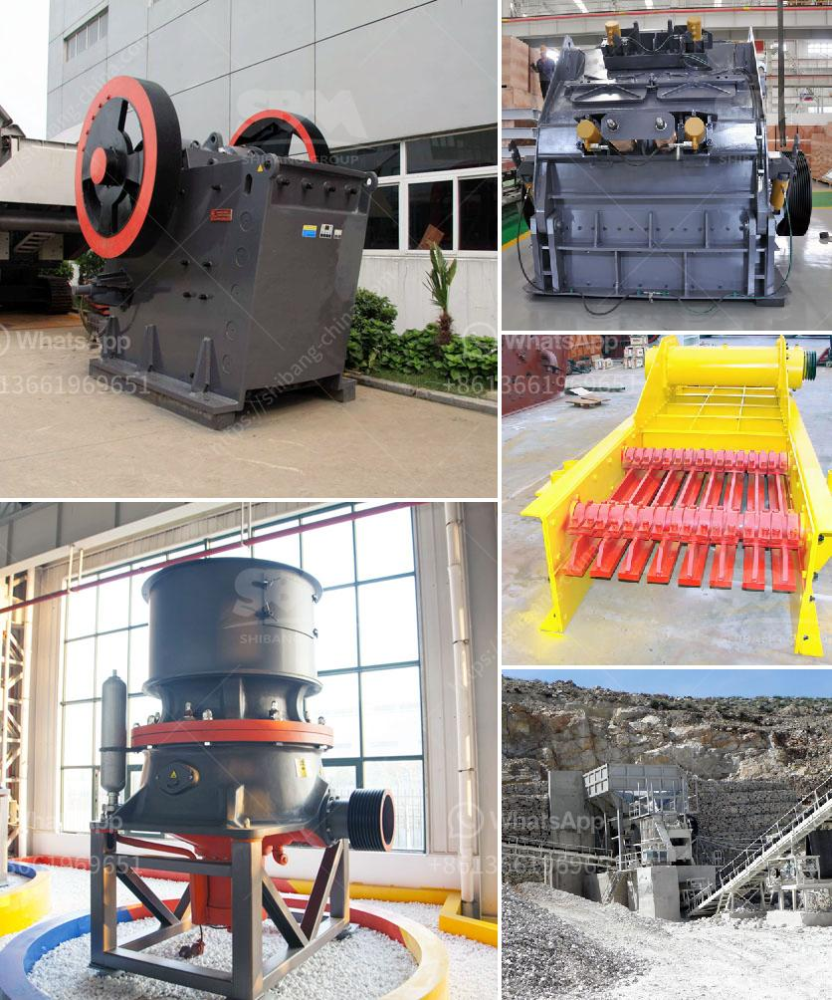

<h3>iron jaw crusher with output of mm</h3>
The iron jaw crusher is a reliable and robust piece of equipment that has been designed with the utmost care. Its main function is to crush raw materials into smaller sizes for further processing. With an output size of mm, it is suitable for various applications such as concrete recycling, river stones, demolition waste, and quarrying. 

The iron jaw crusher is known for its exceptional power and high productivity. It is equipped with a powerful motor and a sturdy structure that can withstand the harshest of conditions. Its heavy-duty construction ensures long-lasting performance, making it the ideal choice for industries that require high-volume crushing. 

One of the standout features of the iron jaw crusher is its adjustable discharge setting. This allows users to easily control the size of the output material, depending on their specific requirements. Whether coarse or fine, the crusher can be adjusted to perfect the desired end product. This flexibility makes it suitable for a wide range of applications, enabling users to produce materials of different sizes for various purposes. 

In addition to its impressive performance, the iron jaw crusher is also incredibly user-friendly. It is designed with safety in mind, featuring a protective guard that prevents any unwanted accidents. The easy-to-use controls allow operators to efficiently operate the crusher, ensuring maximum productivity and reduced downtime. Maintenance is also a breeze, thanks to its simple design and accessible components. 

Furthermore, the iron jaw crusher boasts excellent energy efficiency. It is engineered to consume less power while still delivering superior performance. This not only reduces operational costs but also minimizes the crusher's carbon footprint, making it an environmentally-friendly choice. 

Another advantage of the iron jaw crusher is its versatility. It can handle a wide variety of materials, from soft to hard and everything in between. Whether it's limestone, granite, or even ore, this crusher can effectively crush it to the desired size. This makes it suitable for a wide range of industries such as construction, mining, and recycling. 

Overall, the iron jaw crusher with an output of mm is a solid investment for any industry that requires reliable and efficient crushing. Its robust construction, adjustable discharge setting, and user-friendly design make it a valuable asset for crushing various materials. With its exceptional power and energy efficiency, it is sure to enhance productivity while minimizing costs. Whether it's for recycling, quarrying, or demolition, the iron jaw crusher is a reliable and versatile solution.
<h3>Contact us</h3><ul><li><strong>Whatsapp:&nbsp;<a href="https://wa.me/8613661969651">+8613661969651</a></strong></li><li><a href="https://swt.shibang-china.com/?git&amp;zhl&amp;iron jaw crusher with output of mm"><strong>Online Service(chat now)</strong></a></li></ul><h3>Related</h3><ul><li><a href='manufacturers peru hammer mill.md'>manufacturers peru hammer mill</a></li><li><a href='quartz stone quarry in nigeria.md'>quartz stone quarry in nigeria</a></li><li><a href='how different impact crusher and hammer mill.md'>how different impact crusher and hammer mill</a></li><li><a href='granite quarry in nigeria.md'>granite quarry in nigeria</a></li><li><a href='silica sand beneficiation plant for glass.md'>silica sand beneficiation plant for glass</a></li></ul>