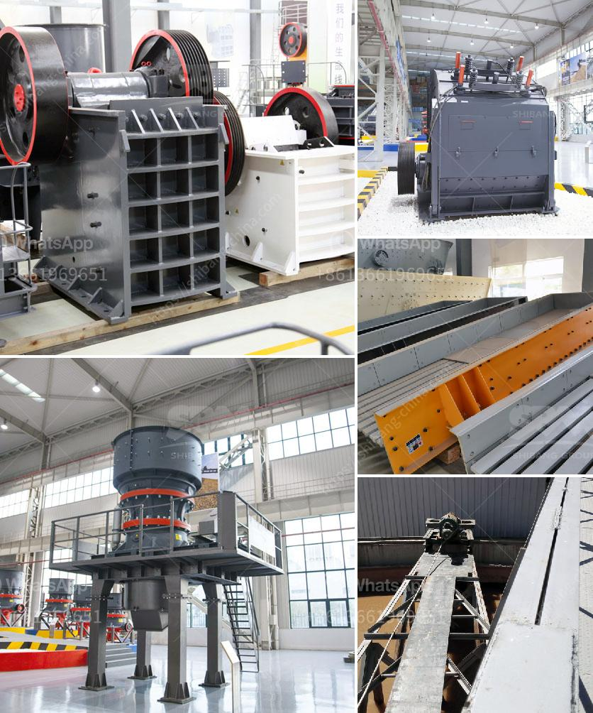

<h3>iron ore crusher machine price</h3>
Iron ore crusher machine is a powerful machine that divides the iron ore, which exists unprocessed in nature, into small pieces to process after extraction. Iron ore crusher machine is utilised as a primary crusher, secondary crusher or tertiary crusher in crushing plants and has an important role in crushing the hardest stones and mines such as iron and basalt.

Iron ore is a mineral aggregate that contains iron elemental or iron compounds that can be economically utilized. Iron ore crushing Process consists of coarse crushing, medium crushing and fine crushing. Primary crushing often includes jaw crusher and gyratory crusher. Secondary crushing usually uses impact crusher, cone crusher, or hammer crusher. Tertiary crushing usually employs vibrating screen, and sand washer producing a final product.

The price of iron ore crusher machine has always been the most concerned issue for customers when purchasing an iron ore crusher machine. To meet customers' various needs, Hongxing Machinery has successfully developed a series of iron ore crusher machines for sale. The high quality and reasonable ore crushing equipment price can bring our clients satisfaction.

Iron ore crusher machine is primary crusher machine that breaks the large scale iron ore raw materials into smaller size. The secondary crusher machine will break the iron ore particles into smaller ones and separate them from the undesired materials. From SBM, the single crusher machine and the mobile crushing plant are available.

Mobile impact crushing plant for sale will process the useless construction waste recycling materials into useful building materials. Construction Waste Recycling:

Construction waste recycling is very important in current industry. It includes some useful materials. Most of them are bricks, concrete structures, and wood materials. Demolition waste recycling:

Technology of demolition waste recycling can have a great impact. Demolition Waste Recycling Crusher Supplier In Singapore:

Construction and demolition waste forms a significant contribution to landfill a few years ago, now the proportion of construction and demolition waste recycled by Read More.

The iron ore crusher machine is the significant equipment for large scale mining and metallurgy industry. The wide range of application makes it popular in the mining industry. With the development of technology, the sales volume of iron ore processing equipment has been gradually increased, so is in the demand of small iron ore crusher machines.
<h3>Contact us</h3><ul><li><strong>Whatsapp:&nbsp;<a href="https://wa.me/8613661969651">+8613661969651</a></strong></li><li><a href="https://swt.shibang-china.com/?git&amp;zhl&amp;iron ore crusher machine price"><strong>Online Service(chat now)</strong></a></li></ul><h3>Related</h3><ul><li><a href='jaw crusher in dar es salaam.md'>jaw crusher in dar es salaam</a></li><li><a href='quarry machine manfacturer.md'>quarry machine manfacturer</a></li><li><a href='small scale crushers in south africa.md'>small scale crushers in south africa</a></li><li><a href='used excavators prices in uae.md'>used excavators prices in uae</a></li><li><a href='crusher plant manufacturers in south africa.md'>crusher plant manufacturers in south africa</a></li></ul>