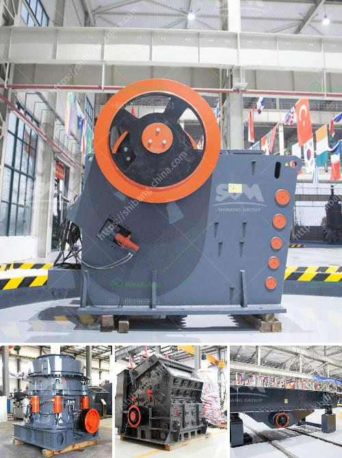

<h3>iron ore crushing plant setup cost in india</h3>
Iron ore crushing plant setup cost in India: Iron ore crushing plant setup cost in India is usually incurred in two phases: first crushing and then screening. Typically, the process involves several stages of crushing to reduce the size of the iron ore. The most commonly used system is open-circuit crushing, which means the raw materials pass through the crusher only once and ultimately become the desired size. 

One of the main factors influencing the setup cost is the size of the iron ore deposit. Large-scale production requires a substantial investment in mining equipment, including crushers, conveyors, and screening plants. Additionally, infrastructure such as power supply, water availability, and transportation networks should be considered. 

Another critical factor affecting the setup cost is the distance of the deposit from the crushing plant. If the deposit is located far from the plant, transportation costs might significantly increase the overall expenditure.  

In India, iron ore crushing plants are typically operated by local contractors, who undertake mining operations on behalf of their clients. In such cases, the setup cost includes hiring skilled labor, acquiring necessary machinery, and procuring raw materials. 

Despite these initial expenses, setting up an iron ore crushing plant in India can be a profitable venture. With the growing demand for iron ore in the country and worldwide, companies have ample opportunities to generate revenues. Moreover, the Indian government has implemented favorable policies that encourage domestic mining and the establishment of mineral processing plants. 

In conclusion, setting up an iron ore crushing plant in India entails significant upfront costs. However, the potential returns on investment and the supportive government policies make it a viable and profitable venture. As the demand for iron ore continues to rise, investing in this industry can be a prudent decision.
<h3>Contact us</h3><ul><li><strong>Whatsapp:&nbsp;<a href="https://wa.me/8613661969651">+8613661969651</a></strong></li><li><a href="https://swt.shibang-china.com/?git&amp;zhl&amp;iron ore crushing plant setup cost in india"><strong>Online Service(chat now)</strong></a></li></ul><h3>Related</h3><ul><li><a href='mobile copper ore shaking table.md'>mobile copper ore shaking table</a></li><li><a href='calcite processing machine.md'>calcite processing machine</a></li><li><a href='india stone crusher machine price in china.md'>india stone crusher machine price in china</a></li><li><a href='roll crusher zenith.md'>roll crusher zenith</a></li><li><a href='set up a quarry business.md'>set up a quarry business</a></li></ul>