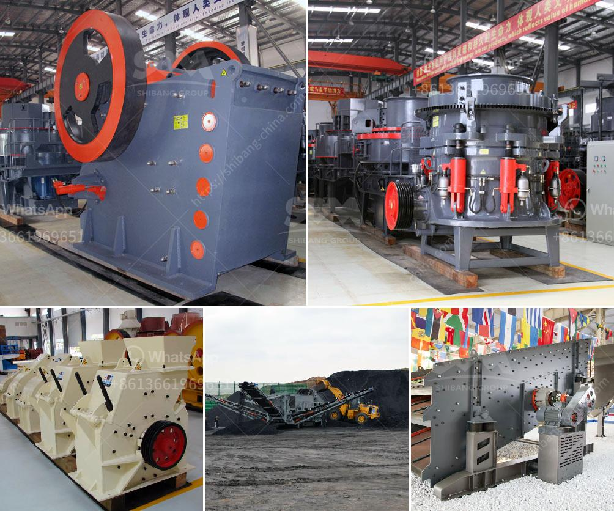

<h3>iron ore dry grinding systems</h3>
Iron ore is one of the most important materials in the global mining industry and has been used for centuries as an essential component in the production of steel. With declining ore grades and more complex ore bodies, the demand for efficient and cost-effective grinding solutions has become crucial in ore processing.

Dry grinding technology has been developing rapidly in recent years, driven by the need to improve energy efficiency and reduce water consumption in mineral processing operations. Iron ore dry grinding systems are gaining popularity due to their simplicity, low maintenance, and ability to handle high tonnages. This article will discuss the benefits and drawbacks of using dry grinding systems in iron ore processing.

One of the main advantages of dry grinding technology is its ability to process ore with a wide range of moisture content. Wet grinding requires a significant amount of water, which can lead to issues such as increased transportation costs, water scarcity in some regions, and the need for expensive water treatment facilities. Dry grinding eliminates these issues by using air or inert gases to transport the material through the mill, reducing the overall moisture content in the process.

Another advantage of dry grinding systems is their overall energy efficiency. Wet grinding processes require a substantial amount of energy to evaporate the water present in the ore, resulting in higher energy consumption compared to dry grinding. Dry grinding systems utilize less energy by utilizing the heat generated during grinding, resulting in significant energy savings.

In addition to energy savings, dry grinding systems offer advantages in terms of operational flexibility. Dry grinding systems can handle a wide range of feed sizes and product sizes, allowing for greater control over the final product specification. Moreover, dry grinding systems can be easily integrated into existing processing plants, minimizing the need for additional infrastructure and reducing the overall investment costs.

However, dry grinding systems also have some drawbacks that need to be considered. One major challenge is the generation of dust during the grinding process. The fine particles produced during dry grinding can pose a health risk to workers if not properly controlled. Therefore, effective dust suppression measures are essential to ensure a safe working environment.

Another challenge is the potential for increased wear on equipment due to the higher abrasiveness of dry-ground materials. The absence of water as a lubricant in the grinding process can accelerate wear on mill components, resulting in higher maintenance costs and downtime. Regular maintenance and the use of wear-resistant materials can help mitigate this issue.

Overall, iron ore dry grinding systems offer multiple benefits in terms of energy efficiency, operational flexibility, and water conservation. However, the generation of dust and increased wear on equipment should be carefully addressed to ensure safe and sustainable operations. As the industry continues to prioritize environmental sustainability and resource optimization, dry grinding systems are likely to play a significant role in iron ore processing in the future.
<h3>Contact us</h3><ul><li><strong>Whatsapp:&nbsp;<a href="https://wa.me/8613661969651">+8613661969651</a></strong></li><li><a href="https://swt.shibang-china.com/?git&amp;zhl&amp;iron ore dry grinding systems"><strong>Online Service(chat now)</strong></a></li></ul><h3>Related</h3><ul><li><a href='components of a limestone primary plant.md'>components of a limestone primary plant</a></li><li><a href='quarry machines for sale in kenya.md'>quarry machines for sale in kenya</a></li><li><a href='rock crusher plant.md'>rock crusher plant</a></li><li><a href='diamond river mining equipment in china.md'>diamond river mining equipment in china</a></li><li><a href='quarry business cost in india.md'>quarry business cost in india</a></li></ul>