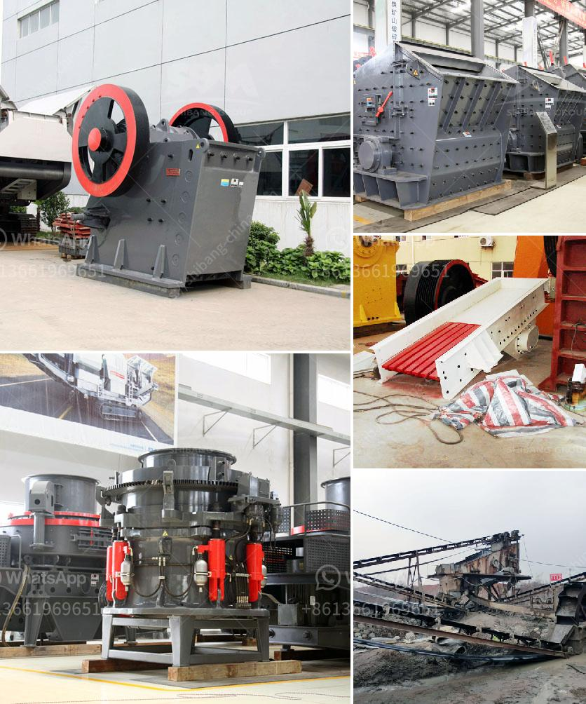

<h3>iron ore grinding ball mill</h3>
Iron ore grinding ball mill is the key equipment for grinding after the crushing process, which is widely used in the manufacture industries, such as cement, silicate, new building material, refractory material, fertilizer, ferrous metal, nonferrous metal and glass ceramics and can be used for the dry and wet grinding for all kinds of ores and other grind-able materials.

Iron ore grinding ball mill mainly consists of main part, feeding part, discharging part, rotating part and driving part (reducer, small driving gear, electric motor and electric control). The quill shaft adopts cast steel part and the liner is detachable. The rotation big gearwheel is made by cast hobbling processing and the drum is equipped with wear-resistant liner, which has good wear-resistance. The machine is stable running, reliable performance.

The iron ore grinding ball mill is equipped with a centrifugal force generated by the rotating of the cylinder. The grinding media (grinding steel balls) are the ideal grinding media widely used in the production of mining and cement industries. It can lead to the grinding media's impact and grind the materials to the required fineness. The iron ore grinding ball mill can also be divided into two forms: dry and wet grinding, which has been widely used in various industries. With the development of economy, the demand for iron ore grinding ball mill is increasing. With the continuous upgrading of grinding technology and equipment, the grinding machine has been continuously improved, and the iron ore grinding ball mill produced has been highly praised.

Iron ore is a kind of important mineral resource. With the continuous development of the national economy, the demand for iron ore is gradually increasing. It’s of great significance to develop iron ore resources reasonably and efficiently. Iron ore grinding ball mill is the most commonly used grinding equipment in iron ore beneficiation process. Grinding can help iron ore to be liberated from gangue minerals, to participate in the beneficiation process, and make the impurities separated from the iron ores.

The grinding mill has a wide range of applications in the iron ore industry. Besides, it has strong process adaptability, high grinding efficiency and energy saving. Through continuous technological innovation, the iron ore grinding ball mill has been updated and improved, which enhances the applicability and grinding efficiency of the equipment. Moreover, it has good wear resistance, long service life and easy maintenance.

In the iron ore grinding ball mill process, the machine adopts open-circuit structure, and the system is composed of short-circuit process. The process of iron ore grinding ball mill is mainly divided into three stages: crushing, grinding and separation. The ore is first crushed by jaw crusher, then the crushed ore enters the ball mill for grinding. After grinding, the ore particles are sent to the spiral classifier for classification, and the coarse sand particles are returned to the ball mill for further grinding. The fine sand particles are sent to the magnetic separator for separation, and then enter the next process for beneficiation.

In summary, the iron ore grinding ball mill is highly praised by customers and widely used in the iron ore grinding process. It is an important equipment in iron ore beneficiation process. If you have any questions about iron ore grinding ball mill, please feel free to consult.
<h3>Contact us</h3><ul><li><strong>Whatsapp:&nbsp;<a href="https://wa.me/8613661969651">+8613661969651</a></strong></li><li><a href="https://swt.shibang-china.com/?git&amp;zhl&amp;iron ore grinding ball mill"><strong>Online Service(chat now)</strong></a></li></ul><h3>Related</h3><ul><li><a href='philippines mining equipment companies.md'>philippines mining equipment companies</a></li><li><a href='how to acid washing silica sand.md'>how to acid washing silica sand</a></li><li><a href='300tpd cement plant price.md'>300tpd cement plant price</a></li><li><a href='cheap stone crushing plant.md'>cheap stone crushing plant</a></li><li><a href='how much does it cost per day to run a gold mine.md'>how much does it cost per day to run a gold mine</a></li></ul>