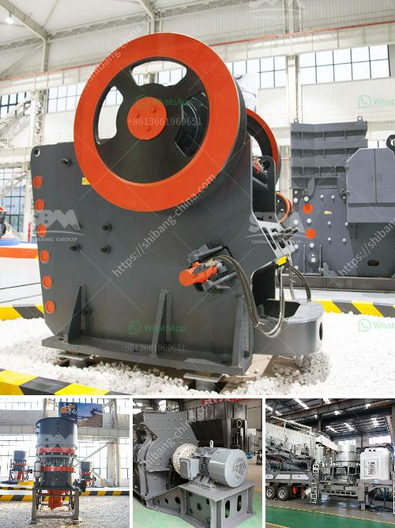

<h3>iron ore mines equipments</h3>
Iron ore mining is a highly competitive industry, with numerous players vying for market share in the global arena. To stay ahead in the race, mining companies are making massive investments in state-of-the-art equipment. These cutting-edge machines not only enhance productivity but also ensure worker safety and minimize environmental impact.

One of the key machines used in iron ore mining is the giant dump truck. These monstrous vehicles are capable of carrying huge loads of ore and are operated by skilled professionals. Their enormous size and weight enable them to transport ores from mines to processing plants or stockyards with efficiency and speed. The dump trucks used in iron ore mining typically have payload capacities of up to 400 tons, ensuring optimal efficiency and cost-effectiveness.

The extraction of iron ore from underground mines requires heavy machinery. Underground mining technology includes various drilling rigs, loaders, haul trucks, and other specialized equipment. These sophisticated machines extract iron ore from the ground safely and efficiently, allowing mining companies to increase their production without compromising worker safety.

Another crucial piece of equipment used in iron ore mining is the crusher. Crushing is the first step of mineral processing, where the ore/rocks from the mine site are fed into the mechanical equipment to reduce the size of the particles for further processing. Crushers are designed to reduce the size of ore into smaller pieces for further processing, increasing its surface area and exposing more valuable minerals.

To transport the extracted iron ore from the mine to the processing plant or stockyard, mining companies use a range of transportation equipment. Rail transport is widely used due to its efficiency and large hauling capacity. Specialized trains capable of carrying massive amounts of ore can transport the material over long distances, minimizing costs and reducing environmental impact.

In recent years, the mining industry has witnessed the advent of autonomous mining equipment. These high-tech machines use artificial intelligence and advanced sensors to improve mining operations. Autonomous trucks and drilling rigs, for example, can operate without human intervention, enhancing productivity and reducing labor costs. Furthermore, autonomous equipment eliminates the risk of injuries associated with human errors or accidents, ensuring worker safety.

Environmental considerations are also at the forefront of modern mining practices. Iron ore mining companies are investing in equipment that minimizes pollution and reduces greenhouse gas emissions. This includes utilizing energy-efficient machinery that consumes less fuel and produces lower carbon emissions. Additionally, some companies are implementing strategies to reuse and recycle water used in mining operations, reducing the overall environmental impact.

In conclusion, the iron ore mining industry relies heavily on advanced equipment to extract, transport, and process iron ore efficiently. From enormous dump trucks to powerful crushing machines, these equipment ensure optimal productivity and worker safety. As the industry progresses, mining companies are embracing sophisticated technologies like autonomous equipment to enhance efficiency and reduce environmental impact. With ongoing advancements in equipment and technology, the future of iron ore mining looks promising as companies strive to stay ahead in this competitive arena.
<h3>Contact us</h3><ul><li><strong>Whatsapp:&nbsp;<a href="https://wa.me/8613661969651">+8613661969651</a></strong></li><li><a href="https://swt.shibang-china.com/?git&amp;zhl&amp;iron ore mines equipments"><strong>Online Service(chat now)</strong></a></li></ul><h3>Related</h3><ul><li><a href='barytes pulverizer mill for sale india.md'>barytes pulverizer mill for sale india</a></li><li><a href='jaw crusher diagram.md'>jaw crusher diagram</a></li><li><a href='double jaw crusher.md'>double jaw crusher</a></li><li><a href='production of cement in guinee.md'>production of cement in guinee</a></li><li><a href='roller crusher for coal.md'>roller crusher for coal</a></li></ul>