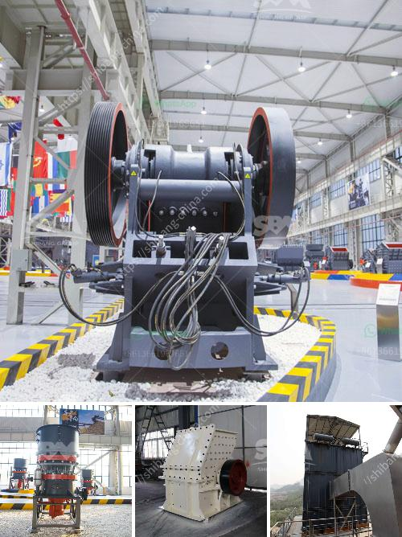

<h3>iron ore pellet plant technology suppliers</h3>
Iron ore pellet plants are facilities that transform raw iron ore into pellets, which are considered a more efficient and manageable form of the mineral. Various companies specialized in this field provide a range of comprehensive solutions, including technological advancements that enhance productivity, reduce emissions, and optimize the use of resources. With their expertise and innovation, iron ore pellet plant technology suppliers play a crucial role in the development and growth of the industry.

One prominent iron ore pellet plant technology supplier is Outotec. The company offers various process solutions, such as traveling grate pelletizing, grate kiln systems, and gas cleaning systems. Their cutting-edge technologies ensure high-quality pellets while minimizing environmental impact. Outotec’s traveling grate pelletizing technology enables the production of uniform pellets with excellent physical and metallurgical properties. This technology is known for its flexibility, allowing it to adapt to different raw materials and process conditions.

Another key player in the field is Metso Outotec, formed through a merger between Metso and Outotec. They provide comprehensive solutions for pelletizing plants, including technological expertise, equipment, and services. Metso Outotec’s solutions focus on ensuring sustainable pellet production. For instance, the company’s Circular Pelletizing Technology is a groundbreaking innovation that enables the use of various raw materials, such as fines, dust, sludge, and biomass, without the need for pre-processing. This technology promotes resource efficiency and reduces energy consumption.

FLSmidth is another well-known technology supplier for iron ore pellet plants. Their solutions cover the entire pelletizing process, from raw material handling to pellet discharge. FLSmidth’s portfolio includes innovative technologies such as the Grate-Kiln system, which combines a grate and rotary kiln for efficient pellet production. This technology ensures uniform pellet quality while offering versatility in terms of raw materials and process flexibility. FLSmidth also provides services for plant optimization, maintenance, and upgrades to enhance operational efficiency.

Additionally, companies like Kobe Steel Ltd. offer advanced pelletizing solutions. Kobe Steel’s iron ore pelletizing process utilizes the Straight Grate method, which consists of a traveling grate, rotary kiln, and an annular cooler. This technology ensures the production of high-quality pellets with consistent physical and metallurgical properties. Kobe Steel’s extensive experience in the industry makes them a reliable choice for iron ore pellet plant technology.

The continuous development of iron ore pellet plant technology is crucial for the efficiency and sustainability of the industry. These technology suppliers play a vital role in driving innovation and providing solutions that optimize production processes, reduce environmental impact, and enhance energy efficiency. As the demand for iron ore pellets continues to rise, these suppliers will continue to advance their technologies, ensuring the industry's long-term growth and development.
<h3>Contact us</h3><ul><li><strong>Whatsapp:&nbsp;<a href="https://wa.me/8613661969651">+8613661969651</a></strong></li><li><a href="https://swt.shibang-china.com/?git&amp;zhl&amp;iron ore pellet plant technology suppliers"><strong>Online Service(chat now)</strong></a></li></ul><h3>Related</h3><ul><li><a href='bauxite crusher design.md'>bauxite crusher design</a></li><li><a href='grinding mill for limestone italy.md'>grinding mill for limestone italy</a></li><li><a href='aggregate crusher plant layout.md'>aggregate crusher plant layout</a></li><li><a href='bauxite crusher manufacturer in china mill gold.md'>bauxite crusher manufacturer in china mill gold</a></li><li><a href='iron ore crushing plant setup cost in india.md'>iron ore crushing plant setup cost in india</a></li></ul>