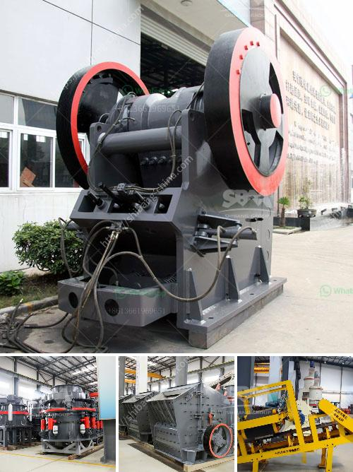

<h3>iron ore processing plant in mexico</h3>
Iron ore is one of Mexico's most important mining products and the country is the world's ninth largest producer of the raw material. With an annual production of 35 million tonnes, Mexico is home to various world-class iron ore processing plants. The process of extracting iron ore from the ground can be described in various stages including blasting, hauling, crushing, and grinding. Iron ore occurs in deposits of different shapes, sizes, and grades, ranging from solid minerals to fines and concentrate.

One of Mexico's most prominent iron ore processing plants is located in the coastal city of Manzanillo. This processing facility, built in the late 1970s, initially focused on magnetite iron ore, also known as lodestone, which is found abundantly in the region. This plant is capable of producing 2.5 million tonnes of concentrate annually. Magnetite ore requires extensive processing to remove impurities and increase its iron content, making it suitable for further use in the steel industry.

The process of iron ore beneficiation begins with the crushing and grinding of crude ore. After this step, the ore undergoes a series of blending, gravity separation, and magnetic separation processes. The purpose is to increase the iron content and remove impurities such as silica, alumina, and phosphorus. The resulting concentrate is then transported to a pelletizing plant for further processing.

In the pelletizing plant, the concentrate is mixed with binders and additives before being formed into small balls called pellets. These pellets are then subjected to heat treatment in furnaces to strengthen them and improve their physical properties. The final product is a high-quality iron ore pellet that can be used in blast furnaces in the steelmaking process.

The iron ore processing plant in Mexico is also equipped with some advanced technological equipment to improve the efficiency of the entire process. For example, the plants are equipped with autogenous grinding (AG) mills and ball mills to optimize the grinding process. The use of AG mills reduces the grinding media consumption and lowers the operational costs.

Additionally, the plants are equipped with high-efficiency magnetic separators, which separate the magnetic particles from the non-magnetic particles. This process allows for further concentration of iron ore and ensures the purity of the final product.

The iron ore processing industry in Mexico not only contributes to the country's economic growth but also plays a crucial role in the global steel industry. The processed iron ore from Mexico finds its way into various steel products, including cars, appliances, buildings, and infrastructure projects. In turn, these products contribute to the development and progress of society.

The iron ore processing plant in Mexico exemplifies the country's commitment to sustainable mining practices and environmental stewardship. The plants are equipped with modern pollution control systems to minimize air and water emissions. Additionally, the mining companies actively reforest and rehabilitate the areas disturbed by mining activities, ensuring the conservation of flora and fauna.

In conclusion, the iron ore processing plants in Mexico play a key role in the country's mining industry and global steel production. These plants employ advanced technologies to extract, process, and produce high-quality iron ore pellets. With a focus on sustainability, the industry continues to contribute to Mexico's economic growth while ensuring minimal environmental impact.
<h3>Contact us</h3><ul><li><strong>Whatsapp:&nbsp;<a href="https://wa.me/8613661969651">+8613661969651</a></strong></li><li><a href="https://swt.shibang-china.com/?git&amp;zhl&amp;iron ore processing plant in mexico"><strong>Online Service(chat now)</strong></a></li></ul><h3>Related</h3><ul><li><a href='roll wheel pulverizer.md'>roll wheel pulverizer</a></li><li><a href='principle of jaw crusher operation.md'>principle of jaw crusher operation</a></li><li><a href='mineral cribado cantera planta trituradora.md'>mineral cribado cantera planta trituradora</a></li><li><a href='machine for crushing stones.md'>machine for crushing stones</a></li><li><a href='diamants usine de lavage mobiles.md'>diamants usine de lavage mobiles</a></li></ul>