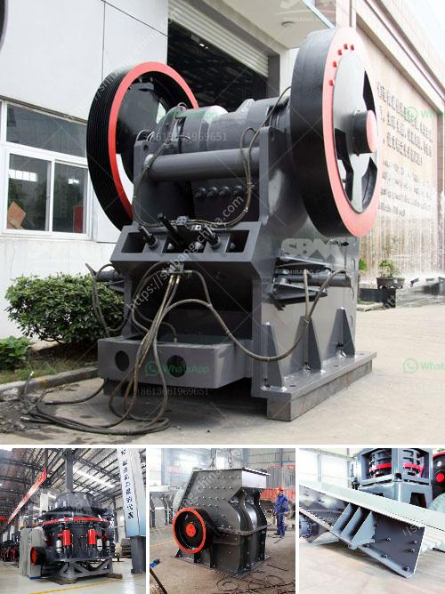

<h3>iron ore used crusher machine</h3>
Iron ore is one of the most abundant resources in the world, and its mining and extraction have been essential for industrial development and economic growth. To extract iron from its raw ore, iron ore needs to be crushed into small particles for convenient processing. As a result, the iron ore used crusher machine plays a significant role in the iron ore beneficiation process.

The iron ore crusher machine is the most widely used crushing equipment in the entire production line. It is mainly used to crush iron ore into small particles for further processing. In modern production, the crushing process is usually divided into several stages: primary crushing, secondary crushing, and tertiary crushing.

In the primary crushing stage, the iron ore is fed into a jaw crusher, which can crush large stones into smaller sizes. The jaw crusher uses a stationary jaw plate and a moving jaw plate to create a V-shaped crushing chamber. As the material enters the crushing chamber, the jaws exert force on it, breaking it into smaller pieces.

After the primary crushing stage, the iron ore is further crushed into smaller particles by a cone crusher or impact crusher. Depending on the requirements of the desired end product, these secondary crushers can produce different sizes of crushed iron ore.

In the final stage of the crushing process, a tertiary crusher is used to further reduce the iron ore into even smaller sizes. This crusher is usually a vertical shaft impactor (VSI) crusher, which uses velocity and impact energy to break the ore into smaller particles. The final product size can be adjusted by changing the rotor speed or the gap between the anvils.

The iron ore used crusher machine has many advantages. Firstly, it has high crushing efficiency and can process large amounts of iron ore to meet the production needs. Secondly, it has a wide range of applications and can be used for crushing various types of iron ore, such as magnetite, hematite, and limonite. Lastly, the machine is reliable and durable, with a low operating cost, making it a cost-effective choice for iron ore processing.

In conclusion, the iron ore used crusher machine is a crucial equipment in the iron ore beneficiation process. It effectively reduces the size of iron ore particles and prepares them for further processing. With its high crushing efficiency and wide range of applications, it plays an important role in the iron ore mining industry.
<h3>Contact us</h3><ul><li><strong>Whatsapp:&nbsp;<a href="https://wa.me/8613661969651">+8613661969651</a></strong></li><li><a href="https://swt.shibang-china.com/?git&amp;zhl&amp;iron ore used crusher machine"><strong>Online Service(chat now)</strong></a></li></ul><h3>Related</h3><ul><li><a href='caterpillar impact crusher.md'>caterpillar impact crusher</a></li><li><a href='quarry stone machine in uk.md'>quarry stone machine in uk</a></li><li><a href='cost to setup cement plant industry.md'>cost to setup cement plant industry</a></li><li><a href='prices crusher prices gypsum crusher prices.md'>prices crusher prices gypsum crusher prices</a></li><li><a href='mobile crusher unit.md'>mobile crusher unit</a></li></ul>