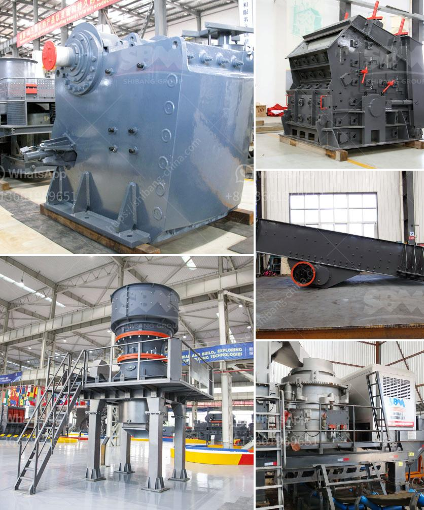

<h3>italia crusher machine</h3>
Italy is renowned around the world for its craftsmanship and excellence in many industries, including the manufacturing sector. One particular industry where Italy has established a prominent presence is the crusher machine industry. Italian companies have been at the forefront of developing innovative and efficient crushers that deliver high-quality output while also ensuring environmental sustainability.

Italian crusher machines are highly versatile and can be used in various applications, such as mining, construction, and recycling. These machines have been designed to withstand the harsh working conditions, delivering exceptional performance and reliability. The key to the success of Italian crushers lies in their robust construction, utilizing high-quality materials and advanced technologies.

One notable Italian crusher machine is the MB Crusher bucket. This unique attachment enables excavators to crush large rocks into manageable sizes, eliminating the need for additional crushing equipment. The MB Crusher bucket is ideal for any construction or mining project, as it drastically reduces the costs associated with transporting and disposing of materials.

Another Italian crusher machine that has gained popularity is the stone crusher. Designed to easily and effortlessly break down stones into different sizes, stone crushers are commonly used in the construction industry, providing an effective solution for homeowners and contractors alike. These machines are easy to operate, allowing operators to quickly adjust the output size according to their needs.

Furthermore, Italian crusher machines are also at the forefront of technological advancements. Many crushers are equipped with intelligent systems that optimize performance and minimize downtime. These features include automated settings, remote monitoring, and maintenance notification systems. With these technologies, operators can easily monitor the efficiency of the machine and detect any potential issues, maximizing productivity and reducing the risk of breakdowns.

Additionally, Italian crusher machines are designed with environmental sustainability in mind. Many companies prioritize eco-friendly manufacturing processes and materials, ensuring that their crushers have a minimal impact on the environment. From energy-efficient motors to reduced noise emissions, these crushers are engineered to meet stringent environmental standards.

In conclusion, the Italian crusher machine industry continues to thrive in delivering high-quality crushing solutions to various sectors. The combination of excellent craftsmanship, advanced technology, and environmental sustainability sets Italian crushers apart from the competition. Whether it's the MB Crusher bucket or a stone crusher, these machines provide cost-effective and efficient solutions for a wide range of applications. With ongoing research and development, we can expect to see even more innovative Italian crusher machines in the near future.
<h3>Contact us</h3><ul><li><strong>Whatsapp:&nbsp;<a href="https://wa.me/8613661969651">+8613661969651</a></strong></li><li><a href="https://swt.shibang-china.com/?git&amp;zhl&amp;italia crusher machine"><strong>Online Service(chat now)</strong></a></li></ul><h3>Related</h3><ul><li><a href='sand conveyors for rent.md'>sand conveyors for rent</a></li><li><a href='production of cement in guinee.md'>production of cement in guinee</a></li><li><a href='kaolin clay processing line.md'>kaolin clay processing line</a></li><li><a href='concrete recycling crushing machine.md'>concrete recycling crushing machine</a></li><li><a href='methods of hammer mill.md'>methods of hammer mill</a></li></ul>