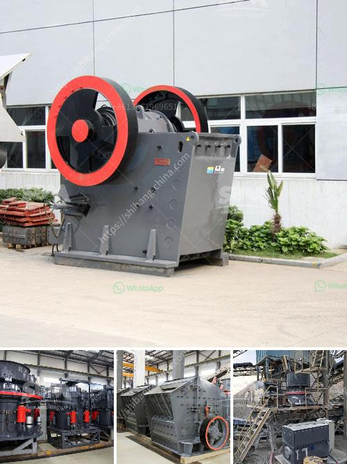

<h3>italia dry production line supplier</h3>
Italy has long been known for its rich heritage in craftsmanship and design, and their contribution to the manufacturing industry is no exception. With an emphasis on quality, precision, and innovation, Italian production line suppliers have become sought after worldwide. One such leader in the industry is Italia Dry, who has revolutionized production line solutions for various industries.

Italia Dry is a distinguished supplier of high-quality dry production lines, catering to industries like food processing, pharmaceuticals, cosmetics, and more. Their commitment to excellence and customer satisfaction has made them a trusted partner for businesses globally.

One of the key factors that have distinguished Italia Dry from its competitors is its emphasis on innovation. They consistently invest in research and development to bring cutting-edge technologies and techniques to their production lines. This results in improved efficiency, reduced downtime, and increased overall productivity. By continuously evolving their solutions, Italia Dry has become a frontrunner in the industry, helping their clients stay at the forefront of their respective markets.

The versatility of Italia Dry's production lines is another reason for their success. They offer tailor-made solutions that address the specific needs and requirements of their clients. Italia Dry understands that every industry has unique challenges, and therefore, their production lines are designed to accommodate various materials, production volumes, and specific processes. Whether it is a small-scale operation or a large-scale industrial facility, Italia Dry has the expertise to provide efficient and effective production line solutions.

Moreover, Italia Dry prioritizes sustainability throughout their manufacturing process. They strive to minimize their environmental impact by incorporating energy-saving technologies and reducing waste generation. Their production lines are designed to optimize resource utilization while still maintaining high levels of productivity. By adhering to stringent sustainability practices, Italia Dry not only benefits the environment but also assists their clients in meeting their own sustainability goals.

An essential aspect of Italia Dry's success as a production line supplier is their commitment to customer service. They provide comprehensive support services, from the initial consultation and planning stages to installation, training, and ongoing maintenance. Their team of experts works closely with clients to understand their unique requirements and ensure that the production line solution provided meets or exceeds their expectations.

Furthermore, Italia Dry's dedication to quality is uncompromising. They employ a rigorous quality control process at every stage of production, from sourcing materials to final inspections. This guarantees that their production lines meet the highest industry standards and consistently deliver exceptional results.

In conclusion, Italia Dry has established itself as a leading supplier of dry production lines, thanks to its relentless pursuit of innovation, versatility, sustainability, and commitment to customer satisfaction. By integrating advanced technologies and offering tailored solutions, Italia Dry has become a trusted partner for businesses in various industries. With the ever-increasing demand for efficient and sustainable manufacturing processes, Italia Dry continues to shape the future of the manufacturing industry.
<h3>Contact us</h3><ul><li><strong>Whatsapp:&nbsp;<a href="https://wa.me/8613661969651">+8613661969651</a></strong></li><li><a href="https://swt.shibang-china.com/?git&amp;zhl&amp;italia dry production line supplier"><strong>Online Service(chat now)</strong></a></li></ul><h3>Related</h3><ul><li><a href='used conveyor belt for sale europe.md'>used conveyor belt for sale europe</a></li><li><a href='granite machine concrete.md'>granite machine concrete</a></li><li><a href='construction of a clinker plant.md'>construction of a clinker plant</a></li><li><a href='granite crushing plant in sri lanka.md'>granite crushing plant in sri lanka</a></li><li><a href='calcium carbonate process flow diagram.md'>calcium carbonate process flow diagram</a></li></ul>