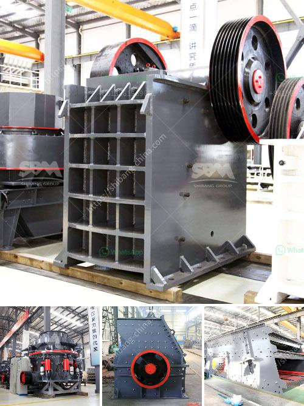

<h3>japan crusher equipment</h3>
Japan is known for its advanced technology and innovative machines. While many industries rely on this technology, one particular sector that stands out is the construction and mining equipment industry. Japan crusher equipment is a prime example of this impressive technology.

Crushers are an integral part of the quarrying and mining industry, where they are used to break down larger rocks into smaller stones, gravel, or even dust particles. Through various processes, crushers reduce the size of the materials down to a desired size for further processing or use.

When it comes to crusher equipment, Japan leads the way. Japanese manufacturers such as Komatsu, Hitachi, Kubota, and others have developed cutting-edge crushers with advanced features and impressive capabilities. These manufacturers have established themselves as global leaders in the crusher equipment industry due to their commitment to quality, reliability, and innovation.

One aspect that sets Japan crusher equipment apart is its efficiency and productivity. Japanese crushers are designed to maximize output while minimizing the time and effort required for maintenance and servicing. This efficiency ensures that construction and mining projects can be completed within deadlines and budgets.

Moreover, Japan crusher equipment prioritizes safety. These machines are equipped with state-of-the-art safety features to protect operators and workers during operation. These features include anti-lock braking systems, emergency stop buttons, and advanced sensors that prevent accidents and injuries in the workplace.

Another remarkable feature of Japan crusher equipment is its versatility. These machines can handle a wide range of materials, from soft limestone to hard granite, allowing construction and mining companies to optimize their operations. Whether the project requires the production of aggregates for concrete or the extraction of valuable minerals, Japanese crushers deliver superior performance.

In terms of technology, Japan crusher equipment is at the forefront of innovation. Manufacturers continuously invest in research and development to introduce new features and improvements to their machines. From automated control systems to intelligent sensors, these advancements enhance the efficiency, reliability, and precision of crushers, ultimately benefiting the end users.

In addition to technological advancements, Japan crusher equipment is known for its durability. Japanese manufacturers use high-quality materials and stringent quality control measures to ensure that their machines withstand the harshest operating conditions. This durability translates into long-lasting, reliable equipment that minimizes downtime and maximizes productivity.

As environmental concerns continue to grow worldwide, Japan crusher equipment also incorporates eco-friendly practices. Manufacturers strive to reduce energy consumption and emissions while optimizing efficiency. They focus on developing crushers that have minimal impact on the environment without compromising performance.

In conclusion, Japan crusher equipment showcases the country's commitment to technological advancement, efficiency, and sustainability. With cutting-edge features, superior performance, and a strong emphasis on safety and durability, Japanese crushers are in high demand globally. As the construction and mining industries evolve, Japan's crusher equipment will continue to play a vital role in facilitating efficient and sustainable operations.
<h3>Contact us</h3><ul><li><strong>Whatsapp:&nbsp;<a href="https://wa.me/8613661969651">+8613661969651</a></strong></li><li><a href="https://swt.shibang-china.com/?git&amp;zhl&amp;japan crusher equipment"><strong>Online Service(chat now)</strong></a></li></ul><h3>Related</h3><ul><li><a href='crusher machine for sale in ethiopia.md'>crusher machine for sale in ethiopia</a></li><li><a href='difference between pebble and rock.md'>difference between pebble and rock</a></li><li><a href='mineral cribado cantera planta trituradora.md'>mineral cribado cantera planta trituradora</a></li><li><a href='pf series impact crusher.md'>pf series impact crusher</a></li><li><a href='dolomite powder mill india.md'>dolomite powder mill india</a></li></ul>