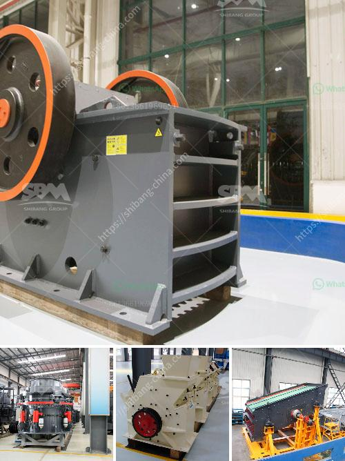

<h3>japan used crushers</h3>
Japan is renowned for its advanced manufacturing technologies and machinery. Among its many industries, the mining and construction sector plays a crucial role in driving the country's economy. Crushers are essential equipment used in these industries for crushing rock and other materials into smaller, more manageable sizes. Japan is known for its high-quality crushers that are extensively used worldwide.

Japanese crushers are highly reliable and durable, ensuring efficient performance even in the most demanding conditions. They are equipped with cutting-edge technology and innovative features to enhance productivity and reduce downtime. Furthermore, Japan is renowned for its emphasis on product research and development, leading to continuous improvements in crusher designs and performance.

When it comes to used crushers, Japan offers a wide range of options. The second-hand crusher market in Japan is thriving, with various types and models available for purchase. Whether it's a jaw crusher, cone crusher, impact crusher, or other types, Japan has a vast inventory to cater to diverse customer needs.

One of the key advantages of purchasing used crushers from Japan is their excellent condition. The Japanese take great care of their machinery, ensuring regular maintenance and servicing. Therefore, used crushers from Japan are often in pristine condition, providing excellent value for money. Additionally, these crushers are often available at competitive prices, making them an attractive option for businesses looking to expand their equipment inventory without breaking the bank.

Moreover, Japan's used crusher market offers one of the widest selections available. With a thriving domestic market and a reputation for high-quality machinery, Japan has a massive pool of used crushers to choose from. This means businesses can find the perfect crusher that suits their specific requirements and preferences.

In conclusion, Japan's used crushers are highly sought-after worldwide due to their reliability, durability, and advanced technology. With a vast inventory and excellent condition, these crushers provide excellent value for money. Whether businesses are looking for a jaw crusher, cone crusher, or any other type of used crusher, Japan is sure to have the perfect one to meet their needs.
<h3>Contact us</h3><ul><li><strong>Whatsapp:&nbsp;<a href="https://wa.me/8613661969651">+8613661969651</a></strong></li><li><a href="https://swt.shibang-china.com/?git&amp;zhl&amp;japan used crushers"><strong>Online Service(chat now)</strong></a></li></ul><h3>Related</h3><ul><li><a href='cost of grinding machines.md'>cost of grinding machines</a></li><li><a href='equipment used for crushing in activated carbon.md'>equipment used for crushing in activated carbon</a></li><li><a href='limestone crushing screening plant sandtrap.md'>limestone crushing screening plant sandtrap</a></li><li><a href='mini copper ore extraction plant.md'>mini copper ore extraction plant</a></li><li><a href='portable sand grinding machine.md'>portable sand grinding machine</a></li></ul>