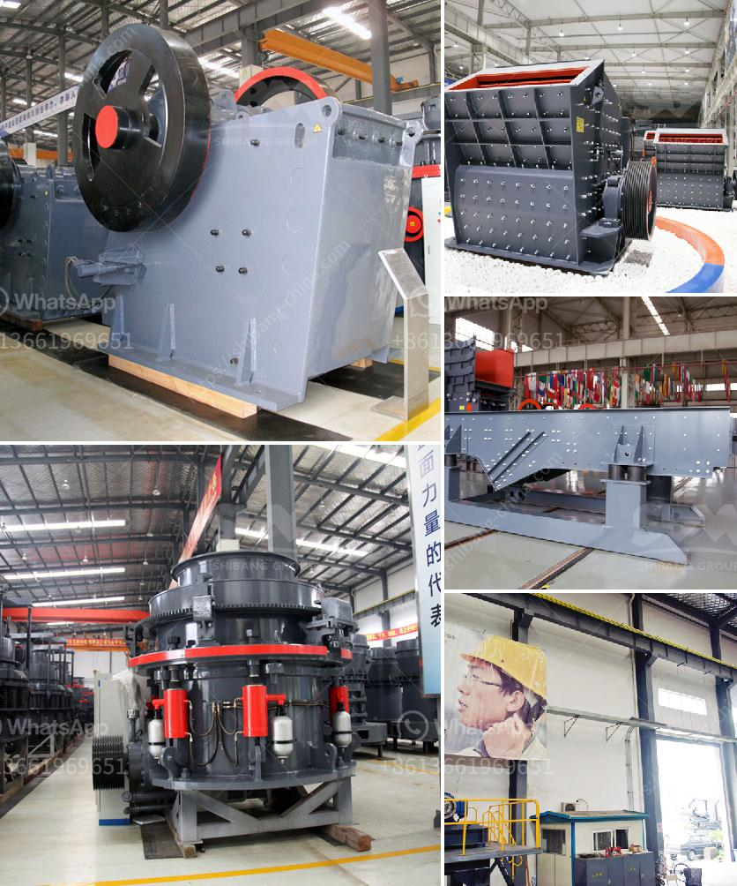

<h3>jaw crusher 30 x 12</h3>
The jaw crusher 30 x 12 is widely used in the mining industry, building materials industry, metallurgy industry, and chemical industry. It is a jaw crusher with a feed opening size of 30 inches x 12 inches and a maximum feed size of 500mm. It has a crushing capacity of between 50-80tph, depending on the material and application.

The jaw crusher 30 x 12 is designed to crush rocks and aggregates into smaller particles for further processing in various industries. It is ideal for primary crushing, as it can handle a large amount of material and reduce it to a size suitable for secondary crushing or even tertiary crushing.

One of the key features of the jaw crusher 30 x 12 is its simple and sturdy construction. It is made up of strong and durable materials that can withstand heavy usage and tough environments. The fixed jaw and the movable jaw are made of high-quality manganese steel, which provides excellent wear resistance and long service life.

The jaw crusher 30 x 12 is equipped with a powerful motor that provides efficient crushing performance. It is also equipped with a hydraulic system that allows for easy adjustment of the CSS (closed side setting) to control the size of the final product. This allows for greater flexibility in the application of the crusher, as it can produce different sizes of crushed material based on the specific requirements.

The jaw crusher 30 x 12 has a simple operating principle. The material is fed into the crushing chamber through the vibrating feeder, and the motor drives the eccentric shaft to rotate, causing the movable jaw to move back and forth. As the material is crushed between the fixed jaw and the movable jaw, it is gradually reduced in size until it reaches the desired size and is discharged through the discharge opening.

The jaw crusher 30 x 12 offers several advantages for users. Its large feed opening size allows for easy feeding of large rocks and reduces the risk of blockages. It can handle a wide range of materials, from soft to hard, and is capable of producing high-quality and uniform-sized aggregates.

In addition, the jaw crusher 30 x 12 has a low operating cost. It consumes less energy compared to other crushers in its class, making it more cost-effective to operate and maintain. It also requires minimal maintenance, thanks to its robust construction and high-quality components.

In conclusion, the jaw crusher 30 x 12 is a reliable and efficient crushing machine that is suitable for various applications in the mining, construction, and aggregate industries. Its simple and sturdy construction, along with its powerful motor and hydraulic system, make it a versatile and cost-effective choice for primary crushing operations. Whether you need to crush rocks, ores, or construction materials, the jaw crusher 30 x 12 can deliver the performance and reliability you need.
<h3>Contact us</h3><ul><li><strong>Whatsapp:&nbsp;<a href="https://wa.me/8613661969651">+8613661969651</a></strong></li><li><a href="https://swt.shibang-china.com/?git&amp;zhl&amp;jaw crusher 30 x 12"><strong>Online Service(chat now)</strong></a></li></ul><h3>Related</h3><ul><li><a href='ball mill pictures.md'>ball mill pictures</a></li><li><a href='mining equipment for hire zimbabwe.md'>mining equipment for hire zimbabwe</a></li><li><a href='5hp industrial crusher mill.md'>5hp industrial crusher mill</a></li><li><a href='ball mills antapaccay.md'>ball mills antapaccay</a></li><li><a href='roll ball mill industries.md'>roll ball mill industries</a></li></ul>