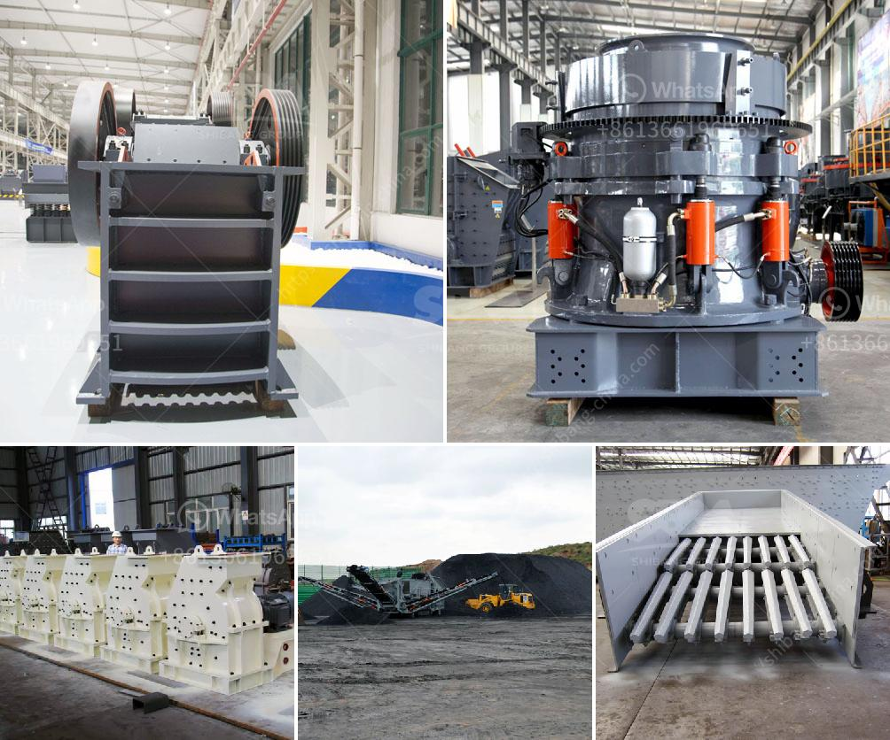

<h3>jaw crusher 600x900 indonesia</h3>
The jaw crusher machine is one of the most widely used crushing equipment in mining and quarry industry. It is ideally suitable for primary and secondary crushing with low power consumption and easy maintenance. Jaw crusher 600x900 indonesia is used for gravel and construction waste processing. Due to the limited natural resources, Indonesia is now making use of the construction waste processing project, aiming to reduce the environmental pollution. As a result, jaw crusher 600x900 Indonesia has been widely used in large-scale infrastructure construction projects.

The jaw crusher machine is powerful and efficient. It crushes stones or rocks with high hardness materials such as quartz, granite, basalt, river pebble, limestone, etc. And it is widely used in various industries such as mining, smelting, building materials, highway, railway, water conservancy, chemical industry and so on. With the continuous development of infrastructure construction in Indonesia, the demand for jaw crusher 600x900 Indonesia is increasing.

The jaw crusher 600x900 Indonesia is unique due to its crushing process and large feed opening. It is designed with a deep “V” shape crushing cavity, which ensures that the materials can be evenly crushed and increases the crushing capacity. It also has a large feed opening, which can allow the material to enter the crushing chamber directly and quickly without any obstacles. Additionally, the jaw crusher machine is equipped with a hydraulic system, which can adjust the discharge size according to customers' requirements.

The jaw crusher 600x900 Indonesia has a wide range of applications in various industries. For example, it can be used for the primary crushing of limestone, coal gangue, granite, basalt, river pebble and other materials. It can also be used for the secondary and fine crushing of various materials. Therefore, it can meet the different needs of customers in different industries.

One of the advantages of the jaw crusher 600x900 Indonesia is its high efficiency and low operation cost. It can crush large stones or rocks into smaller ones with high crushing efficiency. Meanwhile, it has low power consumption, which can save energy and reduce operating costs. In addition, the jaw crusher machine has a simple structure and reliable operation. It is easy to adjust the discharge port and replace the worn parts, which can save maintenance time and improve production efficiency.

In conclusion, the jaw crusher 600x900 Indonesia is a powerful and efficient machine designed for gravel and construction waste processing. It has a deep “V” shape crushing cavity and a large feed opening, which can crush stones or rocks with high hardness materials. It has a wide range of applications and can meet the different needs of customers in various industries. With its high efficiency, low operation cost, simple structure and reliable operation, the jaw crusher 600x900 Indonesia is becoming more and more popular in the Indonesian market.
<h3>Contact us</h3><ul><li><strong>Whatsapp:&nbsp;<a href="https://wa.me/8613661969651">+8613661969651</a></strong></li><li><a href="https://swt.shibang-china.com/?git&amp;zhl&amp;jaw crusher 600x900 indonesia"><strong>Online Service(chat now)</strong></a></li></ul><h3>Related</h3><ul><li><a href='portable rock crusher machine.md'>portable rock crusher machine</a></li><li><a href='sand crushing and screening hire.md'>sand crushing and screening hire</a></li><li><a href='rock crusher portable.md'>rock crusher portable</a></li><li><a href='price of conveyor belt 6 meters.md'>price of conveyor belt 6 meters</a></li><li><a href='crasher sand machine south africa.md'>crasher sand machine south africa</a></li></ul>