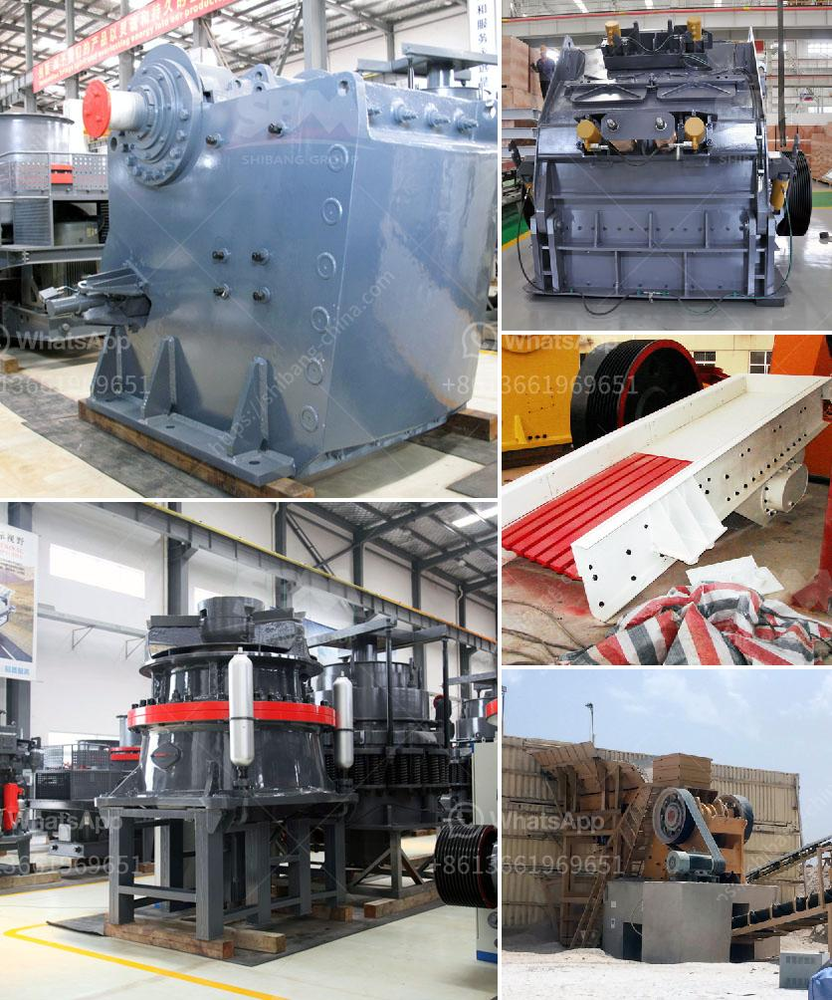

<h3>jaw crusher altairac</h3>
When it comes to construction projects, there are several important factors to consider. One crucial aspect is the crushing process. As modern infrastructure requires sturdy and durable materials, the need for efficient crushers becomes even more prominent. Among the various crushing options available in the market, Jaw Crusher Altairac stands out as a reliable and efficient choice.

Altairac, a renowned manufacturer of crushing equipment, has been providing top-quality machines for over a century. The Jaw Crusher Altairac, with its exceptional capabilities, has become a preferred choice for many construction companies and contractors worldwide.

One of the primary reasons for the popularity of the Jaw Crusher Altairac is its reliability. Designed with a robust structure, this crusher can withstand the toughest conditions and operate consistently without any downtime. Its sturdy construction ensures that it can handle heavy-duty tasks and endure the impact of large rocks or other materials.

In addition to its durability, the Jaw Crusher Altairac is also highly efficient. Equipped with powerful motors and high-quality components, this crusher delivers exceptional performance. Its large feed opening allows for the processing of a wide range of materials, including hard and abrasive ones, thus increasing the versatility of this machine.

Another key feature of the Jaw Crusher Altairac that contributes to its efficiency is its advanced hydraulic system. This system offers a smooth and reliable operation by regulating the crusher's settings and ensuring optimal performance. The hydraulic system also provides a quick and easy maintenance process, minimizing the machine's downtime and reducing overall operating costs.

The Jaw Crusher Altairac is designed with user-friendliness in mind. Its intuitive control panel allows operators to easily monitor and adjust various settings, ensuring precise crushing results. Additionally, the crusher's compact size and mobility make it suitable for both on-site and off-site crushing applications.

Safety is of utmost importance in any construction project, and the Jaw Crusher Altairac prioritizes this aspect. With its advanced safety features, including a material level sensor and overload protection, this crusher ensures the well-being of both operators and the machine itself. Furthermore, Altairac provides comprehensive training and support to its customers, enabling them to operate the equipment safely and efficiently.

When it comes to spare parts and service, Altairac ensures a prompt and reliable supply. With a strong global network of dealers and distributors, customers can expect timely delivery of genuine spare parts and professional assistance whenever needed. This support system further enhances the overall performance and longevity of the Jaw Crusher Altairac.

In conclusion, the Jaw Crusher Altairac stands as a testament to Altairac's commitment to delivering reliable and efficient crushing solutions. With its durable construction, powerful performance, and advanced features, this crusher proves to be a valuable asset for any construction project. Whether for large-scale infrastructure developments or smaller-scale applications, the Jaw Crusher Altairac provides the efficiency and reliability required for successful crushing operations.
<h3>Contact us</h3><ul><li><strong>Whatsapp:&nbsp;<a href="https://wa.me/8613661969651">+8613661969651</a></strong></li><li><a href="https://swt.shibang-china.com/?git&amp;zhl&amp;jaw crusher altairac"><strong>Online Service(chat now)</strong></a></li></ul><h3>Related</h3><ul><li><a href='calcium carbonate processing plant price.md'>calcium carbonate processing plant price</a></li><li><a href='cotizacion de equipos mineros.md'>cotizacion de equipos mineros</a></li><li><a href='crusher machine making in pakistan.md'>crusher machine making in pakistan</a></li><li><a href='mobile mini crusher hire.md'>mobile mini crusher hire</a></li><li><a href='price of world largest stone crushing plant.md'>price of world largest stone crushing plant</a></li></ul>