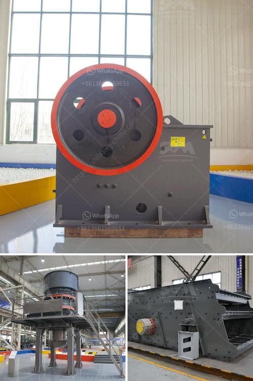

<h3>jaw crusher baxter</h3>
The Baxter jaw crusher is a renowned crushing machine in the industry. It has been widely used for primary crushing of various materials in diverse industries including mining, metallurgy, building materials, quarrying, recycling, and chemical. The crusher is characterized by its simple structure and reliable performance, delivering efficient and cost-effective crushing solutions to its users.

One of the key features of the Baxter jaw crusher is its heavy-duty design. With robust construction, the crusher can withstand the toughest of applications, ensuring long-lasting operation and durability. The strong frame and optimized design allow for the machine to handle high capacities and heavy feed sizes.

The jaw crusher Baxter incorporates a larger feed opening compared to similar models in its class. This larger opening enables the crusher to accept larger feed sizes, reducing the need for secondary crushing stages and saving on energy consumption. Additionally, the wider opening ensures a higher throughput, allowing for a higher production rate.

Furthermore, the Baxter jaw crusher is equipped with a reliable and powerful motor. This motor provides the necessary power to drive the crushing mechanism, ensuring efficient and effective crushing of materials. The motor is also designed to operate smoothly, reducing downtime and increasing productivity.

Maintenance of the Baxter jaw crusher is also made easy. The machine is designed with accessibility and ease of maintenance in mind. Various components and parts are easily accessible, allowing for quick and hassle-free maintenance and repairs. This ensures minimum downtime and maximum productivity.

Overall, the Baxter jaw crusher is a highly efficient and reliable crushing machine. With its heavy-duty design, larger feed opening, powerful motor, and easy maintenance, it is a preferred choice for many industries. Whether it is primary crushing in mining or recycling applications, the Baxter jaw crusher can provide the desired results, delivering high-quality crushed material efficiently.
<h3>Contact us</h3><ul><li><strong>Whatsapp:&nbsp;<a href="https://wa.me/8613661969651">+8613661969651</a></strong></li><li><a href="https://swt.shibang-china.com/?git&amp;zhl&amp;jaw crusher baxter"><strong>Online Service(chat now)</strong></a></li></ul><h3>Related</h3><ul><li><a href='set up a quarry business.md'>set up a quarry business</a></li><li><a href='working cone crushers.md'>working cone crushers</a></li><li><a href='calcium carbonate manufacturing machinery.md'>calcium carbonate manufacturing machinery</a></li><li><a href='ceramic crushing production line.md'>ceramic crushing production line</a></li><li><a href='grinding crushing mill brick.md'>grinding crushing mill brick</a></li></ul>