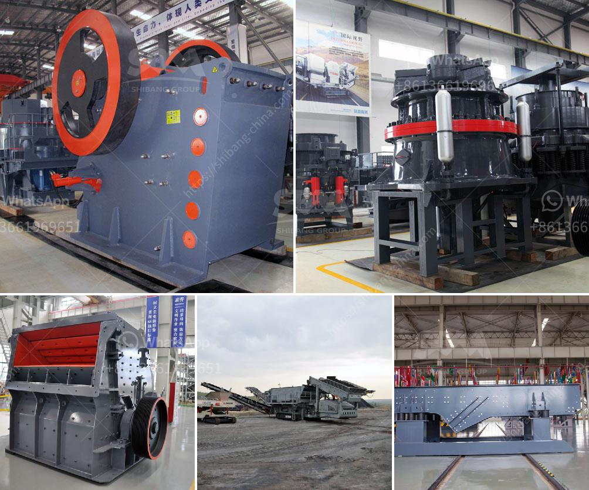

<h3>jaw crusher dealer in dubai</h3>
In the mining industry, jaw crushers are widely used for crushing stones and ores along with other mineral ores. Recently, there has been growing interest in jaw crushers in Dubai. In Dubai, the stones and ores are generally mined in the open pits. The minerals are in huge heaps. The rocks are taken into crushers for further crushing. To increase the production capacity, jaw crushers can be used as primary crushers. In the early stages, both jaw crushers and gyratory crushers are used for initial size reduction.

There are multiple jaw crusher models available in the market. For instance, the Lokotrack LT120E is mobile, electric-driven primary jaw crusher for aggregates production. It is a hybrid mobile crushing plant that can be operated either by an external power source or by multi-stage process optimization. It features a robust and reliable Nordberg C120 jaw crusher with electric drive and hydraulic setting adjustment system.

Another popular choice in primary crushing is the Lokotrack LT330D. It combines a cone crusher and a screen on the same chassis, which means you can easily expand your plant to meet the increased capacity requirements. These machines also have the ability to operate in different terrains. With the help of a radial return conveyor, the unit can be easily pivoted or relocated on site.

When it comes to finding a reliable jaw crusher dealer in Dubai, it is important to consider the reputation and experience of the company. Many dealers in the market sell jaw crushers from different manufacturers, so it is advisable to do some research before making the final decision. With a reliable dealer, you can get the best quality product at an affordable price.

Apart from technology, it is also important to consider the after-sales service offered by the dealer. A good dealer will not only provide you with the product, but also offer maintenance and repair services. They should have a team of technicians who are skilled and experienced in handling jaw crushers. This ensures that your machine remains in good working condition and minimizes any downtime.

In conclusion, if you are in Dubai and looking for a reliable jaw crusher dealer, it is recommended to do proper research and choose a reputable company. A good dealer can provide you with high-quality jaw crushers at competitive prices. They will also offer excellent after-sales service to ensure your machine operates efficiently. With the right jaw crusher, you can significantly improve your productivity in the mining industry.
<h3>Contact us</h3><ul><li><strong>Whatsapp:&nbsp;<a href="https://wa.me/8613661969651">+8613661969651</a></strong></li><li><a href="https://swt.shibang-china.com/?git&amp;zhl&amp;jaw crusher dealer in dubai"><strong>Online Service(chat now)</strong></a></li></ul><h3>Related</h3><ul><li><a href='functions of the hammer mill.md'>functions of the hammer mill</a></li><li><a href='methods of hammer mill.md'>methods of hammer mill</a></li><li><a href='tonnes per year cement plant machinary.md'>tonnes per year cement plant machinary</a></li><li><a href='quarry equipment.md'>quarry equipment</a></li><li><a href='set up a quarry business.md'>set up a quarry business</a></li></ul>