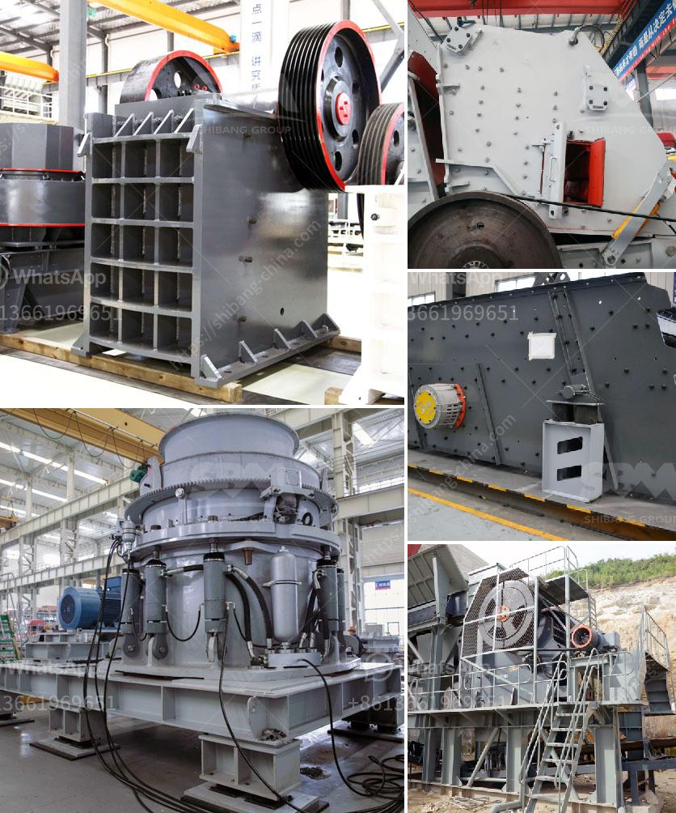

<h3>jaw crusher diagram</h3>
A jaw crusher is a type of primary crusher used in mines and ore processing plants. Jaw crushers are designed to crush the toughest materials through the use of compressive force (pressure). The jaw crusher design includes a set of two vertical jaws—a fixed (stationary) jaw and a swing (reciprocating) jaw. The swing jaw moves back and forth by a cam or pitman mechanism acting like a nutcracker or a class II lever.

The ore particles to be crushed enter the crushing chamber or cavity, commonly referred to as "V-shaped" because of the angled arrangement of the jaws. As the material enters the chamber, it is crushed by the force exerted on it by the swing jaw. This force is generated by the eccentric motion of the pitman, which is connected to the swing jaw. The pitman's motion is produced by the rotating eccentric shaft, which is powered by a motor.

To better understand the jaw crusher working principle, we can visualize the crushing process by observing the three common variations of the jaw crusher:

1. Blake Crusher: In this type of jaw crusher, the swing jaw is pivoted at the top, and the minimum movement is at the bottom. This design produces a large amount of crushing force, which allows the jaw crusher to process large-sized rocks and stones.

2. Dodge Crusher: Similar to the Blake crusher, the swing jaw is fixed at the lower position while the opposite end rotates. The movement is generated by an eccentric arrangement, resulting in a more compact design compared to the Blake crusher.

3. Universal Crusher: A modified Blake crusher introduced in 1906. In this design, the swing jaw moves back and forth within the fixed jaw, allowing it to crush materials with both compressive and shear forces.

The size of a jaw crusher is designated by the rectangular or square opening at the top of the jaws. For instance, a 22 x 30 jaw crusher has an opening of 22" by 30", a 46 x 46 jaw crusher has a opening of 46" square. Primary jaw crushers are typically of the square opening design, and secondary jaw crushers are of the rectangular opening design.

1. Fixed jaw: Fixed on the front wall of the frame and the other jaw is the swing jaw, which moves to provide the crushing action.

2. Eccentric shaft: This shaft is responsible for the movement of the swing jaw, transmitting the power from the motor to the swing jaw.

4. Tension rod and springs: The tension rod assembly provides a means for adjusting the crusher's discharge opening size.

5. Flywheel: Balances the inertia of the reciprocating motion, ensuring smooth operation and reducing energy consumption.

In conclusion, the jaw crusher diagram presented in this article highlights the basic elements that are crucial in organizing the complete crushing process. Understanding the jaw crusher's key components and how they work can be beneficial for both individuals and companies looking to expand their crushing capabilities.
<h3>Contact us</h3><ul><li><strong>Whatsapp:&nbsp;<a href="https://wa.me/8613661969651">+8613661969651</a></strong></li><li><a href="https://swt.shibang-china.com/?git&amp;zhl&amp;jaw crusher diagram"><strong>Online Service(chat now)</strong></a></li></ul><h3>Related</h3><ul><li><a href='cost of an industrial mill.md'>cost of an industrial mill</a></li><li><a href='gold stamp mills in zimbabwe.md'>gold stamp mills in zimbabwe</a></li><li><a href='100tpd cement plant cost in india.md'>100tpd cement plant cost in india</a></li><li><a href='limestone crusher secondary machine price.md'>limestone crusher secondary machine price</a></li><li><a href='granite quarry machines.md'>granite quarry machines</a></li></ul>