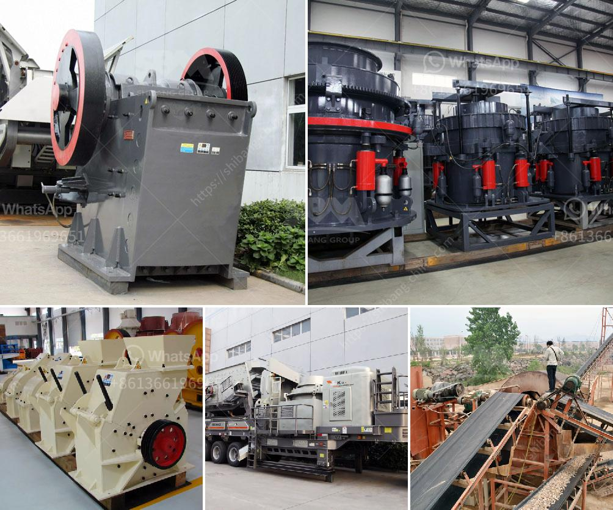

<h3>jaw crusher for sale in usa</h3>
The demand for jaw crushers is increasing steadily in the United States and around the world. Jaw crushers are used extensively in the mining, quarrying, and demolition industries to crush various materials, such as rocks, gravel, or concrete. However, their popularity is not limited to these industries alone. They are also widely used in the construction and recycling sectors.

One of the main reasons why jaw crushers are so popular is their ability to crush materials of any hardness. Whether it is a soft or hard material, a jaw crusher can easily handle it. This makes them suitable for a wide range of applications. Additionally, jaw crushers are known for their high efficiency and low operating costs. Their simple design and reliable operation contribute to their durability and ease of maintenance.

In the United States, there are several manufacturers and suppliers offering jaw crushers for sale. These include both domestic and international companies that cater to the growing demand for these machines. Some of the top manufacturers in the country include Metso Outotec, Sandvik, Terex, and Eagle Crusher.

When searching for a jaw crusher for sale in the USA, there are a few crucial factors to consider. One of the most important aspects is the size of the machine. Jaw crushers come in different sizes, ranging from small portable units to large mining and quarrying models. The size of the jaw crusher you choose will largely depend on the type and amount of material you need to crush.

Another factor to consider is the capacity of the jaw crusher. The capacity refers to the maximum amount of material the machine can process in a given period. It is typically measured in tons per hour. If you have a high production requirement, you should choose a jaw crusher with a higher capacity to ensure smooth operations.

Furthermore, it is essential to consider the power source of the jaw crusher. Some models are powered by diesel engines, while others rely on electric motors. The choice between these two power sources depends on your specific needs and the availability of power at your site. Diesel-powered jaw crushers are ideal for remote locations or areas with limited access to electricity.

Lastly, the price and after-sales support should also be taken into account. The cost of a jaw crusher may vary depending on its size, capacity, and brand. It is advisable to compare the prices offered by different suppliers to get the best deal. Additionally, ensure that the supplier offers excellent after-sales support, including technical assistance, spare parts availability, and warranty coverage.

In conclusion, jaw crushers are versatile machines that play a crucial role in various industries. Their ability to crush different materials, high efficiency, and low operating costs make them sought-after equipment. If you are in the United States and looking for a jaw crusher for sale, consider factors such as machine size, capacity, power source, price, and after-sales support. By carefully evaluating these factors, you can find the right jaw crusher that meets your requirements and delivers optimal results.
<h3>Contact us</h3><ul><li><strong>Whatsapp:&nbsp;<a href="https://wa.me/8613661969651">+8613661969651</a></strong></li><li><a href="https://swt.shibang-china.com/?git&amp;zhl&amp;jaw crusher for sale in usa"><strong>Online Service(chat now)</strong></a></li></ul><h3>Related</h3><ul><li><a href='stone crusher plate specifiion pdf sat.md'>stone crusher plate specifiion pdf sat</a></li><li><a href='ball mill china making.md'>ball mill china making</a></li><li><a href='gold mining equipment nevada oregon used rock crushers.md'>gold mining equipment nevada oregon used rock crushers</a></li><li><a href='quarry and mining crusher equipment.md'>quarry and mining crusher equipment</a></li><li><a href='machinery in limestone production.md'>machinery in limestone production</a></li></ul>