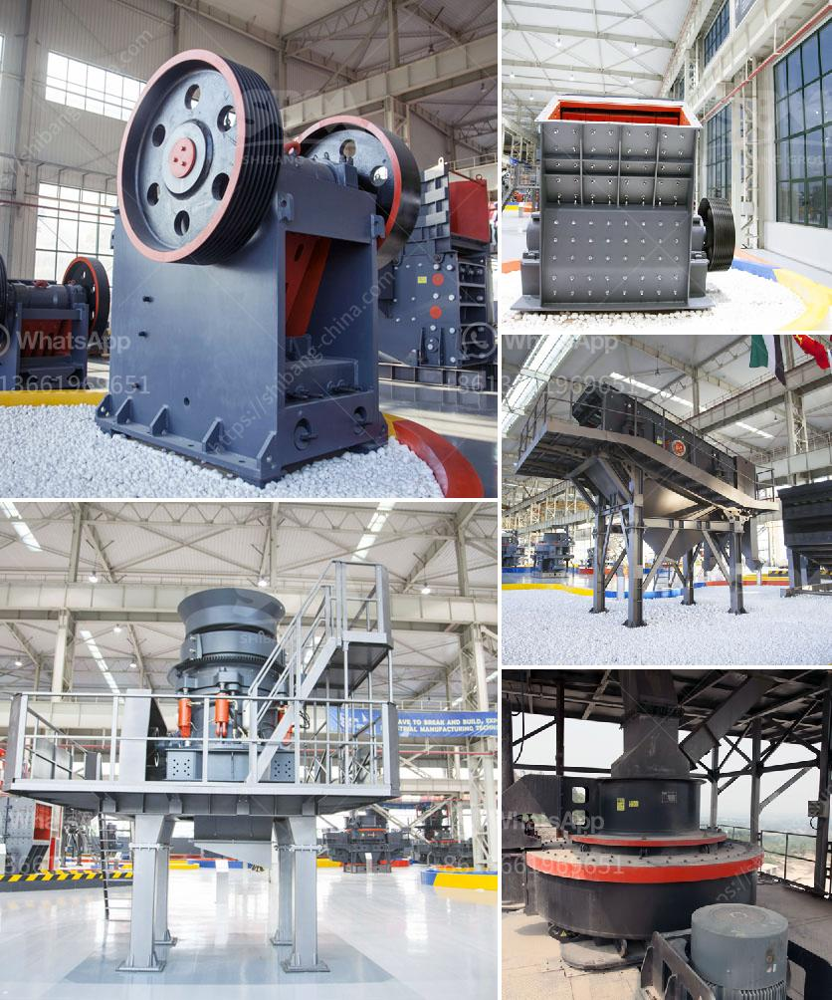

<h3>jaw crusher for sale philippines</h3>
A jaw crusher is an essential machine in the mining and construction industry. In recent years, the Philippine government has been investing in infrastructure projects such as road construction, building, and bridge construction, and it is expected that the market for crushing equipment will expand exponentially.

Jaw crushers are primarily used for reducing the size of larger rocks into smaller ones. They are designed to crush hard materials, such as granite, marble, and limestone. The crushing equipment is equipped with a powerful motor that enhances productivity and efficiency. The operation of the machine is simple, and it can be quickly adjusted to different sizes of material.

In the Philippines, a jaw crusher is usually used as the primary crushing machine for a variety of stone production lines. Jaw crusher is mainly used for coarse crushing of various materials. These materials are broken into small pieces so that they can be transported to the next process. The quality of the product depends on the quality of the jaw crusher. The jaw crusher machine is designed in a way that allows it to destroy all types of rock materials, whether it is hard, abrasive, or of heavy density.

Crushing equipment is one of the most critical and demanding equipment pieces for mining operations. Finding the right jaw crusher machine for your business requires a lot of research and careful selection. To ensure the success of your crushing operation, it is essential to choose a jaw crusher that matches your needs precisely.

When looking for a jaw crusher for sale, you should consider how the crusher will be used, the application it will be used for, and whether it is for primary crushing or secondary crushing.

Another factor to consider when buying a jaw crusher is the output. You want to ensure that the jaw crusher you choose can produce adequate quantities of crushed rock for your business needs.

It is also important to check the size, weight, and dimensions of the jaw crusher to ensure it is suitable for your operation. Additionally, consider the brand reputation, after-sales service, and warranty when making your purchasing decision.

There are various jaw crusher models for sale in the Philippines, and the capacity ranges from 5tph to 1300tph. Of course, these prices are not indicative of the actual price of a jaw crusher machine in the Philippines. In fact, the price of a jaw crusher machine in the Philippines is relatively high for customers who focus on quality. If you want to know the detailed price, you can click on the online customer service for a detailed consultation.

Previous customers' satisfaction with the manufacturer's after-sales support and services will help you make an informed decision. By considering all these factors, you can find the perfect jaw crusher suited to your specific needs in the Philippines.

In conclusion, a jaw crusher is an invaluable machine for mining and construction industry. It plays a crucial role in reducing the size of larger rocks into smaller ones to be transported to other processes. Finding the right jaw crusher for your business requires thorough research and careful selection. Considering factors such as application, output, size, weight, brand reputation, after-sales service, and warranty will help you make an informed decision. With the Philippines' booming infrastructure projects, the demand for jaw crushers is expected to be on the rise, making it an ideal time to invest in this essential crushing equipment.
<h3>Contact us</h3><ul><li><strong>Whatsapp:&nbsp;<a href="https://wa.me/8613661969651">+8613661969651</a></strong></li><li><a href="https://swt.shibang-china.com/?git&amp;zhl&amp;jaw crusher for sale philippines"><strong>Online Service(chat now)</strong></a></li></ul><h3>Related</h3><ul><li><a href='portable limestone jaw crusher for hire in south africa.md'>portable limestone jaw crusher for hire in south africa</a></li><li><a href='supplier of crusher equipment in ghana.md'>supplier of crusher equipment in ghana</a></li><li><a href='mobile stone crusher for sale in south africa.md'>mobile stone crusher for sale in south africa</a></li><li><a href='crusher stone price south africa.md'>crusher stone price south africa</a></li><li><a href='functions of the hammer mill.md'>functions of the hammer mill</a></li></ul>