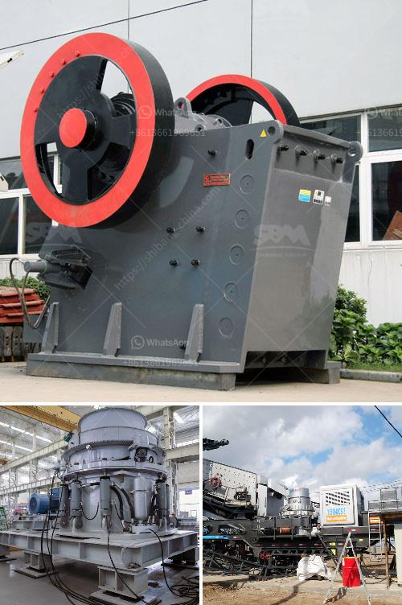

<h3>jaw crusher in dar es salaam</h3>
The jaw crusher is commonly used as the primary crusher for various materials with compressive strength up to 320MPa. The jaw crusher machine is known for its high efficiency, ease of use, and durability. Its power comes from a robust and reliable engine, ensuring efficient performance as it can crush large rocks into smaller pieces.

Dar es Salaam is the largest city in Tanzania and one of the fastest-growing cities in Africa. With its booming construction industry, the demand for aggregates, such as gravel and sand, has been increasing rapidly. The jaw crusher plays a crucial role in meeting the demand for these materials as it can break down large rocks into smaller, more manageable sizes suitable for construction purposes.

One of the main advantages of the jaw crusher is its simplicity in design and ease of operation. It consists of two jaws, one fixed and the other moving, which together form a V-shaped chamber. The materials to be crushed are fed into the chamber through the top opening and are crushed between the jaws as they move closer together. The crushed materials then exit through the bottom opening.

The jaw crusher in Dar es Salaam is known for its high efficiency in crushing various types of materials, including granite, marble, basalt, limestone, quartz, pebble, iron ore, copper ore, and more. Its strength lies in the powerful crusher box, which is made of wear-resistant materials, ensuring its longevity and durability. This ensures that the jaw crusher can withstand the tough conditions of the construction industry in Dar es Salaam.

In addition, the jaw crusher is equipped with a reliable and efficient engine, which provides the power needed for crushing rocks. It can be operated with ease, allowing operators to adjust the size of the crushed materials according to the desired specifications. This flexibility makes the jaw crusher suitable for various applications in the construction industry in Dar es Salaam, including road construction, building construction, and infrastructure projects.

Another advantage of the jaw crusher in Dar es Salaam is its low maintenance requirements. The design of the jaw crusher minimizes the risk of breakdowns and ensures that it operates smoothly even in harsh conditions. Regular maintenance and proper lubrication are enough to keep the machine in excellent working condition, saving both time and money for operators.

In conclusion, the jaw crusher is an essential machine for the construction industry in Dar es Salaam. Its high efficiency, durability, and ease of use make it a valuable asset for crushing various materials. With its robust engine and low maintenance requirements, the jaw crusher is a reliable and cost-effective solution for construction projects in Dar es Salaam.
<h3>Contact us</h3><ul><li><strong>Whatsapp:&nbsp;<a href="https://wa.me/8613661969651">+8613661969651</a></strong></li><li><a href="https://swt.shibang-china.com/?git&amp;zhl&amp;jaw crusher in dar es salaam"><strong>Online Service(chat now)</strong></a></li></ul><h3>Related</h3><ul><li><a href='marble processing plant.md'>marble processing plant</a></li><li><a href='bentonite grinding machine manufacturer in india.md'>bentonite grinding machine manufacturer in india</a></li><li><a href='distribuidor de equipos para laboratorio chancadoras.md'>distribuidor de equipos para laboratorio chancadoras</a></li><li><a href='ansporting coal conveyor belt.md'>ansporting coal conveyor belt</a></li><li><a href='rubber latex processing ppt.md'>rubber latex processing ppt</a></li></ul>