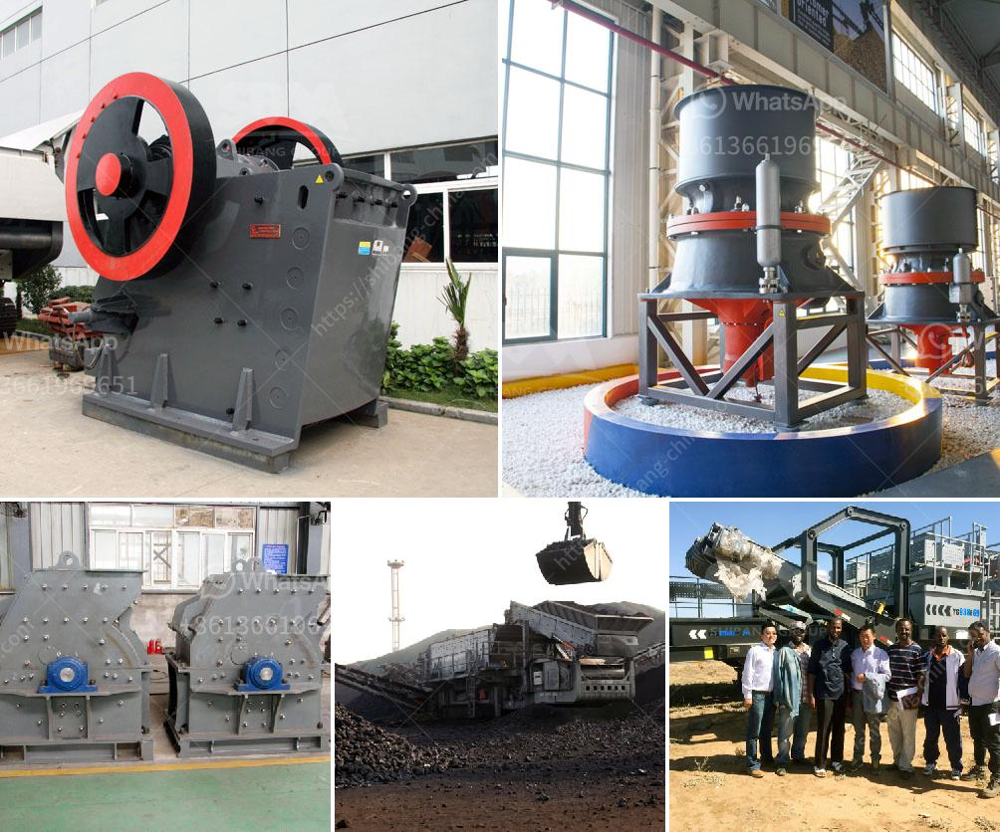

<h3>jaw crusher in egypt</h3>
Egypt is among the top-rated countries with a vast mineral resource deposit. The country has numerous mineral reserves that have promising potentials for exploration and mining. The jaw crusher is a popular alternative to the coarse rotary crusher because it can effectively handle large amounts of hard rock.

Viewed from the side, the movement of the jaw plate is approximately reciprocating, moving up and down as well as back and forth as it squeezes the material into smaller pieces. At the same time, the materials are crushed in the crushing cavity composed of fixed jaw plates, movable jaw plates, and side guard plates, reducing the size of the materials based on the compression principle. The equipment can crush material in all directions, ensuring trouble-free operation and a longer service life.

In the construction-related industry, jaw crushers are widely used on construction sites and in stone quarries to crush large stones into smaller pieces. Crushed rock has a variety of purposes, but is often used to make level surfaces, provide drainage under roads and buildings, or to create gravel roads.

With the increase of construction projects in Egypt, the demand for jaw crushers is also growing. With a population of over 100 million, the construction and infrastructure sectors have been flourishing in Egypt. According to the Egyptian Parliament, new construction permits have been issued for more than 18,000 buildings in 2020 alone. This highlights the significant demand for construction materials, including crushed rock.

One of the key factors driving the jaw crusher market is the growth in the infrastructure sector in Egypt. The construction industry has been witnessing significant growth with government initiatives to build new infrastructure projects. These projects include the development of new highways, airports, railways, and affordable housing.

Additionally, the increasing urbanization in Egypt has led to a rise in demand for housing and commercial spaces. Construction projects to meet these demands require huge amounts of aggregate materials, which are produced by crushing rocks using jaw crushers. Jaw crushers provide high reduction ratios for materials of all degrees of hardness, making them perfect for primary and secondary crushing.

Another factor promoting the growth of the jaw crusher market is the hefty investments made by governments in developing countries to improve their infrastructure. The construction industry in Egypt is projected to grow at a rapid pace, creating wealth and job opportunities for skilled workers, further driving the market.

The competitiveness of the jaw crusher market in Egypt is often attributed to the favorable business conditions, low labor costs, and abundant mineral resources that streamline the mining process. Egypt's mining sector has been a major contributor to the country's economy, providing vital raw materials needed for the infrastructure development projects.

In conclusion, jaw crushers are a valuable resource for a wide range of applications in construction industries. They are capable of crushing different types of hard materials, including rocks, ore, and minerals, ensuring efficient and reliable performance. With the surge in infrastructure projects in Egypt, the demand for jaw crushers is on the rise, making them a gamechanger for the construction industry in the country.
<h3>Contact us</h3><ul><li><strong>Whatsapp:&nbsp;<a href="https://wa.me/8613661969651">+8613661969651</a></strong></li><li><a href="https://swt.shibang-china.com/?git&amp;zhl&amp;jaw crusher in egypt"><strong>Online Service(chat now)</strong></a></li></ul><h3>Related</h3><ul><li><a href='ball mill capacity tons.md'>ball mill capacity tons</a></li><li><a href='roller crusher machine manufacturer.md'>roller crusher machine manufacturer</a></li><li><a href='cost of a stone crusher.md'>cost of a stone crusher</a></li><li><a href='dealer stone crusher di indonesiain indonesia.md'>dealer stone crusher di indonesiain indonesia</a></li><li><a href='jaw stone crusher for excavators.md'>jaw stone crusher for excavators</a></li></ul>