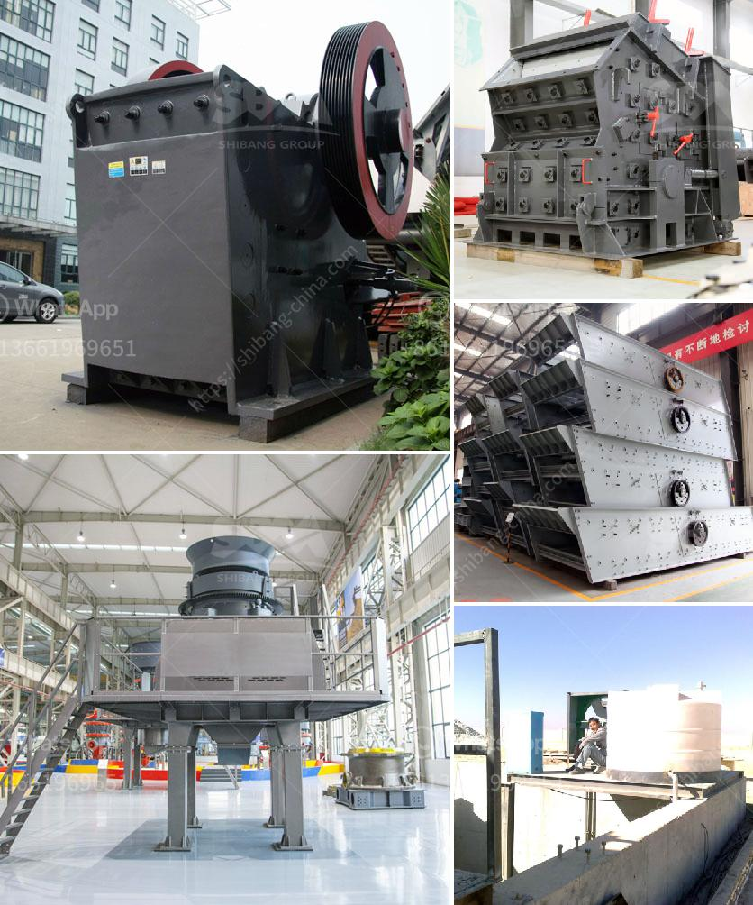

<h3>jaw crusher machine for sale</h3>
Are you in need of a reliable and versatile crusher for your mining or construction project? If yes, then you should consider purchasing a jaw crusher machine. These machines are affordable and highly efficient, making them the perfect choice for numerous industries.

A jaw crusher machine functions by compressing a large rock or stone into smaller and more manageable sizes. The crushing takes place between two vertical jaws, spaced apart, referred to as a "stationary jaw" and a "swing jaw." The swing jaw moves akin to a door's upper and lower hinges, allowing it to open and close like a mouth for proper feeding.

Jaw crusher machines are utilized for various minerals and ores, including iron ore, copper ore, gold ore, bauxite, limestone, marble, granite, coal, and more. They are widely used in mining, construction, metallurgy, highways, railways, water conservancy, and chemical industries.

1. High Efficiency: Jaw crushers are known for their ability to process hard and abrasive materials with high efficiency. This results in reduced operating costs and increased productivity for your operations.

2. Versatility: Jaw crushers are available in different sizes and designs, suitable for various applications. Whether you need a primary crushing machine for mining operations or a secondary crusher for quarrying and recycling, jaw crushers offer flexibility and versatility.

3. Easy Maintenance: Jaw crushers are designed with simplicity in mind, making them easy to maintain and repair. They have replaceable jaw plates, which reduces downtime and ensures convenient maintenance.

4. Adjustable Output Size: With a jaw crusher machine, you have the ability to adjust the final product size according to your specific needs. This makes jaw crushers suitable for producing different end products, such as gravel, aggregates, and sand.

5. Affordable Price: Jaw crusher machines are available at affordable prices in the market, making them accessible for small to medium-sized enterprises. Additionally, their low operating costs and high productivity make them a cost-effective choice for long-term use.

1. Size and Capacity: Determine the size and capacity requirements of your project to ensure that the jaw crusher can meet your needs.

2. Material Hardness: Consider the hardness of the materials you will be processing. Some jaw crushers are specifically designed to handle hard and abrasive materials, while others excel at processing softer ones.

3. Maintenance and Repair: Look for jaw crusher machines that are easy to maintain and repair, with readily available spare parts. This will help minimize downtime and ensure smooth operations.

4. Brand Reputation: Choose a reputable brand that is known for offering reliable and high-quality jaw crusher machines. This will give you assurance about the machine's performance and durability.

In conclusion, a jaw crusher machine is a reliable and versatile crusher that offers high efficiency and easy maintenance. It is suitable for various applications and provides adjustable output sizes, making it an ideal choice for many industries. With numerous options available in the market, consider your project's requirements and choose a reliable brand for a cost-effective and long-lasting solution.
<h3>Contact us</h3><ul><li><strong>Whatsapp:&nbsp;<a href="https://wa.me/8613661969651">+8613661969651</a></strong></li><li><a href="https://swt.shibang-china.com/?git&amp;zhl&amp;jaw crusher machine for sale"><strong>Online Service(chat now)</strong></a></li></ul><h3>Related</h3><ul><li><a href='stone crushing plant use jaw crusher price list.md'>stone crushing plant use jaw crusher price list</a></li><li><a href='metal conveyor belts malaysia.md'>metal conveyor belts malaysia</a></li><li><a href='crusher machine south africa.md'>crusher machine south africa</a></li><li><a href='lime manufacturing process.md'>lime manufacturing process</a></li><li><a href='limestone washing and classifi ion.md'>limestone washing and classifi ion</a></li></ul>