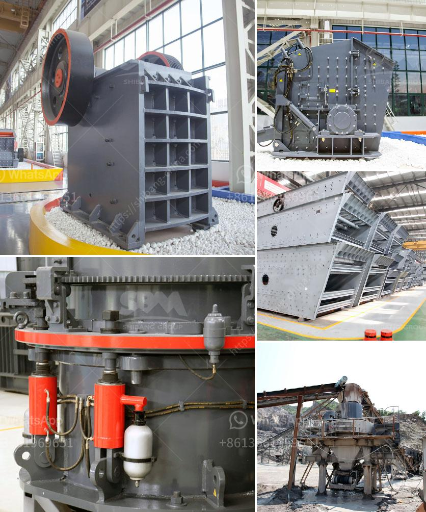

<h3>jaw crusher manufacturers in gujarat</h3>
Jaw Crusher Manufacturers in Gujarat – A jaw crusher is a machine that is widely used in mines or ore processing plants. The jaw crusher reduces large-sized rocks or ore by placing the rock into compression. Our jaw crusher is precisely designed and made of optimum quality raw materials under the guidance of our skilled personnel. The offered crusher is used to crush a variety of materials such as ores and ores, coal, granite and limestone.

Gujarat is the fastest growing industrial state in India, and jaw crusher manufacturers in Gujarat are getting more and more popular among customers. There are two main reasons for this success: superior design and high-quality manufacturing.

Gujarat has been an industrial hub since decades, manufacturing has received a tremendous boost in this period. The majority of leading manufacturers of crushers in Gujarat are located in Vadodara and Ahmedabad. Vadodara is a major manufacturing hub in the state of Gujarat.

The crusher plants are the most preferred choice of the customers for diverse applications like iron ore, coal, aggregate, cement and other mineral sizing operations. Simple design, rugged construction, reliable operation, and easy maintenance are the main factors operating the market for various crusher manufacturers in Gujarat.

If you want to operate a jaw crusher, the product size will be 75mm to 300mm. The main advantage of a jaw crusher is that it can incorporate a belt conveyor to increase the mobility of the crusher. Eventually, jaw crushers are useful machines in breaking large rocks and stones into small particles.

There are a variety of jaw crushers available in the market, but choosing the right one depends on the characteristics of the materials being processed, the site conditions, and the desired product specifications. A trusted manufacturer, Zenith Mining and Construction Machinery, has a full line of jaw crushers available in several sizes for portable or stationary mounting.

Some jaw crusher manufacturers in Gujarat have a reputation for manufacturing quality products, and the brands are:

The jaw crusher manufacturers in Gujarat have been selling products in various industries, including construction, mining and metallurgy, chemical engineering, etc., for a long time. There are some specific models of jaw crusher in Gujarat that they pay close attention to.

Some of the jaw crushers in Gujarat operate with the help of a motor. The rotor and the bearings are important accessories and play an important role in the operation of the jaw crusher. The rotor is mounted on the main shaft, and the rotor is rotated by the V-belt, which is driven by the electric motor or diesel engine.

In conclusion, Gujarat is considered to be one of the fastest-growing industrial states in India. With a wide range of jaw crushers available, one can find the most suitable crusher for their applications. Quality products and reliability make Gujarat the preferred choice of customers when it comes to jaw crusher manufacturers.
<h3>Contact us</h3><ul><li><strong>Whatsapp:&nbsp;<a href="https://wa.me/8613661969651">+8613661969651</a></strong></li><li><a href="https://swt.shibang-china.com/?git&amp;zhl&amp;jaw crusher manufacturers in gujarat"><strong>Online Service(chat now)</strong></a></li></ul><h3>Related</h3><ul><li><a href='crusher stone prices.md'>crusher stone prices</a></li><li><a href='germany standard pyrophyllite powder grinding mill.md'>germany standard pyrophyllite powder grinding mill</a></li><li><a href='rock crusher portable.md'>rock crusher portable</a></li><li><a href='copper ore conveying system.md'>copper ore conveying system</a></li><li><a href='mobile crushing provider.md'>mobile crushing provider</a></li></ul>