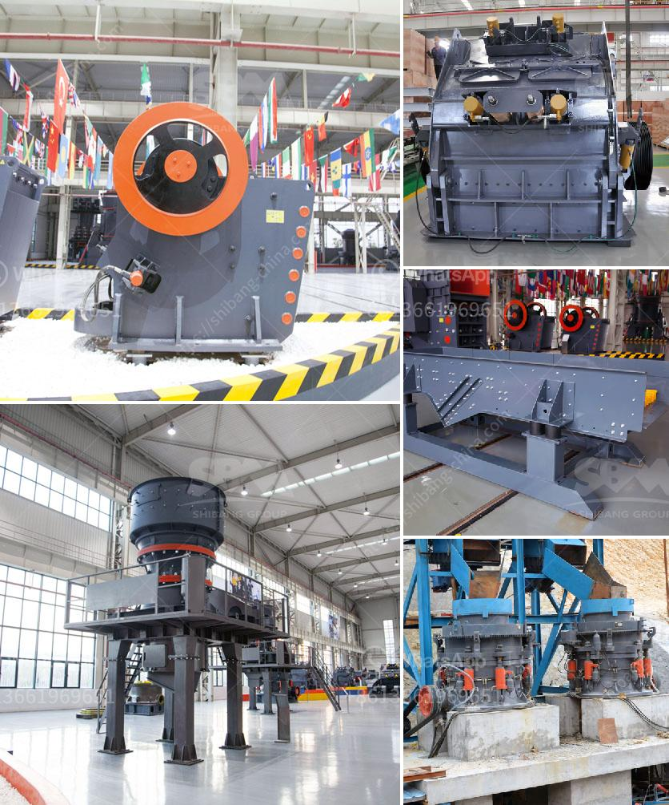

<h3>jaw crusher plant in saudi</h3>
With the development of mineral resources in Saudi Arabia, jaw crusher plants are widely used for its excellent performance in iron ore mining. Crushing and melting speeds were consistent during all tests. Throughput rate was consistent (at 90% rock through the jaw). Jaw crusher capacity was less sensitive to fines, but the presence of clay in the feed was a challenge. A 22% reduction in throughput was observed from the jaw crusher when the feed data showed an increase in fines content.

The primary crushing stage utilizing a jaw crusher plant greatly expands the application of coarse crushing equipment. The working principle of jaw crushers is pretty simple to understand. Material is being crushed into smaller particles by the two jaw plates – one static and one movable. Once crushed, the material is being discharged through a discharge opening. It can be adjusted to achieve the desired product size.

The benefits of using jaw crushers in the mining industry cannot be denied. Their ability to crush hard and abrasive materials is sure to bring about efficiency and productivity to any crushing project. However, a cone crusher plant is often used for secondary crushing. The straightforward and efficient design allows for a quick and easy maintenance process for smooth operation. 

Another advantage is the low cost involved in operations. To bring in jaw crushers in Saudi Arabia, a main deal, was a crucial step. Decided on by the company's management team, together with the crushing experts from Northern California, UAE and Saudi Arabia.

Providing better crusher feed control for the cone crusher through the use of surge piles, hoppers, and variable-speed feeding devices such as belt conveyors or vibrating pan feeders can easily increase crusher productivity by a minimum of 10 percent.

Investing in an efficient, high-performance jaw crusher plant is vital to the ongoing success of every mining company. Hence, adopting a high-quality jaw crusher for sale Saudi Arabia is a good option.

Providing massive crushing impact on the material, jaw crushers are mounted on robust, fabricated chassis with a diesel engine or electric motor to make it a completely self-contained solution. Adding to this, they are designed to take heavy loads, withstand stockpiling, and full production applications. With easy access to the jaw and head units, mobile jaw crushers can be dismantled in a matter of minutes, while track-mounted jaw crushers take longer to set up.

In conclusion, a jaw crusher plant is a vital investment decision for a company. It ensures continuous operation, improves product quality, and reduces production costs. This equipment is popular among businesses because it offers a significant competitive advantage in power engineering. Make sure to consider a jaw crusher plant for sale from a reputable dealer to enjoy these benefits in your mining company.
<h3>Contact us</h3><ul><li><strong>Whatsapp:&nbsp;<a href="https://wa.me/8613661969651">+8613661969651</a></strong></li><li><a href="https://swt.shibang-china.com/?git&amp;zhl&amp;jaw crusher plant in saudi"><strong>Online Service(chat now)</strong></a></li></ul><h3>Related</h3><ul><li><a href='grinding unit cement plant south africa.md'>grinding unit cement plant south africa</a></li><li><a href='stone hammer mill.md'>stone hammer mill</a></li><li><a href='standard operating procedures for cone crusher.md'>standard operating procedures for cone crusher</a></li><li><a href='aggregates crusher philippines.md'>aggregates crusher philippines</a></li><li><a href='what are they vertical grinding mills.md'>what are they vertical grinding mills</a></li></ul>