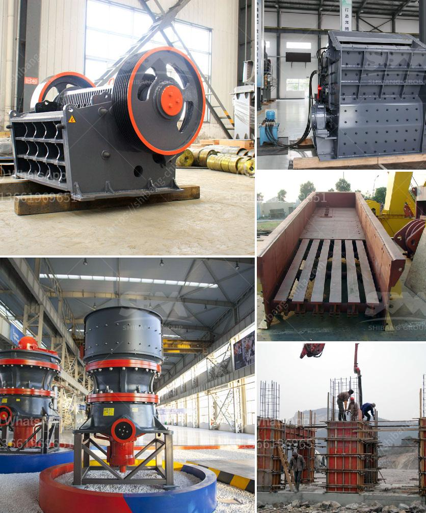

<h3>jaw crusher price list 150 x 200mm</h3>
Jaw crusher plays a pivotal role in mining and construction industry, where it is used for crushing large rocks into smaller pieces. The machine is widely regarded as the primary crusher and is used in various stone production lines, sand making lines, and ore beneficiation plants.

The jaw crusher price list is composed of the stationary jaw plate, swing jaw plate, and the liner plate. These parts will help the crusher to operate efficiently, enabling maximum production and reduced downtime. In the crushing process, the stones will be broken into smaller particles by the motion of the swing jaw plate. This motion is caused by the vertical movement of the pitman, which results in a compressive force being applied to the material.

The jaw crusher price list 150 x 200mm is widely used in the mining industry due to its high reliability, slick design, easy installation, and seamless operation. It can be used for granite, marble, limestone, quartz stone, basalt, river pebbles, iron ore, copper ore processing, and various other materials. The equipment is particularly suitable for primary crushing, as it boasts exceptional crushing capacity.

The jaw crusher price list 150 x 200mm varies depending on the size and capacity of the machine. It ranges from $5,000 to $1,000,000. In general, the smaller the capacity, the smaller the price, and vice versa. Different models, configurations, and specifications have different prices. Thus, it is essential to consider your specific requirements before making a purchase.

When evaluating the price of a jaw crusher, it is crucial to look beyond the initial cost. Operational and maintenance costs should be taken into account as well. A reliable, high-quality jaw crusher will have lower maintenance costs and a longer lifespan, offering a better return on investment in the long run.

Some factors that affect the price of a jaw crusher include the material of construction, brand reputation, after-sales service, and geographical location. For example, jaw crushers made of high-quality materials, such as stainless steel or wear-resistant materials, are generally more expensive. It is recommended to choose a reputable brand known for producing durable and efficient machines.

After-sales service is another important consideration. A reliable manufacturer should provide comprehensive technical support, regular maintenance, and spare parts availability. This ensures that the machine operates seamlessly and minimizes any downtime.

Geographical location can also impact the price due to transportation costs, import/export taxes, and local market conditions. It is advisable to consult local suppliers or dealers to obtain accurate pricing information.

In conclusion, the jaw crusher price list 150 x 200mm offers a range of options for buyers with different requirements. Its reliability, durability, and efficient operation make it a valuable asset in the mining and construction industry. When considering a purchase, factors such as capacity, operational and maintenance costs, reputation, and after-sales service should be carefully weighed. By making an informed decision, buyers can find the best jaw crusher for their specific needs.
<h3>Contact us</h3><ul><li><strong>Whatsapp:&nbsp;<a href="https://wa.me/8613661969651">+8613661969651</a></strong></li><li><a href="https://swt.shibang-china.com/?git&amp;zhl&amp;jaw crusher price list 150 x 200mm"><strong>Online Service(chat now)</strong></a></li></ul><h3>Related</h3><ul><li><a href='portable rock crusher.md'>portable rock crusher</a></li><li><a href='crush rock industries nigeria.md'>crush rock industries nigeria</a></li><li><a href='quarry equipment for sale in south africa.md'>quarry equipment for sale in south africa</a></li><li><a href='used stone crusher plant for sale andhra pradesh.md'>used stone crusher plant for sale andhra pradesh</a></li><li><a href='ball milling method.md'>ball milling method</a></li></ul>