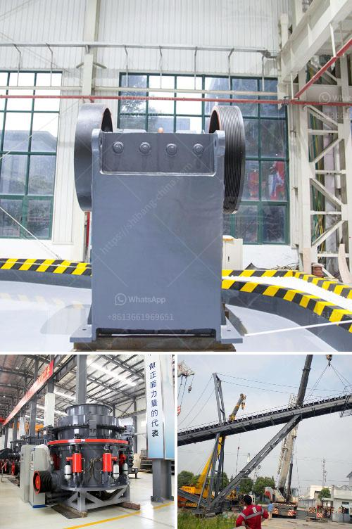

<h3>jaw crusher principle in the refractory</h3>
Jaw crusher is commonly used as a primary crusher, crushing the materials by squeezing. It is suitable for crushing various moderate hardness stones or other materials. The Camelway heavy-duty jaw crusher is suitable for various quarry mining projects.

And it is often used in various gravel production lines of different sizes. Jaw crusher has been widely used in the mining industry. According to the different materials, the specification and parameter of jaw crusher is also different, this article will introduce the technical parameters and maintenance problems of the jaw crusher.

The working mode of jaw crusher is curved extrusion type. The working principle is that the motor drives the belt and pulley to move the jaw up and down through the eccentric axis. When the jaw moves up, the angle between the elbow plate and the jaw becomes larger, thus pushing the jaw plate close to the fixed jaw plate. At the same time, the materials are crushed or split to achieve the purpose of crushing.

According to the feed mouth width size, it is divided into large, medium and small types. There are four types based on different crushing ability: ordinary crushing, intermediate crushing, fine crushing and superfine crushing. Each type is divided into several models and specifications.

The lubrication of the friction surface in time is one of the main ways to ensure the normal operation and extend the service life of the machine. The jaw crusher should be checked regularly for water leakage and oil leakage. The jaw crusher should be thoroughly inspected and maintained regularly.

At the same time, attention should be paid to maintenance and repair of jaw crusher. If a series of problems occur in the process of use, the operator should first stop the inspection and troubleshooting, and avoid arbitrary disassembly and repair, so as to avoid unnecessary damage to the machine.

In conclusion, jaw crusher has been widely used in the mining industry. It successfully realizes the automation and intelligence of the crushing process, and meets the different needs of customers. Different specifications and models of jaw crusher have different prices. The specific price depends on the configuration and model selected by the customer. It is recommended that you consult the specific manufacturer for detailed quotation and configuration.

Camelway Machinery has been committed to providing customers with high-quality equipment and comprehensive after-sales service. The jaw crusher produced by Camelway Machinery has reliable performance and stable operation, which has won the trust and praise of customers.
<h3>Contact us</h3><ul><li><strong>Whatsapp:&nbsp;<a href="https://wa.me/8613661969651">+8613661969651</a></strong></li><li><a href="https://swt.shibang-china.com/?git&amp;zhl&amp;jaw crusher principle in the refractory"><strong>Online Service(chat now)</strong></a></li></ul><h3>Related</h3><ul><li><a href='stone crushing plants close to rotate.md'>stone crushing plants close to rotate</a></li><li><a href='jaw crusher baxter.md'>jaw crusher baxter</a></li><li><a href='products lm vertical grinding mills.md'>products lm vertical grinding mills</a></li><li><a href='quarry machinery for sale.md'>quarry machinery for sale</a></li><li><a href='standard operating procedures for cone crusher.md'>standard operating procedures for cone crusher</a></li></ul>