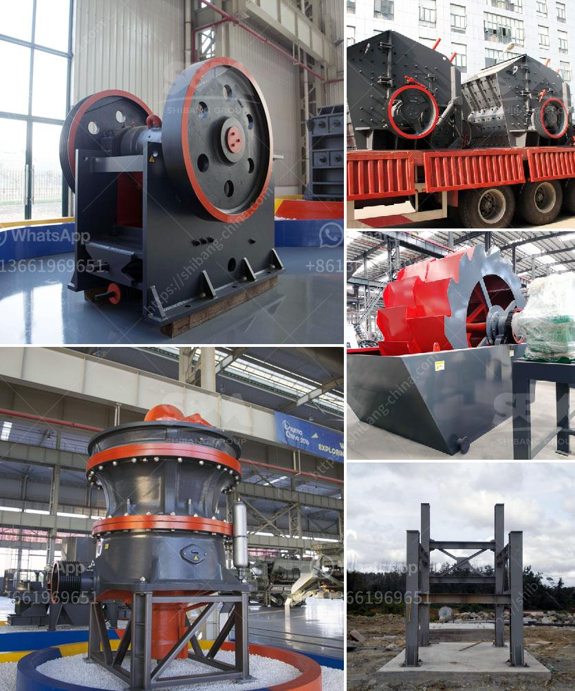

<h3>jaw crusher seller in pakistan</h3>
With the increase in demand for jaw crushers in the industrial sector, the role of jaw crusher sellers in Pakistan is more prominent than ever. Jaw crusher sellers are dealing with a steady rise in demand as the construction and mining industries continue to flourish in the country.

Pakistan boasts a rich variety of minerals, including limestone, coal, calcium, graphite, and granite. These minerals are extensively used in various industries, such as cement, agriculture, and construction. The extraction of these minerals requires heavy-duty machinery, and jaw crushers are an indispensable part of the process.

Jaw crushers are the primary crushers used in the initial stage of crushing rocks and minerals. Their main purpose is to reduce the size of the material for further processing or transportation. The efficiency and performance of jaw crushers largely determine the overall productivity of a mining or quarrying operation.

In Pakistan, there are numerous jaw crusher sellers catering to the escalating demand. These sellers offer a range of jaw crusher models with different specifications and capabilities. Some of the popular models offered by jaw crusher sellers in Pakistan include:

1. PE series jaw crusher: This type of jaw crusher is highly versatile and can crush large rocks effortlessly. It has a sturdy construction and is suitable for both primary and secondary crushing.

2. PEX series jaw crusher: The PEX series jaw crusher is renowned for its high crushing ratio and reliable performance. It is ideal for medium-sized rocks and minerals.

3. CJ series jaw crusher: This jaw crusher model is equipped with advanced features such as a hydraulic setting system and a heavy-duty design. It is suitable for demanding applications and can handle a wide range of materials.

It is crucial for buyers to choose a reputable and reliable jaw crusher seller in Pakistan. A reliable seller will provide quality products, excellent after-sales service, and technical support. Additionally, they will have a comprehensive understanding of the local market and offer competitive prices.

In conclusion, the jaw crusher market in Pakistan is witnessing significant growth due to the increasing demand from the construction and mining industries. As a result, various jaw crusher sellers are emerging in the country, offering a wide range of models to cater to different requirements. It is essential for buyers to carefully evaluate their options and choose a seller that meets their needs and demands effectively.
<h3>Contact us</h3><ul><li><strong>Whatsapp:&nbsp;<a href="https://wa.me/8613661969651">+8613661969651</a></strong></li><li><a href="https://swt.shibang-china.com/?git&amp;zhl&amp;jaw crusher seller in pakistan"><strong>Online Service(chat now)</strong></a></li></ul><h3>Related</h3><ul><li><a href='feldspar powder machine.md'>feldspar powder machine</a></li><li><a href='portable rock crusher.md'>portable rock crusher</a></li><li><a href='construction aggregates crusher.md'>construction aggregates crusher</a></li><li><a href='kenya electrical jaw crusher 32 x 58.md'>kenya electrical jaw crusher 32 x 58</a></li><li><a href='ball grinding machine in india.md'>ball grinding machine in india</a></li></ul>