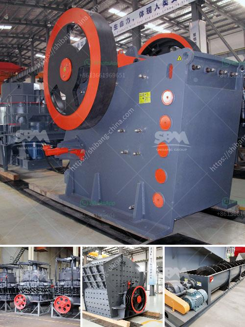

<h3>jaw crusher size specifications</h3>
A jaw crusher is a primary crusher that utilizes compressive force to break down various materials such as rocks and ores into smaller pieces. Due to its rugged construction and versatility, the jaw crusher has become a crucial piece of equipment in many industries. With advancements in technology and engineering, jaw crushers have evolved to be more efficient and safer than ever before.

One important factor to consider when purchasing a jaw crusher is the size of the machine. Crushers come in various sizes and dimensions, each designed to handle a specific range of materials and feed sizes. By understanding the specifications of a jaw crusher, businesses can determine the right machine for their needs and maximize production efficiency.

The size of a jaw crusher is measured by the top opening of the crushing chamber. For example, a 32 x 54 jaw crusher measures 32" from jaw die to jaw die at the top opening or gape opening, and 54” across the width of the two jaw dies. The narrower bottom opening of the crushing chamber is used to size the discharge material.

Jaw crushers are generally classified into two types: single toggle and double toggle. Single toggle jaw crushers have one jaw plate, while double toggle jaw crushers have two. This design allows the crushing operation to be performed steadily and evenly, resulting in better overall performance.

When selecting a jaw crusher, the key considerations are the feed size, capacity requirements, and the required final product size. Feed size is the approximate maximum size of the material being fed into the crusher and determines the size of the machine required. Capacity requirements refer to the volume of material a jaw crusher is capable of processing within a specified time frame.

Although many jaw crushers offer adjustable settings to control the product size, it's important to consider the desired final product size when selecting a jaw crusher. Different industries require different final product sizes, ranging from coarse aggregates for construction to finely crushed minerals for chemical applications.

One of the latest advancements in jaw crusher design is the use of hydraulic systems. These systems facilitate the adjustment of the jaw crusher’s closed side setting, reducing downtime and increasing productivity. This feature is particularly useful when dealing with varying feed materials and different required product sizes.

In addition to the size specifications, it's also important to consider the overall efficiency and operating costs of the jaw crusher. Energy efficiency and low operating costs can be achieved by using the latest technologies and high-quality components. A reliable jaw crusher with proper maintenance and regular servicing can last for decades, ensuring a strong return on investment.

In conclusion, understanding the size specifications of a jaw crusher is essential for selecting the right machine for your business. The feed size, capacity requirements, and desired final product size should be carefully considered when making a purchase. By investing in a high-quality jaw crusher and properly maintaining it, businesses can maximize production efficiency and profitability.
<h3>Contact us</h3><ul><li><strong>Whatsapp:&nbsp;<a href="https://wa.me/8613661969651">+8613661969651</a></strong></li><li><a href="https://swt.shibang-china.com/?git&amp;zhl&amp;jaw crusher size specifications"><strong>Online Service(chat now)</strong></a></li></ul><h3>Related</h3><ul><li><a href='crushing plants for sale.md'>crushing plants for sale</a></li><li><a href='cinder block crushing machines for rent.md'>cinder block crushing machines for rent</a></li><li><a href='stone crusher plant in maharashtra.md'>stone crusher plant in maharashtra</a></li><li><a href='dolomite stone crusher plant cost.md'>dolomite stone crusher plant cost</a></li><li><a href='quartz powder mill shanghaiu.md'>quartz powder mill shanghaiu</a></li></ul>