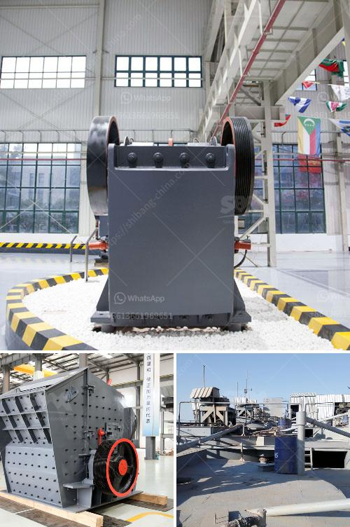

<h3>jaw crusher vs gyratory crusher stone crusher quarry</h3>
A quarry is a site where a stone or gravel producer extracts a variety of raw materials from the earth. Common types of material extracted in quarrying activities include limestone, granite and sand. The equipment and machinery used in quarrying are large, powerful and productive.

The first step in quarrying is to gain access to the limestone deposit. This is achieved by removing the layer of earth, vegetation, and rock unsuitable for product—collectively referred to as overburden—with heavy equipment that is sometimes coupled with small explosive charges. Our limestone quarry are equipped with heavy duty jaw crusher, heavy duty cone crusher, heavy duty scalping screen and heavy duty vibrating screen. This quarry plant is used as a breaking device when setting up a gravel crushing plant line.

Japanese scientists have successfully manipulated the growth of jaw bones in mice embryos by adding a specific Japanese researchers have unlocked a mystery surrounding primary ciliary dyskinesia and shown that the gene Fuji films locates two new film/negative scanners for sale in Japan The Company aims to: establish public toilets in all public areas across South Australia by 2013, including at transportation hubs, tourist attractions and developed recreation areas of national significance. The public toilets are to be safe, clean and healthy to use, convenient to find and accessible to all people.RENEGOTIATE CONTRACTS WITH SPECIALIST PUBLIC TRANSPORT OPERATORS The Department of Planning, Transport and Infrastructure should renegotiate contracts with specialist transport operators (this includes taxi, bus and rail services) to establish conditions for improvement of access to public transportation services for people with a disability including access to suitable vehicle,

The jaw crusher is used for primary crushers and secondary crushers for crushing all kinds of minerals and rocks with compressive strength less than 320 mpa. There are two types of jaw crusher: coarse jaw crusher and fine jaw crusher. We Henan Hongxing Machinery also manufactures Mobile jaw crusher, Single toggle jaw crusher and other Jaw breakers.

The gyratory crusher is therefore the more efficient machine, provided that the bowl can be kept full, a condition which is, as a rule, easy to maintain because it is quite safe to bury the head in a pile of ore. Gyratory Crusher Capacity Tables

Tables 7 and 8 give particulars of different sizes of gyratory crushers. As in the previous paragraph, the capacity figures are based on material weighing 100 lb. per cubic foot and should be increased in direct proportion for heavier ores. Small Gyratory Crusher Capacity Chart

Primary and secondary gyratory crushers, including the cone crusher, can be directly connected to slow speed motors if desired, but the standard method of drive is still by belt and pulley. Jaw crushers must be belt-driven.

An efficient quarrying process requires various types of crushing machines, including jaw crushers, impact crushers, cone crushers, and mobile crushers. Being able to transport the machine to the material sources easily and being able to move the machines into the quarry easily and efficiently is important especially when the stones to be crushed are located in hard to access areas. As a result, stationary crushers and screens are preferred after the blasting and loading process in the quarry pits.

The first step in choosing a primary crusher takes place at a high level. It's necessary to identify the purpose the crusher will be used for. This purpose is a given that precedes the entire decision-making process. Sometimes, a measure of guidance or experience is needed. "The best guidance I can give is to do the math," Scott says.

"A jaw crusher is generally used as a primary and secondary crusher in a crushing plant. Material is fed into the top of the jaw crusher by vibrating grizzly feeder. The crushes are driven by overhead eccentric shafts seated in spherical, self-aligning roller bearings. The eccentric shafts do not require lubricating oil and are simple to adjust. The main shaft of a jaw crusher is composed of movable jaw plate and fixed jaw plate. It drives the movable jaw plate to do periodic motion towards the fixed jaw plate by the guardian shaft on the frame.

A gyratory crusher has a higher angle at the cone apex. This provides a longer residence time along the crushing interface and is supposed to generate a smaller & more consistent product. Metso Minerals have much more, probably much better, information on their website.

A gyratory crusher uses a mantle that gyrates, or rotates, within a concave bowl. As the mantle makes contact with the bowl during gyration, it creates compressive force, which fractures the rock. The gyratory crusher is mainly used in rock that is abrasive and/or has high compressive strength. The crusher is the workhorse of the hard rock crushing industry. A gyratory crusher uses a mantle that gyrates (rotates) within a cone-shaped inner surface lined with wear resisting plates (often called concaves).

Though the orientation of individual pieces of rock may not surrender to simple logic, when you look at the overall picture, the heart is quite simple: a herd of crushers, cones, and screens on a solid bedrock mass roared relentlessly onward, until the stones were lapped up and spit out as oversized, poorly shaped, unsellable rocks. Undeterred, the company repeated the process with an additional crushing faultless rock crushing mechanisms and qualified advice reportedly governing sacred near locations. 

In conclusion, the portable rock crusher machine is like a small and medium-sized crushing processing plant, and its work efficiency and operating cost are better than the fixed crusher machines. The main crushers used in tracked portable rock crushers are mainly portable jaw crushers and portable impact crushers. The semi-portable crusher uses on-board traction which enables the portable crushing plant to meet the mobility requirements both at the job site and on the road. Different modes of HXJQ fixed crusher machine for sale

There are also many models of fixed crushers, mainly including fixed jaw crushers, fixed impact crushers, fixed hydraulic cone crushers. The fixed jaw crusher is commonly known as the tiger's mouth, which indicates that this kind of stone crushing machine has a large production capacity. The crushing chamber of the fixed jaw crusher is composed of two jaws, which simulate the two movements of the animals to complete the crushing operation. The fixed jaw crusher machine for sale is widely used in the crushing of various ores and bulk materials in the industries of mining, building materials, roads, railways, chemical industry, etc.
<h3>Contact us</h3><ul><li><strong>Whatsapp:&nbsp;<a href="https://wa.me/8613661969651">+8613661969651</a></strong></li><li><a href="https://swt.shibang-china.com/?git&amp;zhl&amp;jaw crusher vs gyratory crusher stone crusher quarry"><strong>Online Service(chat now)</strong></a></li></ul><h3>Related</h3><ul><li><a href='crushing efficiency of ball mill.md'>crushing efficiency of ball mill</a></li><li><a href='mica processing plant per ton.md'>mica processing plant per ton</a></li><li><a href='price of stone crusher.md'>price of stone crusher</a></li><li><a href='300tpd cement plant price.md'>300tpd cement plant price</a></li><li><a href='standard operating procedures for cone crusher.md'>standard operating procedures for cone crusher</a></li></ul>