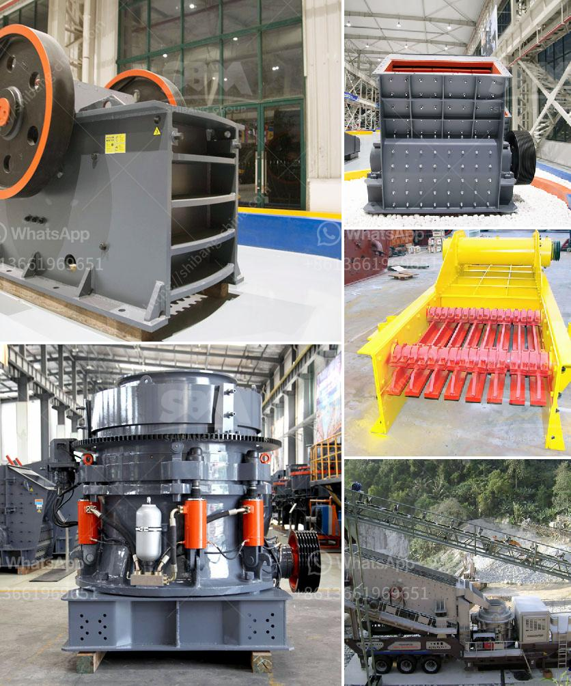

<h3>jaw crushers for sale in saudi</h3>
Jaw crushers are used for primary crushing of hard rocks, including limestone, granite, basalt, and more. Being highly beneficial in all industries, these crushers are crucially versatile as they can process a wide range of materials. Crushers are known for their ability to crush the toughest of materials, making them highly desirable in the construction, mining, and recycling industries. In Saudi Arabia, the demand for jaw crushers is quite high due to their extensive use in the country's construction and mining industries.

Saudi Arabia possesses huge deposits of various minerals, including bauxite, copper, gold, iron, lead, silver, tin, and non-metallic minerals. Mining sector investment alone accounts for about 1% of the country's GDP. This significant level of investment in the mining sector has led to a rise in the demand for jaw crushers, as they are widely utilized in the extraction of minerals, quarrying, and recycling processes.

The Saudi market offers a wide range of jaw crushers that can accommodate various crushing applications. To satisfy customer needs, manufacturers provide different models and sizes of jaw crushers. As the crushers can be customized, manufacturers can tailor them to specific handling requirements and applications. This allows customers to choose the perfect jaw crusher that suits their particular needs.

To cater to the growing demand, numerous companies offer jaw crushers for sale in Saudi Arabia. However, not all crushers are created equal. It's important to ensure that the crusher you select is capable of delivering the required performance and efficiency for your specific application. Here are a few factors to consider when purchasing a jaw crusher in Saudi Arabia:

1. Capacity: The capacity of the jaw crusher should be chosen according to the requirements of the application. Factors such as the hardness, size, and type of material to be crushed, as well as the desired output, all play a crucial role in determining the appropriate machine size.

2. Power Consumption: Opting for a crusher with low power consumption can save on energy costs in the long run. Moreover, it is environmentally friendly and contributes to sustainable development.

3. Durability and Maintenance: The crusher should be constructed with high-quality materials to ensure its durability and resistance to wear and tear. Additionally, ease of maintenance is an essential aspect to consider as it affects the overall operating cost of the crusher.

4. Price: As with any purchase, price is an important factor. However, it is advised not to compromise on quality for the sake of a lower price. It is recommended to look for crushers that offer a balance between cost and performance.

In conclusion, jaw crushers for sale in Saudi Arabia are available from a wide range of manufacturers and suppliers, ensuring they can provide sufficient crushing capacity for all kinds of materials. While they may seem like an expensive investment, their benefits are worth every penny. Jaw crushers offer high performance, efficiency, and durability, making them highly desirable and essential pieces of equipment for various industries in Saudi Arabia.
<h3>Contact us</h3><ul><li><strong>Whatsapp:&nbsp;<a href="https://wa.me/8613661969651">+8613661969651</a></strong></li><li><a href="https://swt.shibang-china.com/?git&amp;zhl&amp;jaw crushers for sale in saudi"><strong>Online Service(chat now)</strong></a></li></ul><h3>Related</h3><ul><li><a href='sample of granite quarry proposal.md'>sample of granite quarry proposal</a></li><li><a href='prices of stone crusher.md'>prices of stone crusher</a></li><li><a href='powder mill grinding machine in nigeria.md'>powder mill grinding machine in nigeria</a></li><li><a href='fine powder grinders machine.md'>fine powder grinders machine</a></li><li><a href='amp gravel conveyor belt.md'>amp gravel conveyor belt</a></li></ul>