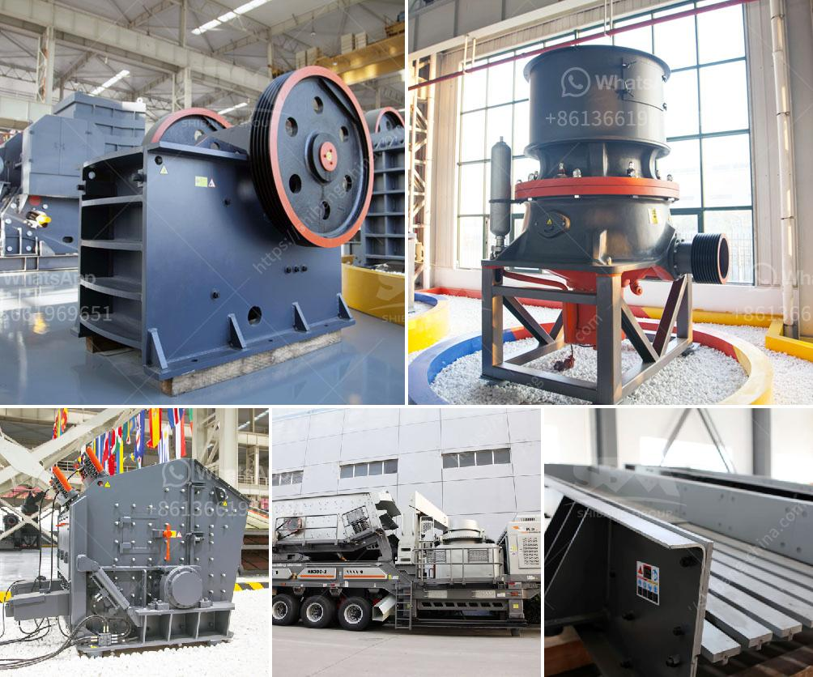

<h3>jaw crushers sale</h3>
When it comes to construction projects, there is no denying the fact that high-quality and efficient machinery plays a crucial role. One such piece of equipment that is essential for any construction site is a jaw crusher. This powerful machine is designed to crush large rocks into smaller rocks or gravel, making it easier to transport and work with. If you are in the market for a jaw crusher, this article will provide some useful information about jaw crushers for sale.

A jaw crusher, also known as a toggle crusher, works by compressing the material between two jaws. One stationary jaw and one movable jaw. As the material enters the crusher, it is crushed between the jaws, creating small pieces that can be easily handled. The size of the crushed material can be adjusted by changing the setting on the crusher. This makes jaw crushers versatile and suitable for a variety of construction projects.

There are several reasons why investing in a jaw crusher is a wise decision. Firstly, a jaw crusher increases productivity on the construction site. By quickly and efficiently crushing large rocks, it reduces the time and effort required to process the materials. This means that more work can be done in a shorter period, leading to increased productivity and profitability for the project.

Secondly, jaw crushers are cost-effective and economical. With a jaw crusher, there is no need for additional machinery or equipment to crush the material. This saves money on equipment costs and reduces the need for additional manpower. Additionally, the maintenance and operating costs of a jaw crusher are relatively low compared to other types of crushers. This makes jaw crushers an affordable option for construction companies of all sizes.

Furthermore, jaw crushers are durable and long-lasting. They are designed to withstand heavy use and are built to last. This means that investing in a jaw crusher is a wise choice as it will serve your construction site for many years to come. The durability of jaw crushers also makes them suitable for use in harsh conditions, such as in quarries or demolition sites.

When looking for jaw crushers for sale, it is important to consider factors such as the brand, model, and condition of the machine. It is advisable to purchase a jaw crusher from a reputable manufacturer known for producing high-quality machinery. Additionally, it is important to inspect the machine and ensure that it is in good working condition before making a purchase. This will help to avoid any unnecessary expenses or repairs in the future.

In conclusion, jaw crushers are a necessary investment for construction sites. They increase productivity, reduce costs, and are built to last. When looking for jaw crushers for sale, it is important to choose a reputable manufacturer and inspect the machine before making a purchase. By investing in a jaw crusher, you are ensuring the success and efficiency of your construction projects.
<h3>Contact us</h3><ul><li><strong>Whatsapp:&nbsp;<a href="https://wa.me/8613661969651">+8613661969651</a></strong></li><li><a href="https://swt.shibang-china.com/?git&amp;zhl&amp;jaw crushers sale"><strong>Online Service(chat now)</strong></a></li></ul><h3>Related</h3><ul><li><a href='equipment for grinding calcium carbonate.md'>equipment for grinding calcium carbonate</a></li><li><a href='start m sand unit kerala cost.md'>start m sand unit kerala cost</a></li><li><a href='used mobile jaw crushers for sale in uk.md'>used mobile jaw crushers for sale in uk</a></li><li><a href='mini stone crushers for small scale mining.md'>mini stone crushers for small scale mining</a></li><li><a href='prices of copper smelting plant.md'>prices of copper smelting plant</a></li></ul>