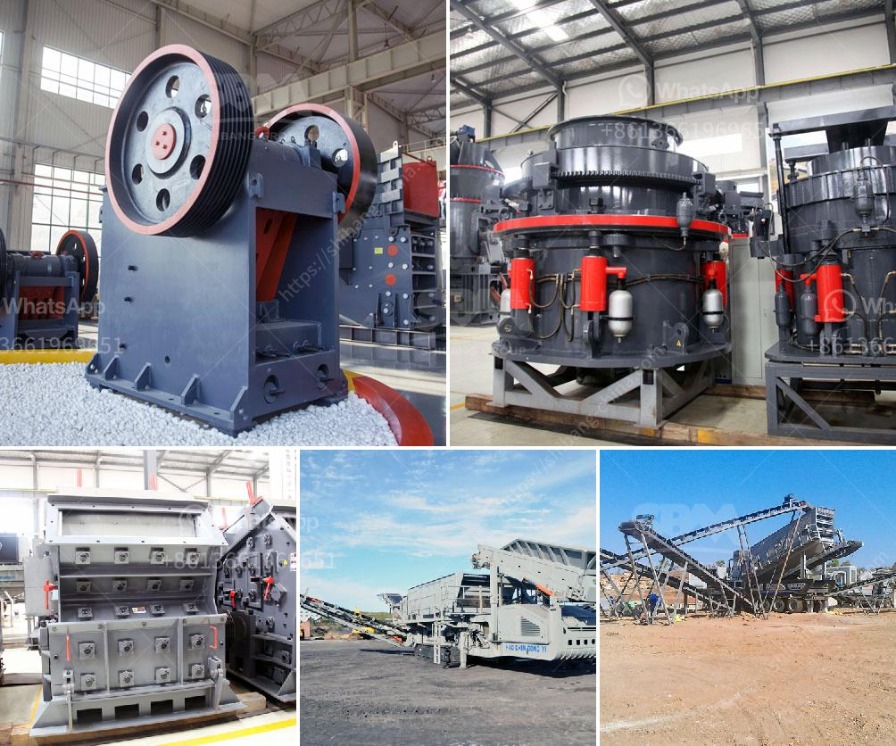

<h3>jaw crushers suppliers</h3>
Jaw crushers are machines used to break and compress materials of various hardness levels. They are widely used in mining, quarrying, and recycling industries. Their main purpose is to reduce the material to a small enough size that it can be transported and processed further. With advancements in technology, jaw crusher suppliers have developed state-of-the-art machines that can withstand the toughest of conditions.

One of the key factors that has contributed to the success of jaw crusher suppliers is the extensive range of options available. Every buyer can find the most suitable machine for their specific requirements. Some suppliers also offer customization options, allowing customers to modify certain features of the jaw crusher to suit their needs.

Reliability is a crucial aspect of jaw crusher suppliers. They understand that downtime is costly and strive to deliver machines that are highly reliable to maximize productivity. Most suppliers use high-quality materials and advanced manufacturing techniques to ensure that their crushers can withstand the wear and tear of continuous operation in harsh conditions. Additionally, they conduct rigorous quality control tests to guarantee that every machine leaving the factory meets the highest standards.

Furthermore, jaw crusher suppliers offer excellent after-sales services, including maintenance and repair. They understand that maintaining the optimal performance of the machine is essential for customer satisfaction. Suppliers often provide comprehensive training programs to equip customers with the necessary knowledge to operate and maintain their purchased jaw crushers efficiently. In case of any issues, suppliers have dedicated service teams that are available round the clock to provide technical support and resolve any problems promptly.

Environmental concerns have become increasingly important in recent years. Jaw crusher suppliers recognize this and offer eco-friendly machines to meet the demands of environmentally conscious customers. These crushers are designed to minimize dust and noise emissions, making them suitable for use in urban areas or locations where strict environmental regulations are in place. By reducing the impact on the environment, suppliers ensure not only the satisfaction of their customers but also contribute to sustainable development.

As competition in the market intensifies, jaw crusher suppliers are continuously investing in research and development to stay at the forefront of innovation. They are constantly looking for ways to improve the performance, efficiency, and safety features of their machines. This commitment to innovation not only benefits customers by providing them with the latest technology but also allows suppliers to differentiate themselves from their competitors.

In conclusion, jaw crushers play a vital role in the mining, quarrying, and recycling industries. Their unmatched efficiency and reliability make them a popular choice among customers. Jaw crusher suppliers strive to deliver machines of superior quality to ensure customer satisfaction and productivity. They go the extra mile to offer after-sales services, eco-friendly options, and innovative solutions. With such dedication, these suppliers have established themselves as leaders in the industry.
<h3>Contact us</h3><ul><li><strong>Whatsapp:&nbsp;<a href="https://wa.me/8613661969651">+8613661969651</a></strong></li><li><a href="https://swt.shibang-china.com/?git&amp;zhl&amp;jaw crushers suppliers"><strong>Online Service(chat now)</strong></a></li></ul><h3>Related</h3><ul><li><a href='portable stone crusher and prices.md'>portable stone crusher and prices</a></li><li><a href='mobile gypsum crusher.md'>mobile gypsum crusher</a></li><li><a href='price of copper ore crushing machine.md'>price of copper ore crushing machine</a></li><li><a href='stone crusher for tractors.md'>stone crusher for tractors</a></li><li><a href='rock crusher machine malaysia.md'>rock crusher machine malaysia</a></li></ul>