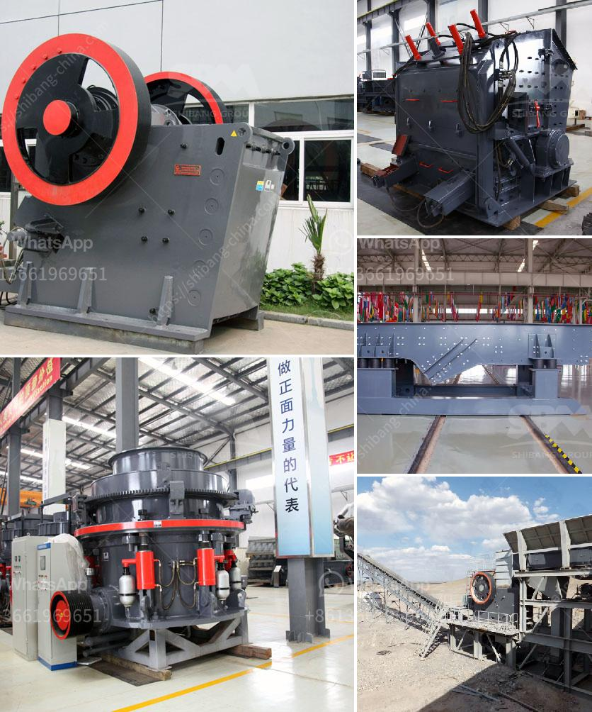

<h3>jaw stone crusher for excavators</h3>
Jaw stone crusher for excavators is a powerful and versatile attachment suitable for excavators with a high operating weight. Jaw crushers have a movable jaw that allows the user to crush various materials such as concrete, rocks, and stones.

Jaw crushers have a wide range of uses in the demolition and recycling industries. Contractors use these machines to break down large pieces of material such as concrete blocks or bricks into smaller, more manageable sizes. This allows them to recycle the material and reuse it for other construction projects.

The basic principle of a jaw crusher is simple - the crusher consists of two jaws, one fixed and one movable. The movable jaw is attached to an eccentric shaft that causes it to move in a reciprocating motion. As the material enters the crushing chamber, it is crushed between the jaws until it reaches the desired size. The crushed material then exits the crusher through a discharge opening.

One of the key advantages of using a jaw crusher attachment for excavators is the increased efficiency and productivity it offers. Excavators equipped with a jaw crusher attachment can crush up to 600 tons of material per hour, making it a cost-effective choice for larger projects. Increased productivity means reduced downtime and more efficient use of equipment.

Another advantage of using a jaw crusher attachment is its versatility. Jaw crushers can be used for a variety of applications, including rock crushing, concrete recycling, and stone breaking. The attachment is commonly used in areas where access to larger machinery is limited or where smaller machines are more suitable.

Jaw crushers are also highly reliable and require minimal maintenance. They are designed to withstand the harshest operating conditions and are built to last. The robust construction of the attachment ensures that it can handle heavy-duty applications without any issues.

Safety is a top priority when operating heavy machinery, and jaw crushers are no exception. Manufacturers design jaw crushers with safety features such as integrated safety shields, automatic relief valves, and emergency stop buttons. These safety features help protect operators and prevent accidents.

As with any equipment, it is important to choose the right jaw crusher attachment for your specific needs. Consider factors such as the required crushing capacity, the size and type of material to be crushed, and the operating weight of your excavator. Consulting with a reputable supplier or manufacturer can help you select the most suitable jaw crusher attachment for your project.

In conclusion, jaw stone crushers for excavators are versatile attachments that offer increased efficiency and productivity. They are ideal for a wide range of applications, including rock crushing, concrete recycling, and stone breaking. With their robust construction and safety features, they are reliable and require minimal maintenance. Choosing the right jaw crusher attachment can help maximize the performance of your excavator and streamline your construction or demolition project.
<h3>Contact us</h3><ul><li><strong>Whatsapp:&nbsp;<a href="https://wa.me/8613661969651">+8613661969651</a></strong></li><li><a href="https://swt.shibang-china.com/?git&amp;zhl&amp;jaw stone crusher for excavators"><strong>Online Service(chat now)</strong></a></li></ul><h3>Related</h3><ul><li><a href='vertical coal mill.md'>vertical coal mill</a></li><li><a href='basalt crushing processing.md'>basalt crushing processing</a></li><li><a href='wanted 120 ton of stone crusher.md'>wanted 120 ton of stone crusher</a></li><li><a href='clay ceromic manufacturing process.md'>clay ceromic manufacturing process</a></li><li><a href='conveyor belt laying procedure.md'>conveyor belt laying procedure</a></li></ul>