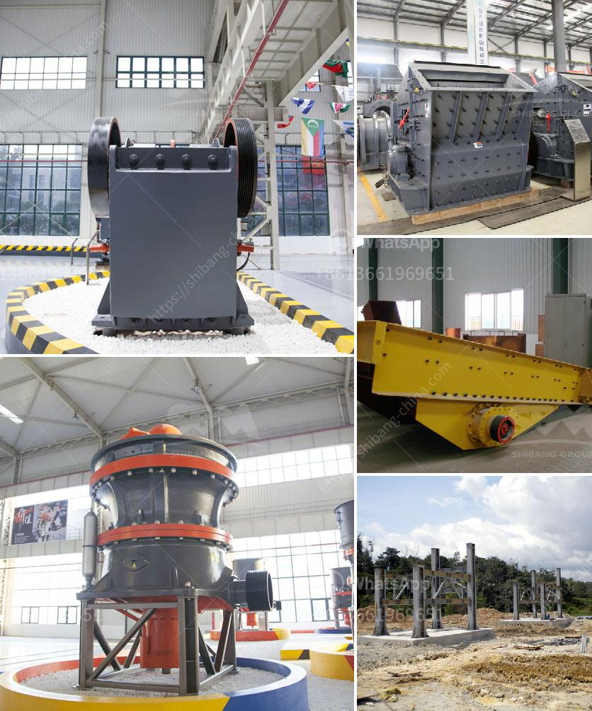

<h3>kaolin clay mining crusher in malaysia</h3>
Kaolin clay mining crusher in Malaysia plays a crucial role in mineral processing and mining industry. Kaolin clay is used in various industries such as ceramics, paper, rubber, paints, pharmaceuticals, and cosmetics. Mining kaolin clay involves different types of crushing processes, including primary crushing, secondary crushing, tertiary crushing, and fine crushing.

Generally, kaolin clay needs to be processed into fine powder before being used in various industrial applications. The kaolin clay mining crusher in Malaysia processes the raw materials into powder form through a combination of various crushers and mills. These crushers and mills break up the ore into smaller particles or sheets to facilitate the next stage of refinement.

The primary crusher in kaolin clay mining in Malaysia is the jaw crusher. The jaw crusher is mainly used for crushing the raw kaolin clay into smaller particles that are suitable for the next step of refining. The jaw crusher has a strong crushing capacity and can process a large amount of raw materials at a time.

After the primary crushing stage, the secondary crusher is used to further process the kaolin clay into smaller particles. The secondary crusher may be a cone crusher or impact crusher, depending on the requirements of the application. These crushers further reduce the size of the particles and prepare them for the next stage.

The tertiary crusher is used to further refine the kaolin clay into even smaller particles. This crusher has a high crushing ratio and produces a fine product. It is typically used in the final stages of the crushing process to produce a high-quality end product.

Once the kaolin clay has been crushed to the desired size, it is further processed through mills to produce fine powder. These mills, such as ball mills and Raymond mills, grind the crushed clay into powder form. The powder is then used in various industries such as ceramics, paper, rubber, paints, pharmaceuticals, and cosmetics.

Kaolin clay mining in Malaysia is an important industry for the country's economy. Malaysia produces around 50,000 tons of kaolin clay annually, making it one of the largest producers in the region. Kaolin clay mining in Malaysia is situated in the state of Pahang, near the town of Kuantan.

The mining and processing of kaolin clay involves several stages. These include prospecting, exploration, mine development, and post-mining reclamation. The kaolin clay mining crusher in Malaysia plays a crucial role in these processes.

Kaolin clay has been used for centuries in various applications due to its unique properties. It is known for its high plasticity, whiteness, and excellent fire resistance. Its versatility makes it a valuable resource in numerous industries.

In conclusion, the kaolin clay mining crusher in Malaysia is an important piece of equipment in the mining industry. It processes raw materials into powder form for use in various industrial applications. The primary, secondary, and tertiary crushers break down the raw materials into smaller particles, while the mills grind the particles into fine powder. Kaolin clay mining in Malaysia is crucial for the country's economy, and the crusher plays a pivotal role in the entire process.
<h3>Contact us</h3><ul><li><strong>Whatsapp:&nbsp;<a href="https://wa.me/8613661969651">+8613661969651</a></strong></li><li><a href="https://swt.shibang-china.com/?git&amp;zhl&amp;kaolin clay mining crusher in malaysia"><strong>Online Service(chat now)</strong></a></li></ul><h3>Related</h3><ul><li><a href='stone crusher in jos plateau state nigeria.md'>stone crusher in jos plateau state nigeria</a></li><li><a href='used mobile crusher in nigeria.md'>used mobile crusher in nigeria</a></li><li><a href='rotary dryer for sale in india.md'>rotary dryer for sale in india</a></li><li><a href='gravimetric centrifugal gold concentrator.md'>gravimetric centrifugal gold concentrator</a></li><li><a href='powder mill grinding machine in nigeria.md'>powder mill grinding machine in nigeria</a></li></ul>