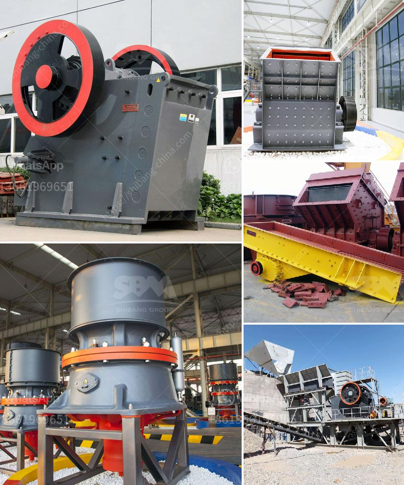

<h3>kaolin clay processing line</h3>
Kaolin clay, also known as China clay, is a white clay mineral found in nature. It is widely used in various industries due to its excellent properties such as high whiteness, softness, and easy dispersion. The processing of kaolin clay is an essential step in the production of various products that are used by people every day.

The kaolin clay processing line starts with the excavation of the raw ore from the ground. The ore is then crushed into small pieces and transported to the plant for further processing. This is where the clay is separated from impurities and other minerals. Different techniques such as wet and dry processing are used to purify the clay and achieve the desired quality.

In the wet process, water is added to the crushed kaolin clay and mixed thoroughly. This mixture is then passed through a series of screens to remove any large impurities. The slurry obtained is further processed through a series of centrifuges to separate the clay particles from the water. The separated clay is then dried and sent for various applications.

On the other hand, in the dry process, the crushed kaolin clay is pulverized and subjected to air classification. This process involves windblown separation of the clay particles based on their size and weight. The larger particles settle down faster and are collected separately from the finer particles. The collected clay is then processed further to remove any remaining impurities before it is dried and used in various applications.

Kaolin clay has numerous applications in industries such as ceramics, paper, paint, rubber, and cosmetics. In the ceramics industry, it is used as a raw material for making porcelain, tiles, and pottery. In the paper industry, it is used as a filler, coating, and pigment in the production of high-quality papers. In the paint industry, kaolin clay provides excellent hiding power and improves the durability and gloss of the paint. In the rubber industry, it is used as a reinforcement agent to enhance the strength and flexibility of rubber products. In the cosmetics industry, it is used in the production of face masks, soaps, and other skincare products.

In conclusion, the processing of kaolin clay is a crucial step in the production of various products used in numerous industries. The clay is extracted from the ground, purified, and processed to achieve the desired quality. The wet and dry processing methods are employed to separate the clay from impurities. The final product is then used in the production of ceramics, paper, paint, rubber, and cosmetics. The versatility and unique properties of kaolin clay make it an essential raw material in various manufacturing processes.
<h3>Contact us</h3><ul><li><strong>Whatsapp:&nbsp;<a href="https://wa.me/8613661969651">+8613661969651</a></strong></li><li><a href="https://swt.shibang-china.com/?git&amp;zhl&amp;kaolin clay processing line"><strong>Online Service(chat now)</strong></a></li></ul><h3>Related</h3><ul><li><a href='copper ore crushing machinery.md'>copper ore crushing machinery</a></li><li><a href='ball mill in malaysia.md'>ball mill in malaysia</a></li><li><a href='grinding crushing mill brick.md'>grinding crushing mill brick</a></li><li><a href='price of quarry crusher in zambia.md'>price of quarry crusher in zambia</a></li><li><a href='deodorization clay processing price.md'>deodorization clay processing price</a></li></ul>